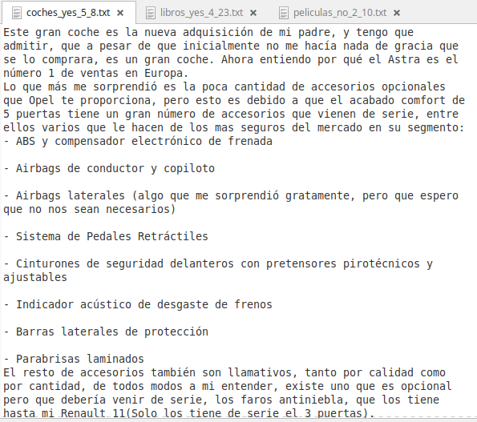
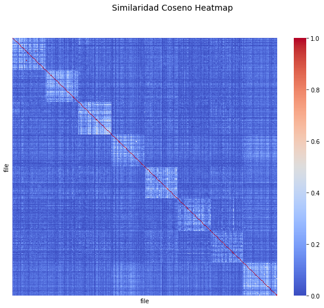
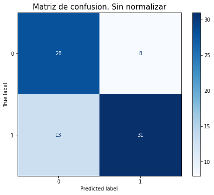

#### 

# <center> Métodos de aprendizaje automático para análisis de textos<center>

<center> Víctor Muñiz Sánchez<center>
<center> Diciembre 2020<center>

# Sobre el curso

## Objetivos:

* Mostrar los conceptos básicos de Procesamiento de Lenguaje Natural (NLP) orientado a textos.
* Mostrar repersentaciones vectoriales útiles de textos a partir de modelos probabilísticos de lenguaje y modelos neuronales de lenguaje.
* Abordar modelos de aprendizaje supervisado y no supervisado utilizando métodos de Machine Learning y Deep Learning, dando especial énfasis en arquitecturas de aprendizaje profundo y diversas aplicaciones.
    
    

# Temario

2. Conceptos básicos de python para el curso
3. Introducción y conceptos básicos de NLP
4. Representaciones básicos de textos: one-hot encoding, modelo n-gram, bolsa de palabras y TF-IDF.
5. Embeddings para palabras y documentos basados en modelos neuronales de lenguaje
6. Modelos de ML y aplicaciones en textos
7. Modelos de DL para textos: redes convolucionales, recurrentes y aplicaciones
8. Arquitecturas avanzadas de DL: sequence to sequence y mecanismos de atención (si da tiempo...)

# Introducción

NLP (Jurafsky & Martin, Speech and Language Processing, 2nd. Ed.
Es un campo de estudio enfocado en la interacción entre __lenguaje humano__ y computadoras. Se encuentra en la intersecciónn de ciencias de la computación, inteligencia artificial y linguistica computacional.
    
El objetivo es que las computadoras, realicen tareas útiles que involucren lenguaje humano, como comunicación máquina-humano, mejorar la comunicación humano-humano o simplemente, realizar procesamiento útil de texto o discurso.

Concepto clave: __lenguaje humano__:
\begin{itemize}
\item Signos linguísticos
\item Signos gráficos (textual)
\item Secuencias sonoras
\item Gestos y señales
\end{itemize}

Nosotros hablaremos sobre textos


__NLP es un área bastante compleja__. Esto se debe principalmente, a que el lenguaje natural es complejo en sí:

\begin{itemize}
\item Altamente ambiguo
\item Utiliza procesos mentales complejos para obtener un significado (uso del entorno)
\item Considera diferentes tipos de "entradas": texto, audio, imágenes, expresiones faciales y corporales, otras representaciones pictóricas 😮 👏 🙌 
\item Resultados en tiempo real (machine translation, automatic answering, etc...).
\item En constante evolución
\end{itemize}

También es un área bastante amplia.

¿Cuántas tareas/aplicaciones de NLP para textos conoces?

Veamos lo que dice Wikipedia


```python
import wikipedia
wikipedia.set_lang("en")
print(wikipedia.search("natural language processing"))
```

    ['Natural language processing', 'History of natural language processing', 'Natural language', 'Natural-language understanding', 'Outline of natural language processing', 'Natural-language user interface', 'Natural Language Toolkit', 'Process', 'List of artificial intelligence projects', 'GPT-3']


```python
nlp = wikipedia.page('Natural language processing')
print(nlp.content)
```

    Natural language processing (NLP) is a subfield of linguistics, computer science, and artificial intelligence concerned with the interactions between computers and human language, in particular how to program computers to process and analyze large amounts of natural language data.  The result is a computer capable of ‘understanding’ the contents of documents, including the contextual nuances of the language within them. The technology can then accurately extract information and insights contained in the documents as well as categorize and organize the documents themselves. 
    Challenges in natural language processing frequently involve speech recognition, natural language understanding, and natural-language generation.
    
    
    == History ==
    
    Natural language processing has its roots in the 1950s. Already in 1950, Alan Turing published an article titled "Computing Machinery and Intelligence" which proposed what is now called the Turing test as a criterion of intelligence, a task that involves the automated interpretation and generation of natural language, but at the time not articulated as a problem separate from artificial intelligence.
    
    
    === Symbolic NLP (1950s - early 1990s) ===
    The premise of symbolic NLP is well-summarized by John Searle's Chinese room experiment: Given a collection of rules (e.g., a Chinese phrasebook, with questions and matching answers), the computer emulates natural language understanding (or other NLP tasks) by applying those rules to the data it is confronted with.
    
    1950s: The Georgetown experiment in 1954 involved fully automatic translation of more than sixty Russian sentences into English. The authors claimed that within three or five years, machine translation would be a solved problem.  However, real progress was much slower, and after the ALPAC report in 1966, which found that ten-year-long research had failed to fulfill the expectations, funding for machine translation was dramatically reduced.  Little further research in machine translation was conducted until the late 1980s when the first statistical machine translation systems were developed.
    1960s: Some notably successful natural language processing systems developed in the 1960s were SHRDLU, a natural language system working in restricted "blocks worlds" with restricted vocabularies, and ELIZA, a simulation of a Rogerian psychotherapist, written by Joseph Weizenbaum between 1964 and 1966.  Using almost no information about human thought or emotion, ELIZA sometimes provided a startlingly human-like interaction. When the "patient" exceeded the very small knowledge base, ELIZA might provide a generic response, for example, responding to "My head hurts" with "Why do you say your head hurts?".
    1970s: During the 1970s, many programmers began to write "conceptual ontologies", which structured real-world information into computer-understandable data.  Examples are MARGIE (Schank, 1975), SAM (Cullingford, 1978), PAM (Wilensky, 1978), TaleSpin (Meehan, 1976), QUALM (Lehnert, 1977), Politics (Carbonell, 1979), and Plot Units (Lehnert 1981).  During this time, the first many chatterbots were written (e.g., PARRY).
    1980s: The 1980s and early 1990s mark the hey-day of symbolic methods in NLP. Focus areas of the time included research on rule-based parsing (e.g., the development of HPSG as a computational operationalization of generative grammar), morphology (e.g., two-level morphology), semantics (e.g., Lesk algorithm), reference (e.g., within Centering Theory) and other areas of natural language understanding (e.g., in the Rhetorical Structure Theory). Other lines of research were continued, e.g., the development of chatterbots with Racter and Jabberwacky. An important development (that eventually led to the statistical turn in the 1990s) was the rising importance of quantitative evaluation in this period.
    
    
    === Statistical NLP (1990s - 2010s) ===
    Up to the 1980s, most natural language processing systems were based on complex sets of hand-written rules.  Starting in the late 1980s, however, there was a revolution in natural language processing with the introduction of machine learning algorithms for language processing.  This was due to both the steady increase in computational power (see Moore's law) and the gradual lessening of the dominance of Chomskyan theories of linguistics (e.g. transformational grammar), whose theoretical underpinnings discouraged the sort of corpus linguistics that underlies the machine-learning approach to language processing.
    1990s: Many of the notable early successes on statistical methods in NLP occurred in the field of machine translation, due especially to work at IBM Research.  These systems were able to take advantage of existing multilingual textual corpora that had been produced by the Parliament of Canada and the European Union as a result of laws calling for the translation of all governmental proceedings into all official languages of the corresponding systems of government.  However, most other systems depended on corpora specifically developed for the tasks implemented by these systems, which was (and often continues to be) a major limitation in the success of these systems. As a result, a great deal of research has gone into methods of more effectively learning from limited amounts of data.
    2000s: With the growth of the web, increasing amounts of raw (unannotated) language data has become available since the mid-1990s. Research has thus increasingly focused on unsupervised and semi-supervised learning algorithms.  Such algorithms can learn from data that has not been hand-annotated with the desired answers or using a combination of annotated and non-annotated data.  Generally, this task is much more difficult than supervised learning, and typically produces less accurate results for a given amount of input data.  However, there is an enormous amount of non-annotated data available (including, among other things, the entire content of the World Wide Web), which can often make up for the inferior results if the algorithm used has a low enough time complexity to be practical.
    
    
    === Neural NLP (present) ===
    In the 2010s, representation learning and deep neural network-style machine learning methods became widespread in natural language processing, due in part to a flurry of results showing that such techniques can achieve state-of-the-art results in many natural language tasks, for example in language modeling, parsing, and many others.
    
    
    == Methods: Rules, statistics, neural networks ==
    In the early days, many language-processing systems were designed by symbolic methods, i.e., the hand-coding of a set of rules, coupled with a dictionary lookup: such as by writing grammars or devising heuristic rules for stemming.
    More recent systems based on machine-learning algorithms have many advantages over hand-produced rules: 
    
    The learning procedures used during machine learning automatically focus on the most common cases, whereas when writing rules by hand it is often not at all obvious where the effort should be directed.
    Automatic learning procedures can make use of statistical inference algorithms to produce models that are robust to unfamiliar input (e.g. containing words or structures that have not been seen before) and to erroneous input (e.g. with misspelled words or words accidentally omitted). Generally, handling such input gracefully with handwritten rules, or, more generally, creating systems of handwritten rules that make soft decisions, is extremely difficult, error-prone and time-consuming.
    Systems based on automatically learning the rules can be made more accurate simply by supplying more input data. However, systems based on handwritten rules can only be made more accurate by increasing the complexity of the rules, which is a much more difficult task. In particular, there is a limit to the complexity of systems based on handwritten rules, beyond which the systems become more and more unmanageable. However, creating more data to input to machine-learning systems simply requires a corresponding increase in the number of man-hours worked, generally without significant increases in the complexity of the annotation process.Despite the popularity of machine learning in NLP research, symbolic methods are still (2020) commonly used
    
    when the amount of training data is insufficient to successfully apply machine learning methods, e.g., for the machine translation of low-resource languages such as provided by the Apertium system,
    for preprocessing in NLP pipelines, e.g., tokenization, or
    for postprocessing and transforming the output of NLP pipelines, e.g., for knowledge extraction from syntactic parses.
    
    
    === Statistical methods ===
    Since the so-called "statistical revolution" in the late 1980s and mid-1990s, much natural language processing research has relied heavily on machine learning. The machine-learning paradigm calls instead for using statistical inference to automatically learn such rules through the analysis of large corpora (the plural form of corpus, is a set of documents, possibly with human or computer annotations) of typical real-world examples.
    Many different classes of machine-learning algorithms have been applied to natural-language-processing tasks. These algorithms take as input a large set of "features" that are generated from the input data. Increasingly, however, research has focused on statistical models, which make soft, probabilistic decisions based on attaching real-valued weights to each input feature. Such models have the advantage that they can express the relative certainty of many different possible answers rather than only one, producing more reliable results when such a model is included as a component of a larger system.
    Some of the earliest-used machine learning algorithms, such as decision trees, produced systems of hard if-then rules similar to existing hand-written rules.  However, part-of-speech tagging introduced the use of hidden Markov models to natural language processing, and increasingly, research has focused on statistical models, which make soft, probabilistic decisions based on attaching real-valued weights to the features making up the input data. The cache language models upon which many speech recognition systems now rely are examples of such statistical models.  Such models are generally more robust when given unfamiliar input, especially input that contains errors (as is very common for real-world data), and produce more reliable results when integrated into a larger system comprising multiple subtasks.
    Since the neural turn, statistical methods in NLP research have been largely replaced by neural networks. However, they continue to be relevant for contexts in which statistical interpretability and transparency is required.
    
    
    === Neural networks ===
    
    A major drawback of statistical methods is that they require elaborate feature engineering. Since the early 2010s, the field has thus largely abandoned statistical methods and shifted to neural networks for machine learning. Popular techniques include the use of word embeddings to capture semantic properties of words, and an increase in end-to-end learning of a higher-level task (e.g., question answering) instead of relying on a pipeline of separate intermediate tasks (e.g., part-of-speech tagging and dependency parsing). In some areas, this shift has entailed substantial changes in how NLP systems are designed, such that deep neural network-based approaches may be viewed as a new paradigm distinct from statistical natural language processing. For instance, the term neural machine translation (NMT) emphasizes the fact that deep learning-based approaches to machine translation directly learn sequence-to-sequence transformations, obviating the need for intermediate steps such as word alignment and language modeling that was used in statistical machine translation (SMT).
    
    
    == Common NLP Tasks ==
    The following is a list of some of the most commonly researched tasks in natural language processing. Some of these tasks have direct real-world applications, while others more commonly serve as subtasks that are used to aid in solving larger tasks.
    Though natural language processing tasks are closely intertwined, they can be subdivided into categories for convenience. A coarse division is given below.
    
    
    === Text and speech processing ===
    Optical character recognition (OCR)
    Given an image representing printed text, determine the corresponding text.Speech recognition
    Given a sound clip of a person or people speaking, determine the textual representation of the speech.  This is the opposite of text to speech and is one of the extremely difficult problems colloquially termed "AI-complete" (see above).  In natural speech there are hardly any pauses between successive words, and thus speech segmentation is a necessary subtask of speech recognition (see below). In most spoken languages, the sounds representing successive letters blend into each other in a process termed coarticulation, so the conversion of the analog signal to discrete characters can be a very difficult process. Also, given that words in the same language are spoken by people with different accents, the speech recognition software must be able to recognize the wide variety of input as being identical to each other in terms of its textual equivalent.
    Speech segmentation
    Given a sound clip of a person or people speaking, separate it into words.  A subtask of speech recognition and typically grouped with it.Text-to-speech
    Given a text, transform those units and produce a spoken representation. Text-to-speech can be used to aid the visually impaired.Word segmentation (Tokenization)
    Separate a chunk of continuous text into separate words. For a language like English, this is fairly trivial, since words are usually separated by spaces. However, some written languages like Chinese, Japanese and Thai do not mark word boundaries in such a fashion, and in those languages text segmentation is a significant task requiring knowledge of the vocabulary and morphology of words in the language. Sometimes this process is also used in cases like bag of words (BOW) creation in data mining.
    
    
    === Morphological analysis ===
    Lemmatization
    The task of removing inflectional endings only and to return the base dictionary form of a word which is also known as a lemma.
    Morphological segmentation
    Separate words into individual morphemes and identify the class of the morphemes. The difficulty of this task depends greatly on the complexity of the morphology (i.e., the structure of words) of the language being considered. English has fairly simple morphology, especially inflectional morphology, and thus it is often possible to ignore this task entirely and simply model all possible forms of a word (e.g., "open, opens, opened, opening") as separate words. In languages such as Turkish or Meitei, a highly agglutinated Indian language, however, such an approach is not possible, as each dictionary entry has thousands of possible word forms.
    Part-of-speech tagging
    Given a sentence, determine the part of speech (POS) for each word. Many words, especially common ones, can serve as multiple parts of speech. For example, "book" can be a noun ("the book on the table") or verb ("to book a flight"); "set" can be a noun, verb or adjective; and "out" can be any of at least five different parts of speech. Some languages have more such ambiguity than others. Languages with little inflectional morphology, such as English, are particularly prone to such ambiguity. Chinese is prone to such ambiguity because it is a tonal language during verbalization. Such inflection is not readily conveyed via the entities employed within the orthography to convey the intended meaning.Stemming
    The process of reducing inflected (or sometimes derived) words to their root form. (e.g., "close" will be the root for "closed", "closing", "close", "closer" etc.).
    
    
    === Syntactic analysis ===
    Grammar induction
    Generate a formal grammar that describes a language's syntax.
    Sentence breaking (also known as "sentence boundary disambiguation")
    Given a chunk of text, find the sentence boundaries. Sentence boundaries are often marked by periods or other punctuation marks, but these same characters can serve other purposes (e.g., marking abbreviations).
    Parsing
    Determine the parse tree (grammatical analysis) of a given sentence. The grammar for natural languages is ambiguous and typical sentences have multiple possible analyses: perhaps surprisingly, for a typical sentence there may be thousands of potential parses (most of which will seem completely nonsensical to a human). There are two primary types of parsing: dependency parsing and constituency parsing. Dependency parsing focuses on the relationships between words in a sentence (marking things like primary objects and predicates), whereas constituency parsing focuses on building out the parse tree using a probabilistic context-free grammar (PCFG) (see also stochastic grammar).
    
    
    === Lexical semantics (of individual words in context) ===
    Lexical semantics
    What is the computational meaning of individual words in context?
    Distributional semantics
    How can we learn semantic representations from data?
    Named entity recognition (NER)
    Given a stream of text, determine which items in the text map to proper names, such as people or places, and what the type of each such name is (e.g. person, location, organization). Although capitalization can aid in recognizing named entities in languages such as English, this information cannot aid in determining the type of named entity, and in any case, is often inaccurate or insufficient.  For example, the first letter of a sentence is also capitalized, and named entities often span several words, only some of which are capitalized.  Furthermore, many other languages in non-Western scripts (e.g. Chinese or Arabic) do not have any capitalization at all, and even languages with capitalization may not consistently use it to distinguish names. For example, German capitalizes all nouns, regardless of whether they are names, and French and Spanish do not capitalize names that serve as adjectives.Sentiment analysis (see also multimodal sentiment analysis)
    Extract subjective information usually from a set of documents, often using online reviews to determine "polarity" about specific objects. It is especially useful for identifying trends of public opinion in social media, for marketing.Terminology extractionThe goal of terminology extraction is to automatically extract relevant terms from a given corpus.
    Word sense disambiguation
    Many words have more than one meaning; we have to select the meaning which makes the most sense in context.  For this problem, we are typically given a list of words and associated word senses, e.g. from a dictionary or an online resource such as WordNet.
    
    
    === Relational semantics (semantics of individual sentences) ===
    Relationship extraction
    Given a chunk of text, identify the relationships among named entities (e.g. who is married to whom).
    Semantic Parsing
    Given a piece of text (typically a sentence), produce a formal representation of its semantics, either as a graph (e.g., in AMR parsing) or in accordance with a logical formalism (e.g., in DRT parsing). This challenge typically includes aspects of several more elementary NLP tasks from semantics (e.g., semantic role labelling, word sense disambiguation) and can be extended to include full-fledged discourse analysis (e.g., discourse analysis, coreference; see Natural Language Understanding below).
    Semantic Role Labelling (see also implicit semantic role labelling below)
    Given a single sentence, identify and disambiguate semantic predicates (e.g., verbal frames), then identify and classify the frame elements (semantic roles).
    
    
    === Discourse (semantics beyond individual sentences) ===
    Coreference resolution
    Given a sentence or larger chunk of text, determine which words ("mentions") refer to the same objects ("entities"). Anaphora resolution is a specific example of this task, and is specifically concerned with matching up pronouns with the nouns or names to which they refer. The more general task of coreference resolution also includes identifying so-called "bridging relationships" involving referring expressions. For example, in a sentence such as "He entered John's house through the front door", "the front door" is a referring expression and the bridging relationship to be identified is the fact that the door being referred to is the front door of John's house (rather than of some other structure that might also be referred to).
    Discourse analysis
    This rubric includes several related tasks.  One task is discourse parsing, i.e., identifying the discourse structure of a connected text, i.e. the nature of the discourse relationships between sentences (e.g. elaboration, explanation, contrast).  Another possible task is recognizing and classifying the speech acts in a chunk of text (e.g. yes-no question, content question, statement, assertion, etc.).Implicit Semantic Role Labelling
    Given a single sentence, identify and disambiguate semantic predicates (e.g., verbal frames) and their explicit semantic roles in the current sentence (see Semantic Role Labelling above). Then, identify semantic roles that are not explicitly realized in the current sentence, classify them into arguments that are explicitly realized elsewhere in the text and those that are not specified, and resolve the former against the local text. A closely related task is zero anaphora resolution, i.e., the extension of coreference resolution to pro-drop languages.Recognizing Textual entailment
    Given two text fragments, determine if one being true entails the other, entails the other's negation, or allows the other to be either true or false.Topic segmentation and recognition
    Given a chunk of text, separate it into segments each of which is devoted to a topic, and identify the topic of the segment.
    
    
    === Higher-level NLP applications ===
    Automatic summarization (text summarization)
    Produce a readable summary of a chunk of text.  Often used to provide summaries of the text of a known type, such as research papers, articles in the financial section of a newspaper.
    Book generation
    Not an NLP task proper but an extension of Natural Language Generation and other NLP tasks is the creation of full-fledged books. The first machine-generated book was created by a rule-based system in 1984 (Racter, The policeman's beard is half-constructed). The first published work by a neural network was published in 2018, 1 the Road, marketed as a novel, contains sixty million words. Both these systems are basically elaborate but non-sensical (semantics-free) language models. The first machine-generated science book was published in 2019 (Beta Writer, Lithium-Ion Batteries, Springer, Cham). Unlike Racter and 1 the Road, this is grounded on factual knowledge and based on text summarization.
    Dialogue management
    Computer systems intended to converse with a human.
    Document AI
    A Document AI platform sits on top of the NLP technology enabling users with no prior experience of artificial intelligence, machine learning or NLP to quickly train a computer to extract the specific data they need from different document types. NLP-powered Document AI enables non-technical teams to quickly access information hidden in documents, for example, lawyers, business analysts and accountants.
    Machine translation
    Automatically translate text from one human language to another.  This is one of the most difficult problems, and is a member of a class of problems colloquially termed "AI-complete", i.e. requiring all of the different types of knowledge that humans possess (grammar, semantics, facts about the real world, etc.) to solve properly.
    Natural language generation (NLG):
    Convert information from computer databases or semantic intents into readable human language.
    Natural language understanding (NLU)
    Convert chunks of text into more formal representations such as first-order logic structures that are easier for computer programs to manipulate. Natural language understanding involves the identification of the intended semantic from the multiple possible semantics which can be derived from a natural language expression which usually takes the form of organized notations of natural language concepts. Introduction and creation of language metamodel and ontology are efficient however empirical solutions. An explicit formalization of natural language semantics without confusions with implicit assumptions such as closed-world assumption (CWA) vs. open-world assumption, or subjective Yes/No vs. objective True/False is expected for the construction of a basis of semantics formalization.
    Question answering
    Given a human-language question, determine its answer.  Typical questions have a specific right answer (such as "What is the capital of Canada?"), but sometimes open-ended questions are also considered (such as "What is the meaning of life?"). Recent works have looked at even more complex questions.
    
    
    == Cognition and NLP ==
    Cognition refers to "the mental action or process of acquiring knowledge and understanding through thought, experience, and the senses." Cognitive science is the interdisciplinary, scientific study of the mind and its processes. Cognitive linguistics is an interdisciplinary branch of linguistics, combining knowledge and research from both psychology and linguistics.  George Lakoff offers a methodology to build Natural language processing (NLP) algorithms through the perspective of Cognitive science, along with the findings of Cognitive linguistics:The first defining aspect of this cognitive task of NLP is the application of the theory of Conceptual metaphor, explained by Lakoff as “the understanding of one idea, in terms of another” which provides an idea of the intent of the author.For example, consider some of the meanings, in English, of the word “big”. When used as a Comparative, as in “That is a big tree,” a likely inference of the intent of the author is that the author is using the word “big” to imply a statement about the tree being ”physically large” in comparison to other trees or the authors experience.  When used as a Stative verb, as in ”Tomorrow is a big day”, a likely inference of the author’s intent it that ”big” is being used to imply ”importance”.  These examples are not presented to be complete, but merely as indicators of the implication of the idea of Conceptual metaphor.  The intent behind other usages, like in ”She is a big person” will remain somewhat ambiguous to a person and a cognitive NLP algorithm alike without additional information.
    This leads to the second defining aspect of this cognitive task of NLP, namely Probabilistic context-free grammar (PCFG) which enables cognitive NLP algorithms to assign relative measures of meaning  to a word, phrase, sentence or piece of text based on the information presented before and after the piece of text being analyzed. The mathematical equation for such algorithms is presented in US patent 9269353 :
    
      
        
          
            
              R
              M
              M
              (
              t
              o
              k
              e
              
                n
                
                  N
                
              
              )
            
            =
            
              P
              M
              M
              (
              t
              o
              k
              e
              
                n
                
                  N
                
              
              )
            
            ×
            
              
                1
                
                  2
                  d
                
              
            
            
              (
              
                
                  ∑
                  
                    i
                    =
                    −
                    d
                  
                  
                    d
                  
                
                
                  (
                  (
                  P
                  M
                  M
                  (
                  t
                  o
                  k
                  e
                  
                    n
                    
                      N
                      −
                      1
                    
                  
                  )
                
                ×
                
                  P
                  F
                  (
                  t
                  o
                  k
                  e
                  
                    n
                    
                      N
                    
                  
                  ,
                  t
                  o
                  k
                  e
                  
                    n
                    
                      N
                      −
                      1
                    
                  
                  )
                  
                    )
                    
                      i
                    
                  
                
              
              )
            
          
        
        {\displaystyle {RMM(token_{N})}={PMM(token_{N})}\times {\frac {1}{2d}}\left(\sum _{i=-d}^{d}{((PMM(token_{N-1})}\times {PF(token_{N},token_{N-1}))_{i}}\right)}
      Where,
         RMM, is the Relative Measure of Meaning
         token, is any block of text, sentence, phrase or word
         N, is the number of tokens being analyzed
         PMM, is the Probable Measure of Meaning based on a corpora
         d, is the location of the token along the sequence of N-1 tokens
         PF, is the Probability Function specific to a language
    
    
    == See also ==
    
    
    == References ==
    
    
    == Further reading ==


Independientemente de la tarea o aplicación, necesitamos una __representación eficiente__ del texto.

*...it is not enough to simply provide a computer with a large amount of data and expect it to learn to speak --the data has to be prepared in such a way that the computer can more easily find patterns and inferences.''*
  
  - James Pustejovsky et al. *Natural Language Annotation.*
  


Aquí es donde empezamos con la parte técnica...

# Conceptos básicos de programación para el curso

## Lo que necesitamos saber sobre `python` para éste curso


## ¿Porqué `python`?

* Es un lenguaje interpretado (no compilado, como C, C++) y de alto nivel, como Matlab, R o Java.
* Es un lenguaje orientado a objetos
* Es el lenguaje de programación de mayor crecimiento en la última década
* Es el lenguaje científico de mayor uso para aplicaciones de análisis y ciencia de datos, desplazando a R y Matlab
* Es el lenguaje orientado a Deep Learning
* Es "*fácil*" de aprender
* Es `wrapper` de muchas librerias de bajo nivel (C, CUDA-NVIDIA) implementadas en paralelo, lo que mejora el rendimiento

### Python y la infraestructura para cómputo científico y ciencia de datos


Veremos algunas cosas básicas y la mayoría, las veremos sobre la marcha.

## Instalación local.

* La opción más óptima: instalar python (https://www.python.org/) y los editores que sean de su preferencia (`vi`, `emacs`, `pycharm`, `spyder`, `jupyter-notebook`, etc).
* La opción más rápida (recomendada para iniciar), instalar Anaconda: https://www.anaconda.com/
* En cualquier caso, recomiendo ampliamente crear __virtual environments__ para proyectos específicos que requieran a su vez, librerías específicas

## Instalar librerías
En Anaconda, se puede hacer directamente en el framework. También puedes hacerlo en consola con los comandos `pip` y `conda` (si tienes Anaconda).

### Ejecución de código python

* The Python interpreter
* The IPython interpreter
* Self-contained Python scripts
* The Jupyter notebook


Jupyter Notebook [*Jupyter Project*](https://jupyter.org/):

* A useful hybrid of the interactive terminal and the self-contained script
* A document format that allows executable code, formatted text, graphics, and even interactive features to be combined into a single document.
* Useful both as a development environment, and as a means of sharing work via rich computational and data-driven narratives that mix together code, figures, data, and text.

### Jupyter + Google Colab


¿Qué es Colaboratory? (del sitio oficial de Google Colab)

Colaboratory, también llamado Colab, te permite escribir y ejecutar código de Python en un navegador, con las siguientes particularidades:
- Sin configuración requerida
- Acceso gratuito a GPU y TPU
- Facilidad para compartir

Seas <strong>estudiante</strong>, <strong>científico de datos</strong> o <strong>investigador de IA</strong>, Colab facilita tu trabajo. Mira <a href="https://www.youtube.com/watch?v=inN8seMm7UI">este video introductorio sobre Colab</a> para obtener más información.


En este curso, usaremos Jupyter Notebooks y Colab como nuestra plataforma de programación y procesamiento.

¿Qué necesitamos?

* Una cuenta de Google
* Una carpeta dentro de Google Drive para el curso (te ayudará a tenerlo mejor organizado)

El uso de Colab es muy intuitivo, y también hay varios tutoriales para aprender a usarlo. Por ejemplo: 
* [An Absolute Beginner’s Guide To Google Colaboratory](https://medium.com/@dinaelhanan/an-absolute-beginners-guide-to-google-colaboratory-d55c0eb375de).
* [Getting Started With Google Colab](https://towardsdatascience.com/getting-started-with-google-colab-f2fff97f594c)


El Github para el curso es https://github.com/victorm0202/Curso_banxico/tree/Python-basics

## Python basics

Lo veremos directamente en Colab.

Algo que quizá pueda ayudar: 
- [Python for R users](http://www.data-analysis-in-python.org/python_for_r.html)
- [Python for SAS users](https://nbviewer.jupyter.org/github/RandyBetancourt/PythonForSASUsers/tree/master/)

# Procesamiento de textos

Volviendo al tema...

Los textos se obtienen de distintas fuentes, tienen diferentes características y su análisis depende en gran parte de tales características.

El procedimiento es como siempre:
\begin{itemize}
\item Obtención del texto
\item Preprocesamiento
\item Representación
\item Modelación
\end{itemize}

En `python` hay varios módulos especializados. Nosotros usaremos varios:
- NLTK
- Scikit Learn
- Keras

Preprocesamiento y análisis básicos de textos.

Lo veremos en el notebook

El preproceso y normalización (canonicalización) de texto es una parte muy importante para su posterior modelación y análisis.

Este puede incluir alguno de los siguientes operaciones:

\begin{itemize}
\item Convertir letras a minúsculas o mayúsculas
\item Remover números o convertirlos a palabras
\item Remover signos de puntuación, acentos y otros signos diacríticos
\item Remover caracteres repetidos, incluídos espacios en blanco
\item Remover caracteres con poca frecuencia
\item Remover palabras funcionales o stop words
\item Convertir símbolos a palabras (emojis y otros)
\item Stemming, lematización y POS-tagging
\end{itemize}


Sin embargo, el preproceso y en general, la __extracción__ del texto puede ser mucho más complejo.

Formalidad de la escritura.  The formality continuum (Choudhyrt M. *NLP for social media*)


Datos de la web:


Digitalización y reconocimiento de caracteres:


Textos generados por usuarios:


Textos generados por usuarios:


Una gran variedad de módulos para preproceso y normalización están disponibles en `python`. Ver por ejemplo:

[Módulos para procesamiento de textos](https://docs.google.com/spreadsheets/d/1-9rMhfcmxFv2V2Q5ZWn1FfLDZZYsuwb1eoSp9CiEEOg/edit#gid=1112515333)

Nosotros usaremos preprocesamientos básicos. Hay dos que son relevantes para ciertas aplicaciones:

- Stemming
- Lematización

## Stemming

Proceso heurístico para, secuencialmente, remover las partes finales de una palabra (affixes) para obtener su "raíz". Es una forma básica para hacer análisis morfológico. El algoritmo mas usado es el de Porter (Porter, M. F. (1980). *An algorithm for suffix stripping*. Program, 14(3), 130–127). 


Por ejemplo, considera las palabras 

|token | stemming|
| --- | --- |
|  operate     |   oper |
|  operating   |   oper |
|  operates    |   oper |
|  operation   |   oper |
|  operative   |   oper |
|  operatives  |   oper |
|  operational |   oper |


## Lematización

Análisis morfológico para obtener el *"lema"* de cada palabra, es decir, una forma normalizada de un conjunto de términos morfológicamente relacionados (como aparece generalmente en un diccionario).
    
|      token  | stemming |      lemma| POS |
|      ---  | --- |      ---| --- |
|    operate  |   oper |    operate  | VB  |
|  operating  |   oper |    operate  | VBG |
|   operates  |   oper |    operate  | VBZ |
|  operation  |   oper |  operation  | NN  |
|  operative  |   oper |  operative  | NN  |
| operatives  |   oper |  operative  | NNS |
|operational  |   oper | operational |  JJ |

Hay diferentes formas de realizarlo. El más común es obtener su etiqueta gramatical (POS-tag) y luego obtener su lema en un diccionario. Dependiente del idioma.

## Ejemplos de preprocesamiento


```python
# revisar las funciones, si tienes dudas, me preguntas...
from my_functions import *

preprocesador = preprocesaTexto(idioma='es', _tokeniza=False, _muestraCambios=False, _quitarAcentos=True, 
                                _remueveStop=False, _stemming=False, _lematiza=True, _removerPuntuacion=True)

txt = 'Sobre la mesa está el sobre'
txt_prep = preprocesador.preprocesa(txt)
print(txt_prep)
```

    sobrar lo mesar este el sobrar 


```python
preprocesador = preprocesaTexto(idioma='es', _tokeniza=False, _muestraCambios=False, _quitarAcentos=True, 
                                _remueveStop=False, _stemming=False, _lematiza=True, _removerPuntuacion=True)

corpus = ['Hola, me llamo Víctor, vivo en Monterrey, ¿y tú?', 'El perro se comió mi tarea.', 
          'Mi vecina se pelea con otra vecina.', 'El gato toca el piano.']
corpus_prep = []
for txt in corpus:
    txt_prep = preprocesador.preprocesa(txt)
    corpus_prep.append(txt_prep)

corpus_prep
```


    ['hola me llamar victor vivir en monterrey y tu ',
     'el perro se comio mi tarea ',
     'mi vecino se pelear con otro vecino ',
     'el gato tocar el piano ']


# Representaciones de textos

## One-hot encoding

Dado un vocabulario, usamos variables *dummy* para indicar la presencia o ausencia de las palabras del vocabulario en algún documento. 

__El orden NO es importante__


```python
import keras
from keras.preprocessing.text import Tokenizer
import pandas as pd

samples = ['El perro se comió mi tarea.', 'Mi vecina se pelea con otra vecina.', 'El gato toca el piano.']

max_words = 15
tokenizer = Tokenizer(num_words=max_words)
# word index
tokenizer.fit_on_texts(samples)
# vectorizacion (one-hot u otro)
one_hot_results = tokenizer.texts_to_matrix(samples, mode='binary') #"count", "tfidf", "freq"

word_index = tokenizer.word_index
print('Found %s unique tokens.' % len(word_index))
pos = list(word_index.values())
cols = ['0' for i in range(15)] 
cols[pos[0]:pos[len(pos)-1]+1] = list(word_index.keys())
doc_matrix = pd.DataFrame(one_hot_results,columns=cols)
doc_matrix
```

    Found 13 unique tokens.


<div>
<style scoped>
    .dataframe tbody tr th:only-of-type {
        vertical-align: middle;
    }

    .dataframe tbody tr th {
        vertical-align: top;
    }

    .dataframe thead th {
        text-align: right;
    }
</style>
<table border="1" class="dataframe">
  <thead>
    <tr style="text-align: right;">
      <th></th>
      <th>0</th>
      <th>el</th>
      <th>se</th>
      <th>mi</th>
      <th>vecina</th>
      <th>perro</th>
      <th>comió</th>
      <th>tarea</th>
      <th>pelea</th>
      <th>con</th>
      <th>otra</th>
      <th>gato</th>
      <th>toca</th>
      <th>piano</th>
      <th>0</th>
    </tr>
  </thead>
  <tbody>
    <tr>
      <th>0</th>
      <td>0.0</td>
      <td>1.0</td>
      <td>1.0</td>
      <td>1.0</td>
      <td>0.0</td>
      <td>1.0</td>
      <td>1.0</td>
      <td>1.0</td>
      <td>0.0</td>
      <td>0.0</td>
      <td>0.0</td>
      <td>0.0</td>
      <td>0.0</td>
      <td>0.0</td>
      <td>0.0</td>
    </tr>
    <tr>
      <th>1</th>
      <td>0.0</td>
      <td>0.0</td>
      <td>1.0</td>
      <td>1.0</td>
      <td>1.0</td>
      <td>0.0</td>
      <td>0.0</td>
      <td>0.0</td>
      <td>1.0</td>
      <td>1.0</td>
      <td>1.0</td>
      <td>0.0</td>
      <td>0.0</td>
      <td>0.0</td>
      <td>0.0</td>
    </tr>
    <tr>
      <th>2</th>
      <td>0.0</td>
      <td>1.0</td>
      <td>0.0</td>
      <td>0.0</td>
      <td>0.0</td>
      <td>0.0</td>
      <td>0.0</td>
      <td>0.0</td>
      <td>0.0</td>
      <td>0.0</td>
      <td>0.0</td>
      <td>1.0</td>
      <td>1.0</td>
      <td>1.0</td>
      <td>0.0</td>
    </tr>
  </tbody>
</table>
</div>


## Vector space model (Salton et al., 1975), también conocido como Bag of Words (BOW, Joachims 1998).

<center>

<center>

Detalle curioso: 
<center>

<center>

Nunca usa el término *Bag of words*...

<center>

<center>

- Un documento es entonces, un punto $d\in \mathbb{R}^{|V|}$, donde $V$ es un vocabulario. Documentos similares tenderán a tener palabras similares, y por lo tanto, vectores parecidos. En nuestro ejemplo, vectores rengl\'on.

- De forma equivalente, una palabra es un punto $w\in \mathbb{R}^{|N|}$, donde $N$ es el número de documentos del corpus. Palabras similares tenderán a ocurrir en documentos similares, entonces tendrán vectores parecidos. En nuestro ejemplo, vectores columna.


```python
import keras
from keras.preprocessing.text import Tokenizer
import pandas as pd

samples = ['El perro se comió mi tarea.', 'Mi vecina se pelea con otra vecina.', 'El gato toca el piano.']

max_words = 15
tokenizer = Tokenizer(num_words=max_words)
# word index
tokenizer.fit_on_texts(samples)
# vectorizacion (one-hot u otro)
one_hot_results = tokenizer.texts_to_matrix(samples, mode='binary') #"binary", count", "tfidf", "freq"

word_index = tokenizer.word_index
print('Found %s unique tokens.' % len(word_index))
pos = list(word_index.values())
cols = ['0' for i in range(15)] 
cols[pos[0]:pos[len(pos)-1]+1] = list(word_index.keys())
doc_matrix = pd.DataFrame(one_hot_results,columns=cols)
doc_matrix
```

    Found 13 unique tokens.


<div>
<style scoped>
    .dataframe tbody tr th:only-of-type {
        vertical-align: middle;
    }

    .dataframe tbody tr th {
        vertical-align: top;
    }

    .dataframe thead th {
        text-align: right;
    }
</style>
<table border="1" class="dataframe">
  <thead>
    <tr style="text-align: right;">
      <th></th>
      <th>0</th>
      <th>el</th>
      <th>se</th>
      <th>mi</th>
      <th>vecina</th>
      <th>perro</th>
      <th>comió</th>
      <th>tarea</th>
      <th>pelea</th>
      <th>con</th>
      <th>otra</th>
      <th>gato</th>
      <th>toca</th>
      <th>piano</th>
      <th>0</th>
    </tr>
  </thead>
  <tbody>
    <tr>
      <th>0</th>
      <td>0.0</td>
      <td>1.0</td>
      <td>1.0</td>
      <td>1.0</td>
      <td>0.0</td>
      <td>1.0</td>
      <td>1.0</td>
      <td>1.0</td>
      <td>0.0</td>
      <td>0.0</td>
      <td>0.0</td>
      <td>0.0</td>
      <td>0.0</td>
      <td>0.0</td>
      <td>0.0</td>
    </tr>
    <tr>
      <th>1</th>
      <td>0.0</td>
      <td>0.0</td>
      <td>1.0</td>
      <td>1.0</td>
      <td>1.0</td>
      <td>0.0</td>
      <td>0.0</td>
      <td>0.0</td>
      <td>1.0</td>
      <td>1.0</td>
      <td>1.0</td>
      <td>0.0</td>
      <td>0.0</td>
      <td>0.0</td>
      <td>0.0</td>
    </tr>
    <tr>
      <th>2</th>
      <td>0.0</td>
      <td>1.0</td>
      <td>0.0</td>
      <td>0.0</td>
      <td>0.0</td>
      <td>0.0</td>
      <td>0.0</td>
      <td>0.0</td>
      <td>0.0</td>
      <td>0.0</td>
      <td>0.0</td>
      <td>1.0</td>
      <td>1.0</td>
      <td>1.0</td>
      <td>0.0</td>
    </tr>
  </tbody>
</table>
</div>


### Ejemplo

Textos en español que corresponden a opiniones de usuarios en los siguientes productos: automóviles, hoteles, lavadoras, libros, teléfonos celulares, música, computadoras y películas (Julian Brooke and Maite Taboada. https://www.sfu.ca/~mtaboada/SFU_Review_Corpus.html).

<table align='left'>
<tr>
<td></td>
<td></td>
<td></td>    
</tr>
</table>


```python
from sklearn.feature_extraction.text import CountVectorizer
from sklearn.metrics.pairwise import cosine_similarity
import matplotlib.pyplot as plt
import seaborn as sns
import numpy as np
import pandas as pd
import my_functions
from my_functions import *

t_data = pd.read_csv('../data/spanish_reviews/reviews_text_caract.csv', header=0)
t_data
```


<div>
<style scoped>
    .dataframe tbody tr th:only-of-type {
        vertical-align: middle;
    }

    .dataframe tbody tr th {
        vertical-align: top;
    }

    .dataframe thead th {
        text-align: right;
    }
</style>
<table border="1" class="dataframe">
  <thead>
    <tr style="text-align: right;">
      <th></th>
      <th>file</th>
      <th>categoria</th>
      <th>sentimiento</th>
    </tr>
  </thead>
  <tbody>
    <tr>
      <th>0</th>
      <td>coches_no_1_11.txt</td>
      <td>coches</td>
      <td>no</td>
    </tr>
    <tr>
      <th>1</th>
      <td>coches_no_1_13.txt</td>
      <td>coches</td>
      <td>no</td>
    </tr>
    <tr>
      <th>2</th>
      <td>coches_no_1_15.txt</td>
      <td>coches</td>
      <td>no</td>
    </tr>
    <tr>
      <th>3</th>
      <td>coches_no_1_18.txt</td>
      <td>coches</td>
      <td>no</td>
    </tr>
    <tr>
      <th>4</th>
      <td>coches_no_1_19.txt</td>
      <td>coches</td>
      <td>no</td>
    </tr>
    <tr>
      <th>...</th>
      <td>...</td>
      <td>...</td>
      <td>...</td>
    </tr>
    <tr>
      <th>395</th>
      <td>peliculas_yes_5_23.txt</td>
      <td>peliculas</td>
      <td>yes</td>
    </tr>
    <tr>
      <th>396</th>
      <td>peliculas_yes_5_4.txt</td>
      <td>peliculas</td>
      <td>yes</td>
    </tr>
    <tr>
      <th>397</th>
      <td>peliculas_yes_5_5.txt</td>
      <td>peliculas</td>
      <td>yes</td>
    </tr>
    <tr>
      <th>398</th>
      <td>peliculas_yes_5_7.txt</td>
      <td>peliculas</td>
      <td>yes</td>
    </tr>
    <tr>
      <th>399</th>
      <td>peliculas_yes_5_9.txt</td>
      <td>peliculas</td>
      <td>yes</td>
    </tr>
  </tbody>
</table>
<p>400 rows × 3 columns</p>
</div>


```python
dir_data = '../data/spanish_reviews/all_files/'
# leer y preprocesar textos
preprocesador = preprocesaTexto(idioma='es', _tokeniza=False, _muestraCambios=False, _quitarAcentos=True, 
                                _remueveStop=True, _stemming=False)

files_txt = dir_data+t_data['file']
files_txt = files_txt.tolist()

corpus = []
for f in files_txt:
    file = open(f, 'r', encoding='latin-1')
    txt = file.read()
    txt_prep = preprocesador.preprocesa(txt)
    corpus.append(txt_prep)

y1 = t_data['categoria'].astype('category').cat.codes
y2 = t_data['sentimiento'].astype('category').cat.codes
```


```python
corpus[10]
```


    'hola scenic rx dos años medio km mayoria defectos citan desilusionados entregaron coche fallo turbo creo hicieran revision preentrega si hicieron dio igual darme coche averia sic rotura turbo km pese garantia kilometraje renault hizo cargo solo pague euros infinitos fallos sensor presion neumaticos reconozco chorrada averia obligo llevar coche concesionario menos veces sistema anclaje tapa gasolina motor cierre hechos rompan tiempo solo verlo ultimo famoso sistema escape cambiado veces catalizador dos veces tramo intermedio silencioso final acoples cambios diseño escape servido todas semanas reviso bajos coche si miedo pusieran bomba vaya solo conozco caso propietario vehiculo roto verdad aun pocos km conozco personalmente casos peores fundidas embrague roturas suspensiones etc espero afecten unidad fin coche bonito malo si renault dejado fabricarlo honor verdad decir salvo tapa gasolina reparacion turbo resto reparaciones hecho cargo renault incluso producido periodo garantia sintoma inequivoco reconocen chapuza coche comercializan cierto ampliacion garantia años km costaba euros regalo renault tercera vez lleve coche taller definitiva pedi quedara casa coche diera valor actual mercado solo hacian si compraba renault logicamente pase disgusto producido birria casi millones pesetas pienso volver hacer saludos perdon rollo apetecia desahogarme '


Para éste ejemplo, usaremos las funciones de procesamiento de textos de [CountVectorizer (scikit learn)](https://scikit-learn.org/stable/modules/generated/sklearn.feature_extraction.text.CountVectorizer.html#sklearn.feature_extraction.text.CountVectorizer)


```python
vectorizer = CountVectorizer(lowercase=False, ngram_range= (1,1), max_features=10000)
#vectorizer = CountVectorizer(lowercase=True, ngram_range= (2,2), max_features=10000)
X = vectorizer.fit_transform(corpus)
bow = X.toarray()
bow_df = pd.DataFrame(bow,columns=vectorizer.get_feature_names())
bow_df[55:65]
```


<div>
<style scoped>
    .dataframe tbody tr th:only-of-type {
        vertical-align: middle;
    }

    .dataframe tbody tr th {
        vertical-align: top;
    }

    .dataframe thead th {
        text-align: right;
    }
</style>
<table border="1" class="dataframe">
  <thead>
    <tr style="text-align: right;">
      <th></th>
      <th>aaron</th>
      <th>abajo</th>
      <th>abandona</th>
      <th>abandonado</th>
      <th>abandonar</th>
      <th>abandono</th>
      <th>abarcan</th>
      <th>abate</th>
      <th>abatibles</th>
      <th>abatir</th>
      <th>...</th>
      <th>zi</th>
      <th>zona</th>
      <th>zonas</th>
      <th>zoom</th>
      <th>zumbido</th>
      <th>zumo</th>
      <th>zumos</th>
      <th>zwan</th>
      <th>ñoñas</th>
      <th>ñoño</th>
    </tr>
  </thead>
  <tbody>
    <tr>
      <th>55</th>
      <td>0</td>
      <td>0</td>
      <td>0</td>
      <td>0</td>
      <td>0</td>
      <td>0</td>
      <td>0</td>
      <td>0</td>
      <td>0</td>
      <td>0</td>
      <td>...</td>
      <td>0</td>
      <td>0</td>
      <td>0</td>
      <td>0</td>
      <td>0</td>
      <td>0</td>
      <td>0</td>
      <td>0</td>
      <td>0</td>
      <td>0</td>
    </tr>
    <tr>
      <th>56</th>
      <td>0</td>
      <td>0</td>
      <td>0</td>
      <td>0</td>
      <td>0</td>
      <td>0</td>
      <td>0</td>
      <td>0</td>
      <td>0</td>
      <td>0</td>
      <td>...</td>
      <td>0</td>
      <td>0</td>
      <td>0</td>
      <td>0</td>
      <td>0</td>
      <td>1</td>
      <td>0</td>
      <td>0</td>
      <td>0</td>
      <td>0</td>
    </tr>
    <tr>
      <th>57</th>
      <td>0</td>
      <td>0</td>
      <td>0</td>
      <td>0</td>
      <td>0</td>
      <td>0</td>
      <td>0</td>
      <td>0</td>
      <td>0</td>
      <td>0</td>
      <td>...</td>
      <td>0</td>
      <td>1</td>
      <td>0</td>
      <td>0</td>
      <td>0</td>
      <td>0</td>
      <td>0</td>
      <td>0</td>
      <td>0</td>
      <td>0</td>
    </tr>
    <tr>
      <th>58</th>
      <td>0</td>
      <td>0</td>
      <td>0</td>
      <td>0</td>
      <td>0</td>
      <td>0</td>
      <td>0</td>
      <td>0</td>
      <td>0</td>
      <td>0</td>
      <td>...</td>
      <td>0</td>
      <td>0</td>
      <td>3</td>
      <td>0</td>
      <td>0</td>
      <td>0</td>
      <td>0</td>
      <td>0</td>
      <td>0</td>
      <td>0</td>
    </tr>
    <tr>
      <th>59</th>
      <td>0</td>
      <td>0</td>
      <td>0</td>
      <td>0</td>
      <td>0</td>
      <td>0</td>
      <td>0</td>
      <td>0</td>
      <td>0</td>
      <td>0</td>
      <td>...</td>
      <td>0</td>
      <td>0</td>
      <td>0</td>
      <td>0</td>
      <td>0</td>
      <td>0</td>
      <td>0</td>
      <td>0</td>
      <td>0</td>
      <td>0</td>
    </tr>
    <tr>
      <th>60</th>
      <td>0</td>
      <td>0</td>
      <td>0</td>
      <td>0</td>
      <td>0</td>
      <td>0</td>
      <td>0</td>
      <td>0</td>
      <td>0</td>
      <td>0</td>
      <td>...</td>
      <td>0</td>
      <td>0</td>
      <td>0</td>
      <td>0</td>
      <td>0</td>
      <td>0</td>
      <td>0</td>
      <td>0</td>
      <td>0</td>
      <td>0</td>
    </tr>
    <tr>
      <th>61</th>
      <td>0</td>
      <td>0</td>
      <td>0</td>
      <td>0</td>
      <td>0</td>
      <td>0</td>
      <td>0</td>
      <td>0</td>
      <td>0</td>
      <td>0</td>
      <td>...</td>
      <td>0</td>
      <td>0</td>
      <td>0</td>
      <td>0</td>
      <td>0</td>
      <td>0</td>
      <td>0</td>
      <td>0</td>
      <td>0</td>
      <td>0</td>
    </tr>
    <tr>
      <th>62</th>
      <td>0</td>
      <td>0</td>
      <td>0</td>
      <td>0</td>
      <td>0</td>
      <td>0</td>
      <td>0</td>
      <td>0</td>
      <td>0</td>
      <td>0</td>
      <td>...</td>
      <td>0</td>
      <td>0</td>
      <td>0</td>
      <td>0</td>
      <td>0</td>
      <td>0</td>
      <td>0</td>
      <td>0</td>
      <td>0</td>
      <td>0</td>
    </tr>
    <tr>
      <th>63</th>
      <td>0</td>
      <td>0</td>
      <td>0</td>
      <td>0</td>
      <td>0</td>
      <td>0</td>
      <td>0</td>
      <td>0</td>
      <td>0</td>
      <td>0</td>
      <td>...</td>
      <td>0</td>
      <td>0</td>
      <td>0</td>
      <td>0</td>
      <td>0</td>
      <td>0</td>
      <td>0</td>
      <td>0</td>
      <td>0</td>
      <td>0</td>
    </tr>
    <tr>
      <th>64</th>
      <td>0</td>
      <td>0</td>
      <td>0</td>
      <td>0</td>
      <td>0</td>
      <td>1</td>
      <td>0</td>
      <td>0</td>
      <td>0</td>
      <td>0</td>
      <td>...</td>
      <td>0</td>
      <td>0</td>
      <td>0</td>
      <td>0</td>
      <td>0</td>
      <td>0</td>
      <td>0</td>
      <td>0</td>
      <td>0</td>
      <td>0</td>
    </tr>
  </tbody>
</table>
<p>10 rows × 10000 columns</p>
</div>


Podemos realizar tareas de aprendizaje supervisado y no supervisado usando alguna métrica apropiada. Generalmente, se usa la distancia de coseno.


<center>

<center>


```python
cos_sim = cosine_similarity(bow, bow)
sim_df = pd.DataFrame(cos_sim)
sim_df.columns = t_data['file']
sim_df.index = t_data['file']
```


```python
f, ax = plt.subplots(figsize=(12, 10))
hm = sns.heatmap(sim_df, annot=False, ax=ax, cmap="coolwarm",fmt='.2f',
            xticklabels = False, yticklabels = False)
#f.subplots_adjust(top=0.93)
t= f.suptitle('Similaridad Coseno Heatmap', fontsize=14)
```





#### Information retrieval


```python
## QUERY
#q = 'Los saltos con breves reflexiones, de lectura ágil y sin problemas de comprensión de una historia que se cuenta hacia atrás y en peequeñas dosis. Al libro le sobran páginas, divagaciones que no aportan demasiado, sin embargo me gustó bastante'
q = 'una lavadora muy buena para mi ropa'
q_prep = [preprocesador.preprocesa(q)]
q_bow = vectorizer.transform(q_prep)
sim_q = cosine_similarity(bow,q_bow.toarray())
ind_sort = np.argsort(sim_q,0)[::-1] ## sort con reverse mediante slicing
# top 5
cerca_ind = np.ndarray.flatten(ind_sort[:5])
ff = [t_data['file'][i] for i in cerca_ind]
ff

```


    ['lavadoras_yes_4_21.txt',
     'lavadoras_no_1_5.txt',
     'lavadoras_yes_5_16.txt',
     'lavadoras_yes_5_7.txt',
     'lavadoras_no_1_9.txt']


#### Clustering


```python
from sklearn.cluster import AgglomerativeClustering

cluster = AgglomerativeClustering(n_clusters=None, distance_threshold=0, affinity='cosine', linkage='average')
cluster.fit_predict(bow)

print('Clusters: ',cluster.n_clusters_)
```

    Clusters:  400


```python
from scipy.cluster.hierarchy import dendrogram

def plot_dendrogram(model, **kwargs):
    # Create linkage matrix and then plot the dendrogram

    # create the counts of samples under each node
    counts = np.zeros(model.children_.shape[0])
    n_samples = len(model.labels_)
    for i, merge in enumerate(model.children_):
        current_count = 0
        for child_idx in merge:
            if child_idx < n_samples:
                current_count += 1  # leaf node
            else:
                current_count += counts[child_idx - n_samples]
        counts[i] = current_count

    linkage_matrix = np.column_stack([model.children_, model.distances_,
                                      counts]).astype(float)

    # Plot the corresponding dendrogram
    dendrogram(linkage_matrix, **kwargs)
```


```python
plt.figure(figsize=(20, 10))
plt.title('Hierarchical Clustering Dendrogram')
plot_dendrogram(cluster) #, truncate_mode='level', p=5)
plt.xlabel("Number of points in node (or index of point if no parenthesis).")
plt.show()
```


#### K-Means y visualización con PCA


```python
from sklearn import cluster
from sklearn.decomposition import PCA, KernelPCA
from sklearn.preprocessing import StandardScaler
import plotly.express as px

k = 8
k_means = cluster.MiniBatchKMeans(n_clusters=k, random_state=10)
k_means.fit(bow)
cl_pred = k_means.predict(bow)
cl_pred
```


    array([3, 3, 3, 3, 3, 3, 3, 3, 3, 3, 3, 1, 3, 3, 3, 3, 3, 3, 3, 3, 3, 3,
           3, 3, 1, 3, 3, 3, 3, 3, 3, 3, 3, 3, 3, 3, 3, 3, 0, 3, 3, 3, 3, 3,
           3, 3, 3, 3, 3, 3, 3, 3, 3, 3, 3, 3, 3, 3, 3, 3, 3, 3, 3, 5, 3, 3,
           3, 3, 3, 3, 0, 3, 3, 3, 3, 3, 3, 3, 3, 3, 3, 3, 3, 3, 3, 3, 3, 3,
           3, 3, 3, 3, 3, 3, 3, 3, 3, 3, 3, 3, 3, 3, 3, 3, 3, 3, 3, 3, 3, 3,
           3, 3, 3, 3, 6, 3, 3, 3, 3, 3, 3, 3, 0, 3, 3, 3, 3, 6, 6, 6, 3, 3,
           6, 3, 3, 3, 3, 3, 3, 3, 3, 3, 3, 3, 6, 3, 3, 3, 3, 6, 3, 3, 3, 3,
           0, 3, 3, 3, 0, 0, 3, 3, 3, 0, 0, 3, 3, 3, 3, 3, 2, 3, 0, 3, 3, 3,
           0, 3, 0, 0, 0, 3, 3, 3, 0, 3, 0, 3, 0, 3, 3, 3, 3, 3, 3, 3, 3, 3,
           3, 3, 3, 3, 3, 3, 3, 3, 3, 3, 3, 0, 3, 0, 3, 3, 3, 3, 3, 3, 3, 3,
           3, 3, 3, 3, 3, 0, 3, 3, 3, 3, 3, 3, 3, 3, 3, 3, 3, 3, 3, 3, 3, 3,
           3, 3, 3, 3, 3, 3, 3, 3, 3, 3, 3, 3, 3, 3, 3, 3, 3, 3, 3, 3, 3, 3,
           3, 3, 3, 3, 3, 3, 3, 3, 3, 3, 0, 0, 3, 3, 0, 3, 3, 3, 3, 0, 3, 3,
           3, 3, 0, 3, 3, 3, 3, 3, 3, 3, 3, 3, 3, 0, 3, 3, 3, 3, 3, 3, 3, 3,
           3, 3, 3, 3, 3, 3, 3, 3, 3, 3, 3, 3, 3, 3, 3, 3, 3, 3, 3, 3, 3, 3,
           3, 3, 3, 3, 3, 3, 3, 3, 3, 3, 3, 3, 3, 3, 3, 3, 3, 3, 0, 3, 3, 3,
           3, 3, 3, 3, 0, 0, 0, 3, 0, 3, 0, 3, 3, 0, 0, 3, 0, 3, 0, 0, 3, 3,
           3, 0, 0, 4, 3, 0, 0, 0, 0, 3, 0, 0, 0, 0, 0, 3, 0, 3, 0, 3, 7, 3,
           0, 0, 0, 0], dtype=int32)


```python
X = StandardScaler().fit_transform(bow)
pca = PCA(n_components=5)
bow_pca = pca.fit_transform(X)
proj = pd.DataFrame(bow_pca,columns = ['pc1','pc2','pc3','pc4','pc5'])

pca_bow = pd.DataFrame({'pc1': proj['pc1'], 'pc2': proj['pc2'], 'tipo': t_data['categoria'],
                       'clus':cl_pred})
```


```python
fig = px.scatter(pca_bow, x='pc1', y='pc2', hover_data=['tipo'], color = 'tipo')
fig.update_layout(
    autosize=False,
    width=600,
    height=600,
)
fig.show()
```


<div>


            <div id="f711fde7-d3a6-48f2-a985-c5fd384b351b" class="plotly-graph-div" style="height:600px; width:600px;"></div>
            <script type="text/javascript">
                require(["plotly"], function(Plotly) {
                    window.PLOTLYENV=window.PLOTLYENV || {};

                if (document.getElementById("f711fde7-d3a6-48f2-a985-c5fd384b351b")) {
                    Plotly.newPlot(
                        'f711fde7-d3a6-48f2-a985-c5fd384b351b',
                        [{"customdata": [["coches"], ["coches"], ["coches"], ["coches"], ["coches"], ["coches"], ["coches"], ["coches"], ["coches"], ["coches"], ["coches"], ["coches"], ["coches"], ["coches"], ["coches"], ["coches"], ["coches"], ["coches"], ["coches"], ["coches"], ["coches"], ["coches"], ["coches"], ["coches"], ["coches"], ["coches"], ["coches"], ["coches"], ["coches"], ["coches"], ["coches"], ["coches"], ["coches"], ["coches"], ["coches"], ["coches"], ["coches"], ["coches"], ["coches"], ["coches"], ["coches"], ["coches"], ["coches"], ["coches"], ["coches"], ["coches"], ["coches"], ["coches"], ["coches"], ["coches"]], "hovertemplate": "tipo=%{customdata[0]}<br>pc1=%{x}<br>pc2=%{y}<extra></extra>", "legendgroup": "coches", "marker": {"color": "#636efa", "symbol": "circle"}, "mode": "markers", "name": "coches", "orientation": "v", "showlegend": true, "type": "scatter", "x": [-5.35930879144547, -1.420828145502196, -3.2878237186842054, -4.724539369787748, -4.088959667085899, -2.621289923580877, -4.270443873207162, -4.530021315017323, -4.241285337334004, -3.324246039698133, -3.187441575449502, 2.3399413072897417, -5.065541252628257, -3.5200837457700174, -4.810458389419014, -3.9939648439943762, -4.3833178260724965, -2.496369988629952, -3.6205680609491453, -4.894223843765176, -4.376761794993837, -3.551660143717193, -2.240854735726128, -4.329407623698797, -4.732538919921333, -4.697787519619584, -4.91543823905078, -4.24187430867614, -0.8885524382659616, -4.929424860460868, -4.752279491448839, -3.861699127622191, -4.062892302662625, -3.6163423717604237, -3.8979344918760974, -3.551660143717193, -4.830478846623354, -3.4802060526646046, 4.8058835900190795, -4.410189989257319, -1.1213945798146843, -2.7069755545103757, -4.3453443323987475, -4.632947328890586, -3.5818435267537683, -4.533952278590468, -2.787650560117764, -4.675213646102745, -4.45466553400078, -2.2851404767854855], "xaxis": "x", "y": [-5.274275327746007, -2.5569794374547516, -4.090400628245255, -5.021897213681291, -3.910729402629003, -3.4589749828593184, -4.548374008052809, -5.032411299707495, -3.8489327131422506, -4.438370742872548, -3.7882651674038708, 2.4504846068138306, -5.33222926719952, -2.9701498384157485, -4.953910190812029, -4.883144025524838, -4.205311892423863, -2.5981921317900905, -3.02957336428593, -5.05461040369996, -4.610213801505344, -3.349780827758242, -1.5698604152490865, -3.607420071000233, -4.513504355227434, -4.138265269210356, -4.854333622890707, -3.8628038600078587, 1.3974762544295258, -4.5526387179202565, -4.4081988310793365, -3.5715232542446027, -3.870611800988168, -3.1078992254447306, -2.91710564256421, -3.349780827758242, -4.852644465694635, -3.8307638882591006, 7.953074288699389, -4.284101917966658, 1.159594948625013, -2.9801957806899777, -3.9538236781201865, -4.559012775172137, -2.58415657980064, -4.672446105163526, -2.1375681074109774, -4.581930623039343, -4.024586432963893, -1.2516110114596575], "yaxis": "y"}, {"customdata": [["hoteles"], ["hoteles"], ["hoteles"], ["hoteles"], ["hoteles"], ["hoteles"], ["hoteles"], ["hoteles"], ["hoteles"], ["hoteles"], ["hoteles"], ["hoteles"], ["hoteles"], ["hoteles"], ["hoteles"], ["hoteles"], ["hoteles"], ["hoteles"], ["hoteles"], ["hoteles"], ["hoteles"], ["hoteles"], ["hoteles"], ["hoteles"], ["hoteles"], ["hoteles"], ["hoteles"], ["hoteles"], ["hoteles"], ["hoteles"], ["hoteles"], ["hoteles"], ["hoteles"], ["hoteles"], ["hoteles"], ["hoteles"], ["hoteles"], ["hoteles"], ["hoteles"], ["hoteles"], ["hoteles"], ["hoteles"], ["hoteles"], ["hoteles"], ["hoteles"], ["hoteles"], ["hoteles"], ["hoteles"], ["hoteles"], ["hoteles"]], "hovertemplate": "tipo=%{customdata[0]}<br>pc1=%{x}<br>pc2=%{y}<extra></extra>", "legendgroup": "hoteles", "marker": {"color": "#EF553B", "symbol": "circle"}, "mode": "markers", "name": "hoteles", "orientation": "v", "showlegend": true, "type": "scatter", "x": [-3.303982148861127, -3.715008832851958, -3.0159379482984647, -4.832636495976801, -2.452801662844631, -0.2243255369774614, -4.087078807800737, -2.8310646132169337, -1.009780831987119, -4.93638932308122, -1.601122163364355, -3.9905053733351905, -4.01963653803528, -4.090947172673284, -3.824338437074394, -4.370911187389112, -2.86360594865876, -5.090928805734772, -4.150295143238825, -5.2104776537700825, 3.324065035561302, -5.099410118539012, -1.7477569565602054, -1.3822440798364715, -3.3201851603324086, -4.843795712088478, -0.5758671085195676, -4.851767654095335, -4.818830572481591, -5.133844272850973, -4.768585566737557, -4.250511135264513, -3.89381524719474, -1.6661099746774517, -4.770662288971638, -4.751453826080517, -4.8574017676916155, -4.01894185203472, -4.150177029489823, -2.647682554116267, -4.94016157963388, -1.5599298692551677, -3.8392716270672524, -3.919478849503486, -2.4229037776001427, 6.177771716964885, -5.019920408757421, -4.11434214242161, -4.76834659524344, -4.299188232930008], "xaxis": "x", "y": [-4.64555794831036, -4.263635497558225, -3.333966105338172, -4.369124283941344, -2.898911036684576, -0.9284742949234164, -3.1802945866956813, -3.6348533014938447, -0.22234973556202572, -5.014549998953755, -2.84490289561269, -4.149841782572201, -3.824940728748997, -4.078169773299949, -4.4413568457843295, -4.867218314457065, -3.9943070822448767, -5.016990435568115, -4.868569663956612, -4.983248688965326, 4.297428889049765, -5.100490777162698, -1.657957222869168, -0.46788792329916995, -4.211515147444378, -4.657008563284331, -4.172468356470341, -4.662636101967995, -4.582751562253517, -5.22387227031208, -4.435684093848638, -4.242983139307602, -3.742579688185538, -2.648617979064406, -4.62693911760006, -4.182278911557554, -4.688059318113796, -4.155302660677772, -3.330152581692171, -2.921290125699658, -4.588003414558287, -0.6028449982310159, -3.9841549257525335, -2.6882827484761624, -3.1579282276954856, 6.476599011265341, -5.2011841123727365, -4.3859077519, -4.624181624256807, -3.877818502269538], "yaxis": "y"}, {"customdata": [["lavadoras"], ["lavadoras"], ["lavadoras"], ["lavadoras"], ["lavadoras"], ["lavadoras"], ["lavadoras"], ["lavadoras"], ["lavadoras"], ["lavadoras"], ["lavadoras"], ["lavadoras"], ["lavadoras"], ["lavadoras"], ["lavadoras"], ["lavadoras"], ["lavadoras"], ["lavadoras"], ["lavadoras"], ["lavadoras"], ["lavadoras"], ["lavadoras"], ["lavadoras"], ["lavadoras"], ["lavadoras"], ["lavadoras"], ["lavadoras"], ["lavadoras"], ["lavadoras"], ["lavadoras"], ["lavadoras"], ["lavadoras"], ["lavadoras"], ["lavadoras"], ["lavadoras"], ["lavadoras"], ["lavadoras"], ["lavadoras"], ["lavadoras"], ["lavadoras"], ["lavadoras"], ["lavadoras"], ["lavadoras"], ["lavadoras"], ["lavadoras"], ["lavadoras"], ["lavadoras"], ["lavadoras"], ["lavadoras"], ["lavadoras"]], "hovertemplate": "tipo=%{customdata[0]}<br>pc1=%{x}<br>pc2=%{y}<extra></extra>", "legendgroup": "lavadoras", "marker": {"color": "#00cc96", "symbol": "circle"}, "mode": "markers", "name": "lavadoras", "orientation": "v", "showlegend": true, "type": "scatter", "x": [-4.886900573892728, -5.076350616299153, -2.8108051125064093, -4.276009878648162, -2.6286978035387443, -3.8774039708809505, -4.699863773657017, -4.2661527181487315, -4.390194940517682, -4.851773289835794, -5.1181326114742856, -4.333712458600426, -4.910868669538262, -5.193424595279962, 1.9763622913249437, -2.934004585842032, -4.938992874812954, -2.366980531167239, -4.683960946133129, -4.552785973242824, -4.8592395663154955, -4.583895903749126, 5.91195812242158, -4.987497474658051, -4.65266254325915, -5.335462866789628, -4.804340915535064, 1.8218546076772792, -0.43949207016613423, -0.9116245540077137, -4.962568645173557, -4.669239197289977, 2.838942536538007, -5.213499501948805, -4.70663214797569, -3.438555129309602, -4.760586116266103, -4.612838102126849, -5.040039760138885, -1.7690931050322318, -3.690238110452504, -4.585880631010709, -4.474176785196167, -4.320337824629925, -4.107533593985054, -4.6578870580787095, -5.152375510443128, -4.1942759459449235, -4.658137496639935, 0.14861046906576553], "xaxis": "x", "y": [-5.1594603214700685, -4.815830441087159, -4.234929774297129, -4.848066525887238, -1.9754003686363921, -4.84819899916046, -4.306427778305198, -4.62976548548457, -4.4564431729734615, -4.6406608550043735, -5.074020881497572, -4.615807756339168, -4.647641318590117, -5.10756737816407, 2.4565999801094502, -2.780234390765823, -5.334514079252535, -1.9955718409785768, -4.458450264753176, -4.185953643447741, -5.158135897790352, -4.632557646420889, 5.532243582095378, -4.833051014216006, -4.723088382379149, -5.355955023287791, -4.840404707641549, 0.4734339499931354, -0.5371494425175033, -1.5404916171133345, -4.809774641092341, -4.801445156700138, 1.6755696658737238, -4.568976483290588, -4.326779516586796, -4.330993643771787, -5.037434532172344, -4.180737891956103, -4.949874921153634, -2.424557646718732, -3.6179117797627107, -4.201873333397356, -3.994607587479832, -4.192703822749369, -3.6861083426740935, -4.746394678679529, -5.069886564783961, -3.6432806491738274, -3.8242613041869964, -1.484140680140469], "yaxis": "y"}, {"customdata": [["libros"], ["libros"], ["libros"], ["libros"], ["libros"], ["libros"], ["libros"], ["libros"], ["libros"], ["libros"], ["libros"], ["libros"], ["libros"], ["libros"], ["libros"], ["libros"], ["libros"], ["libros"], ["libros"], ["libros"], ["libros"], ["libros"], ["libros"], ["libros"], ["libros"], ["libros"], ["libros"], ["libros"], ["libros"], ["libros"], ["libros"], ["libros"], ["libros"], ["libros"], ["libros"], ["libros"], ["libros"], ["libros"], ["libros"], ["libros"], ["libros"], ["libros"], ["libros"], ["libros"], ["libros"], ["libros"], ["libros"], ["libros"], ["libros"], ["libros"]], "hovertemplate": "tipo=%{customdata[0]}<br>pc1=%{x}<br>pc2=%{y}<extra></extra>", "legendgroup": "libros", "marker": {"color": "#ab63fa", "symbol": "circle"}, "mode": "markers", "name": "libros", "orientation": "v", "showlegend": true, "type": "scatter", "x": [-4.625753378642235, -4.448429272228523, -0.4806365187643045, -1.7646419770320574, 13.499866112724881, -4.9961872718565195, -3.4435284322602344, -2.8983182344066836, 2.1970728808415925, 19.951401720027032, 7.119330462809362, 3.2947215568836676, -3.2133811807946757, 8.502780052333467, 3.940029385289549, -3.8219019502157296, -1.2315891851984917, -4.574661301691067, -1.2913655462953104, -0.2707942452779423, -4.14949737109985, -3.5680536401195986, 3.3742515222990197, -4.453394466670199, -3.3308816208311773, -4.737901536913927, 12.8219650911473, -2.9161170904780804, 316.42194204388, 14.87175207486538, 24.01509031183734, 0.1022816321990638, 3.4882148824483927, -1.7711768016061007, 10.577732814881067, -0.44360388716908383, 12.829526999517984, 5.049990154134979, 16.56868305134427, 5.938199894848053, 7.816885522162244, -4.71876187671681, -2.638380310493756, -2.278295604502076, 0.05803498072757092, -3.567901967440731, -2.6672190434073846, 0.1121064710398817, 13.636035311124063, 3.1046675464769824], "xaxis": "x", "y": [-4.039052690983631, -4.815262179126278, -2.977554549244974, -3.5039149578619977, 11.232968100521735, -5.006236601111952, -3.463633314959606, -3.2521082880498877, 2.60532522145936, 19.186549691307533, 5.012266036317025, 1.8495860771806185, -4.313641363719279, 5.842941794838491, 3.196841126986125, -4.443172019128522, -1.419663275139468, -4.659985816065509, -1.0635968307035404, -0.3283232303517534, -4.016704273260628, -3.593015550358436, 3.11699814704922, -4.482891480482734, -3.496747189585764, -4.465482487807824, 9.73597783179877, -3.4791547519837303, -129.69689675590791, 6.977911606786093, 30.572335226275072, -0.706548172007436, 2.3460753488642885, -0.6505094844348125, -1.0965571510199394, -1.6413143870222768, 16.609234536526923, 0.4293797325756922, 10.356483660672103, 1.685994618538335, 5.041773131969299, -4.551417523767427, -2.788070207561976, -3.9992980020808635, -2.123560595544399, -4.286170695619681, -2.609294983616057, -0.10075707271905225, 10.658039301118768, 3.054704179023922], "yaxis": "y"}, {"customdata": [["moviles"], ["moviles"], ["moviles"], ["moviles"], ["moviles"], ["moviles"], ["moviles"], ["moviles"], ["moviles"], ["moviles"], ["moviles"], ["moviles"], ["moviles"], ["moviles"], ["moviles"], ["moviles"], ["moviles"], ["moviles"], ["moviles"], ["moviles"], ["moviles"], ["moviles"], ["moviles"], ["moviles"], ["moviles"], ["moviles"], ["moviles"], ["moviles"], ["moviles"], ["moviles"], ["moviles"], ["moviles"], ["moviles"], ["moviles"], ["moviles"], ["moviles"], ["moviles"], ["moviles"], ["moviles"], ["moviles"], ["moviles"], ["moviles"], ["moviles"], ["moviles"], ["moviles"], ["moviles"], ["moviles"], ["moviles"], ["moviles"], ["moviles"]], "hovertemplate": "tipo=%{customdata[0]}<br>pc1=%{x}<br>pc2=%{y}<extra></extra>", "legendgroup": "moviles", "marker": {"color": "#FFA15A", "symbol": "circle"}, "mode": "markers", "name": "moviles", "orientation": "v", "showlegend": true, "type": "scatter", "x": [-5.263382934996685, -4.924320187898679, -2.8682139826295177, -4.759431688666083, -2.7447207971280174, -3.257009498025667, -3.7203753750685378, -3.041827501848562, -3.8785576646107445, 8.36719547550148, -2.8965275529501158, 2.8521614752938986, -5.067784466716403, -4.8461591991078565, -4.3931167733189636, -3.8582618155799246, -4.751353050231494, -4.006400044850945, -5.035272031663421, -1.4500425910457129, -4.325605677442881, -3.9818468135721456, -3.372907256608202, -2.9840329494894258, -3.1998604495203753, 45.98634115002314, -5.29520139388694, -4.891744543893815, -4.883032706546648, -3.792809739261352, -4.65322922514336, -5.165735341317085, -3.981921296607952, -4.789351771258392, -0.42739526968753766, -1.0780104164527158, -4.334928057859358, 1.0420334773825495, -4.105089936525204, -2.6325872981335876, 1.2568116085509993, -3.9488087934747753, -4.084211037487918, -4.43464333368263, -3.2384391290139622, -2.602523478993857, -4.8782053845609665, -1.265580725461792, -3.625919612022887, -0.7707331829177674], "xaxis": "x", "y": [-4.9634222187422905, -4.44380029360802, -2.6691418365856636, -4.397877349309053, -3.733598090843888, -2.488913982111535, -4.755399791079614, -2.656389783255553, -3.1271375099999474, 14.370876561266568, -2.736589224704467, 2.2221060138638697, -4.693577621244947, -4.654593163955653, -4.318224210559775, -3.964552921232756, -4.228669002040938, -3.3472219134054915, -4.669674911988516, -0.8962506454919268, -4.0754875035278, -3.8184073734574486, -2.6563418785026336, -3.3426187517353094, -2.434435128319439, 73.20770113625227, -5.285925627448743, -4.20808192327271, -4.367566471806266, -3.1446729652011554, -3.9467385529474353, -4.847639438229096, -2.514011305174463, -4.384874504718317, 2.476128026317107, 1.423930859514324, -3.9769629270905944, 4.046232503408733, -4.0208198717683965, -1.9745322693235134, 7.479475767853013, -3.459741461446196, -3.630752732143765, -4.967148161072771, -2.629419821534449, -1.579657813083181, -4.004492415696386, -0.016424706328032015, -3.085904369470961, 0.45926213455182163], "yaxis": "y"}, {"customdata": [["musica"], ["musica"], ["musica"], ["musica"], ["musica"], ["musica"], ["musica"], ["musica"], ["musica"], ["musica"], ["musica"], ["musica"], ["musica"], ["musica"], ["musica"], ["musica"], ["musica"], ["musica"], ["musica"], ["musica"], ["musica"], ["musica"], ["musica"], ["musica"], ["musica"], ["musica"], ["musica"], ["musica"], ["musica"], ["musica"], ["musica"], ["musica"], ["musica"], ["musica"], ["musica"], ["musica"], ["musica"], ["musica"], ["musica"], ["musica"], ["musica"], ["musica"], ["musica"], ["musica"], ["musica"], ["musica"], ["musica"], ["musica"], ["musica"], ["musica"]], "hovertemplate": "tipo=%{customdata[0]}<br>pc1=%{x}<br>pc2=%{y}<extra></extra>", "legendgroup": "musica", "marker": {"color": "#19d3f3", "symbol": "circle"}, "mode": "markers", "name": "musica", "orientation": "v", "showlegend": true, "type": "scatter", "x": [-4.568689323767084, -3.692741140438883, -2.3967928648006778, -3.9483918076937514, -3.322725550056872, -2.632891043239863, -4.311103036673236, -4.492866004651346, -4.289912085656147, -4.733574539130188, 3.0682080477625275, 6.694109089423977, -4.79669017732901, -2.977443098797733, -4.6394080683203365, -4.846568452744566, -4.983679404470934, -5.19166350254938, -3.9398782454574803, -2.1767836335953534, -4.18256852338896, -4.863951442004881, -4.874355080542994, -4.877294766972532, 2.2298622129032974, 3.6405853425691355, 0.7329920661937731, -4.558788379241488, 1.7410050900614782, -4.720797838891685, -2.342317410271535, -4.4906027378184294, 0.07122800950818096, 13.988875604202939, -4.251302204163828, -4.4344774008952275, -3.0183807289351456, -2.9512715541686423, 30.65897989265022, -3.9125199176112733, -5.024904519687641, -3.8761394705189227, 1.5128000002633113, -3.88844155642766, -4.901415775524879, -4.8799371405479, -5.282195620088015, -4.177395814294838, -4.224468140608029, 49.59139568385678], "xaxis": "x", "y": [-4.478701933980875, -3.3094448060123245, -1.158433714621612, -4.762276624153978, -3.077819957976039, -2.582574189872492, -4.73150490568792, -3.9985159715072833, -4.986502692048641, -2.9619323985330133, 5.728066333664066, 11.798419989406149, -4.6520480368957555, -0.6051429871059999, -3.6949390062514333, -4.325625412318898, -4.987234571460812, -4.606142497321656, -3.0357404867086832, -0.630834683619813, -3.568369407266568, -4.142114631231093, -4.507651957295238, -4.4388793060556155, 7.651698079377849, 7.297073905043505, 0.9796053075081208, -4.070257253185691, 9.738749558841196, -4.059242839150581, -3.252001440045675, -3.856190779889524, 4.438011848256853, 18.41648329701758, -3.4305986247684657, -3.7266731143687326, -2.130419953217229, -2.224817914949619, 73.91210416822624, -3.4412083053319664, -4.113055583610475, -2.628148190711692, -2.568345986554785, -3.6981746813630703, -4.425537995974952, -4.443966915287453, -4.814030708032776, -3.424821935835303, -3.2855468038048086, 130.0028078729389], "yaxis": "y"}, {"customdata": [["ordenadores"], ["ordenadores"], ["ordenadores"], ["ordenadores"], ["ordenadores"], ["ordenadores"], ["ordenadores"], ["ordenadores"], ["ordenadores"], ["ordenadores"], ["ordenadores"], ["ordenadores"], ["ordenadores"], ["ordenadores"], ["ordenadores"], ["ordenadores"], ["ordenadores"], ["ordenadores"], ["ordenadores"], ["ordenadores"], ["ordenadores"], ["ordenadores"], ["ordenadores"], ["ordenadores"], ["ordenadores"], ["ordenadores"], ["ordenadores"], ["ordenadores"], ["ordenadores"], ["ordenadores"], ["ordenadores"], ["ordenadores"], ["ordenadores"], ["ordenadores"], ["ordenadores"], ["ordenadores"], ["ordenadores"], ["ordenadores"], ["ordenadores"], ["ordenadores"], ["ordenadores"], ["ordenadores"], ["ordenadores"], ["ordenadores"], ["ordenadores"], ["ordenadores"], ["ordenadores"], ["ordenadores"], ["ordenadores"], ["ordenadores"]], "hovertemplate": "tipo=%{customdata[0]}<br>pc1=%{x}<br>pc2=%{y}<extra></extra>", "legendgroup": "ordenadores", "marker": {"color": "#FF6692", "symbol": "circle"}, "mode": "markers", "name": "ordenadores", "orientation": "v", "showlegend": true, "type": "scatter", "x": [-5.063032637264528, -3.5831143174748834, -3.5340537634870453, -4.5133845705837485, -2.1307543315822643, -4.511253937402002, -4.553576537206296, -3.6327902351433936, -2.1629762697265873, -4.40872708645376, -2.548311281508839, -5.17889618820626, -4.657329922114495, -4.869740549933984, -4.853322629501738, -4.48669882037339, -4.917765455205298, -4.864755956282364, -4.571104335296665, -3.714926077095215, -4.358188484757543, -5.117873653175121, -2.8888582236552836, -4.61055942199018, -4.464637221359217, -4.213434885525205, -4.764148471368862, -4.913619282162938, -4.003397068267594, -2.1803058987494075, -5.084380981602045, -4.602587400939975, -3.174665646817027, -4.931383139391329, -4.904113957717764, -4.464653270599515, -4.72513849228668, -4.7113375944231395, -3.130749157673434, -4.728219775228694, -3.5619559018753595, -4.969538984646588, -4.290126774853974, -2.748356728761415, -3.9237103066214734, -4.039852273075382, -4.940760280092713, -4.428726491022715, 36.57191836500859, -0.9924639564992425], "xaxis": "x", "y": [-4.654346975868732, -2.659669321330954, -4.562023157551666, -3.117450923860716, -1.1978006745690137, -3.7703654722079354, -4.0072598461461855, -2.6560735835934692, -1.225900107773058, -4.415357610675442, -0.8296788730838365, -4.634920409916568, -4.418641865646625, -5.211202565266692, -4.837202467738772, -4.504753928713713, -4.81491731849678, -4.488622321099728, -4.472751532109567, -3.1331870170794014, -3.855715257958315, -4.982644800548468, -1.2911760555731266, -4.63762719433558, -5.119703411818829, -3.786856292125432, -3.808951217719873, -4.327214321734742, -3.943236875113858, -1.4084061059594402, -4.866762773774308, -3.8808034364226014, -1.4087679426852502, -4.395500568322863, -4.98906968740919, -5.240435183983944, -3.9757206891371193, -4.254750240036947, -2.6862453500770487, -4.750814728137462, -2.172700418915904, -4.789847179416462, -3.411418547756118, -1.6294655201343502, -4.333674593862254, -2.960669960987914, -4.164627948650099, -3.590639745527047, 77.53072738302468, -2.3993062573907795], "yaxis": "y"}, {"customdata": [["peliculas"], ["peliculas"], ["peliculas"], ["peliculas"], ["peliculas"], ["peliculas"], ["peliculas"], ["peliculas"], ["peliculas"], ["peliculas"], ["peliculas"], ["peliculas"], ["peliculas"], ["peliculas"], ["peliculas"], ["peliculas"], ["peliculas"], ["peliculas"], ["peliculas"], ["peliculas"], ["peliculas"], ["peliculas"], ["peliculas"], ["peliculas"], ["peliculas"], ["peliculas"], ["peliculas"], ["peliculas"], ["peliculas"], ["peliculas"], ["peliculas"], ["peliculas"], ["peliculas"], ["peliculas"], ["peliculas"], ["peliculas"], ["peliculas"], ["peliculas"], ["peliculas"], ["peliculas"], ["peliculas"], ["peliculas"], ["peliculas"], ["peliculas"], ["peliculas"], ["peliculas"], ["peliculas"], ["peliculas"], ["peliculas"], ["peliculas"]], "hovertemplate": "tipo=%{customdata[0]}<br>pc1=%{x}<br>pc2=%{y}<extra></extra>", "legendgroup": "peliculas", "marker": {"color": "#B6E880", "symbol": "circle"}, "mode": "markers", "name": "peliculas", "orientation": "v", "showlegend": true, "type": "scatter", "x": [-4.740870911531302, 3.3137314313170236, -4.309154611315685, -1.5329778972781365, 0.3051820228099587, -1.39782852614734, 8.795037547352514, 6.037491180859057, 6.287715226153864, -3.0157475084514416, 9.077178641258769, 2.19251358304246, 7.205156139912877, -0.5472301194053669, -4.173572156255946, 5.069228577940418, 5.739972661970916, 3.3015999990175957, 8.513539279140947, -0.5616909551088712, 6.693587655133543, 13.432431340792494, -2.7173117130479936, -4.570505634998551, -0.9792506525683952, 6.535863476575427, 57.33755122211883, 30.533720975198666, 5.042737796165597, 22.21852709069743, 6.446942509106962, 42.46158281770726, 8.757333310370585, 4.290920650827169, 9.945972144990957, 14.142913937413361, 16.774379197039938, 13.458191044613201, 14.585283721763147, -3.440615818075081, 13.808211133062512, -3.425300133548264, 16.85247641671025, -1.0109446151284762, -4.105155807808701, -0.736597750132252, 18.142423974971372, 19.593110645042092, 37.83865251904405, 8.77152650808704], "xaxis": "x", "y": [-4.2801867222325845, 2.2822464680535335, -4.391121561761182, -2.236178009399715, 3.0026542046793807, 0.857072979125979, 8.645368142258754, 2.889080215768405, 8.43121422439574, -2.935866002759289, 9.751466334540108, 1.759766647201438, 14.894325968939956, 1.5654849201275647, -3.494108403665281, 4.985154207053806, 6.540543118321953, 3.786457681617864, 9.276316796884235, -0.939665626991999, 9.731010210231153, 14.916144674721647, -2.9765605847935745, -4.509419078551229, -1.492972491393964, 6.092560685563958, 114.66169135161935, 51.39916372741135, 3.1075245683156916, 29.59830787029626, 9.457780101088005, 78.52526550250681, 6.2517147650421325, 4.968776847975454, 16.37779823584932, 18.868567022572474, 23.834331612063938, 17.125696351905916, 10.785659191224488, -2.1601699726415413, 14.30049524261224, -3.8649226308808218, 14.90305571494427, -0.3154472283672236, -3.762790282403605, -0.09382251632710702, 21.603869007169827, 21.56574059171409, 73.71009276190172, 7.139138637775243], "yaxis": "y"}],
                        {"autosize": false, "height": 600, "legend": {"title": {"text": "tipo"}, "tracegroupgap": 0}, "margin": {"t": 60}, "template": {"data": {"bar": [{"error_x": {"color": "#2a3f5f"}, "error_y": {"color": "#2a3f5f"}, "marker": {"line": {"color": "#E5ECF6", "width": 0.5}}, "type": "bar"}], "barpolar": [{"marker": {"line": {"color": "#E5ECF6", "width": 0.5}}, "type": "barpolar"}], "carpet": [{"aaxis": {"endlinecolor": "#2a3f5f", "gridcolor": "white", "linecolor": "white", "minorgridcolor": "white", "startlinecolor": "#2a3f5f"}, "baxis": {"endlinecolor": "#2a3f5f", "gridcolor": "white", "linecolor": "white", "minorgridcolor": "white", "startlinecolor": "#2a3f5f"}, "type": "carpet"}], "choropleth": [{"colorbar": {"outlinewidth": 0, "ticks": ""}, "type": "choropleth"}], "contour": [{"colorbar": {"outlinewidth": 0, "ticks": ""}, "colorscale": [[0.0, "#0d0887"], [0.1111111111111111, "#46039f"], [0.2222222222222222, "#7201a8"], [0.3333333333333333, "#9c179e"], [0.4444444444444444, "#bd3786"], [0.5555555555555556, "#d8576b"], [0.6666666666666666, "#ed7953"], [0.7777777777777778, "#fb9f3a"], [0.8888888888888888, "#fdca26"], [1.0, "#f0f921"]], "type": "contour"}], "contourcarpet": [{"colorbar": {"outlinewidth": 0, "ticks": ""}, "type": "contourcarpet"}], "heatmap": [{"colorbar": {"outlinewidth": 0, "ticks": ""}, "colorscale": [[0.0, "#0d0887"], [0.1111111111111111, "#46039f"], [0.2222222222222222, "#7201a8"], [0.3333333333333333, "#9c179e"], [0.4444444444444444, "#bd3786"], [0.5555555555555556, "#d8576b"], [0.6666666666666666, "#ed7953"], [0.7777777777777778, "#fb9f3a"], [0.8888888888888888, "#fdca26"], [1.0, "#f0f921"]], "type": "heatmap"}], "heatmapgl": [{"colorbar": {"outlinewidth": 0, "ticks": ""}, "colorscale": [[0.0, "#0d0887"], [0.1111111111111111, "#46039f"], [0.2222222222222222, "#7201a8"], [0.3333333333333333, "#9c179e"], [0.4444444444444444, "#bd3786"], [0.5555555555555556, "#d8576b"], [0.6666666666666666, "#ed7953"], [0.7777777777777778, "#fb9f3a"], [0.8888888888888888, "#fdca26"], [1.0, "#f0f921"]], "type": "heatmapgl"}], "histogram": [{"marker": {"colorbar": {"outlinewidth": 0, "ticks": ""}}, "type": "histogram"}], "histogram2d": [{"colorbar": {"outlinewidth": 0, "ticks": ""}, "colorscale": [[0.0, "#0d0887"], [0.1111111111111111, "#46039f"], [0.2222222222222222, "#7201a8"], [0.3333333333333333, "#9c179e"], [0.4444444444444444, "#bd3786"], [0.5555555555555556, "#d8576b"], [0.6666666666666666, "#ed7953"], [0.7777777777777778, "#fb9f3a"], [0.8888888888888888, "#fdca26"], [1.0, "#f0f921"]], "type": "histogram2d"}], "histogram2dcontour": [{"colorbar": {"outlinewidth": 0, "ticks": ""}, "colorscale": [[0.0, "#0d0887"], [0.1111111111111111, "#46039f"], [0.2222222222222222, "#7201a8"], [0.3333333333333333, "#9c179e"], [0.4444444444444444, "#bd3786"], [0.5555555555555556, "#d8576b"], [0.6666666666666666, "#ed7953"], [0.7777777777777778, "#fb9f3a"], [0.8888888888888888, "#fdca26"], [1.0, "#f0f921"]], "type": "histogram2dcontour"}], "mesh3d": [{"colorbar": {"outlinewidth": 0, "ticks": ""}, "type": "mesh3d"}], "parcoords": [{"line": {"colorbar": {"outlinewidth": 0, "ticks": ""}}, "type": "parcoords"}], "pie": [{"automargin": true, "type": "pie"}], "scatter": [{"marker": {"colorbar": {"outlinewidth": 0, "ticks": ""}}, "type": "scatter"}], "scatter3d": [{"line": {"colorbar": {"outlinewidth": 0, "ticks": ""}}, "marker": {"colorbar": {"outlinewidth": 0, "ticks": ""}}, "type": "scatter3d"}], "scattercarpet": [{"marker": {"colorbar": {"outlinewidth": 0, "ticks": ""}}, "type": "scattercarpet"}], "scattergeo": [{"marker": {"colorbar": {"outlinewidth": 0, "ticks": ""}}, "type": "scattergeo"}], "scattergl": [{"marker": {"colorbar": {"outlinewidth": 0, "ticks": ""}}, "type": "scattergl"}], "scattermapbox": [{"marker": {"colorbar": {"outlinewidth": 0, "ticks": ""}}, "type": "scattermapbox"}], "scatterpolar": [{"marker": {"colorbar": {"outlinewidth": 0, "ticks": ""}}, "type": "scatterpolar"}], "scatterpolargl": [{"marker": {"colorbar": {"outlinewidth": 0, "ticks": ""}}, "type": "scatterpolargl"}], "scatterternary": [{"marker": {"colorbar": {"outlinewidth": 0, "ticks": ""}}, "type": "scatterternary"}], "surface": [{"colorbar": {"outlinewidth": 0, "ticks": ""}, "colorscale": [[0.0, "#0d0887"], [0.1111111111111111, "#46039f"], [0.2222222222222222, "#7201a8"], [0.3333333333333333, "#9c179e"], [0.4444444444444444, "#bd3786"], [0.5555555555555556, "#d8576b"], [0.6666666666666666, "#ed7953"], [0.7777777777777778, "#fb9f3a"], [0.8888888888888888, "#fdca26"], [1.0, "#f0f921"]], "type": "surface"}], "table": [{"cells": {"fill": {"color": "#EBF0F8"}, "line": {"color": "white"}}, "header": {"fill": {"color": "#C8D4E3"}, "line": {"color": "white"}}, "type": "table"}]}, "layout": {"annotationdefaults": {"arrowcolor": "#2a3f5f", "arrowhead": 0, "arrowwidth": 1}, "coloraxis": {"colorbar": {"outlinewidth": 0, "ticks": ""}}, "colorscale": {"diverging": [[0, "#8e0152"], [0.1, "#c51b7d"], [0.2, "#de77ae"], [0.3, "#f1b6da"], [0.4, "#fde0ef"], [0.5, "#f7f7f7"], [0.6, "#e6f5d0"], [0.7, "#b8e186"], [0.8, "#7fbc41"], [0.9, "#4d9221"], [1, "#276419"]], "sequential": [[0.0, "#0d0887"], [0.1111111111111111, "#46039f"], [0.2222222222222222, "#7201a8"], [0.3333333333333333, "#9c179e"], [0.4444444444444444, "#bd3786"], [0.5555555555555556, "#d8576b"], [0.6666666666666666, "#ed7953"], [0.7777777777777778, "#fb9f3a"], [0.8888888888888888, "#fdca26"], [1.0, "#f0f921"]], "sequentialminus": [[0.0, "#0d0887"], [0.1111111111111111, "#46039f"], [0.2222222222222222, "#7201a8"], [0.3333333333333333, "#9c179e"], [0.4444444444444444, "#bd3786"], [0.5555555555555556, "#d8576b"], [0.6666666666666666, "#ed7953"], [0.7777777777777778, "#fb9f3a"], [0.8888888888888888, "#fdca26"], [1.0, "#f0f921"]]}, "colorway": ["#636efa", "#EF553B", "#00cc96", "#ab63fa", "#FFA15A", "#19d3f3", "#FF6692", "#B6E880", "#FF97FF", "#FECB52"], "font": {"color": "#2a3f5f"}, "geo": {"bgcolor": "white", "lakecolor": "white", "landcolor": "#E5ECF6", "showlakes": true, "showland": true, "subunitcolor": "white"}, "hoverlabel": {"align": "left"}, "hovermode": "closest", "mapbox": {"style": "light"}, "paper_bgcolor": "white", "plot_bgcolor": "#E5ECF6", "polar": {"angularaxis": {"gridcolor": "white", "linecolor": "white", "ticks": ""}, "bgcolor": "#E5ECF6", "radialaxis": {"gridcolor": "white", "linecolor": "white", "ticks": ""}}, "scene": {"xaxis": {"backgroundcolor": "#E5ECF6", "gridcolor": "white", "gridwidth": 2, "linecolor": "white", "showbackground": true, "ticks": "", "zerolinecolor": "white"}, "yaxis": {"backgroundcolor": "#E5ECF6", "gridcolor": "white", "gridwidth": 2, "linecolor": "white", "showbackground": true, "ticks": "", "zerolinecolor": "white"}, "zaxis": {"backgroundcolor": "#E5ECF6", "gridcolor": "white", "gridwidth": 2, "linecolor": "white", "showbackground": true, "ticks": "", "zerolinecolor": "white"}}, "shapedefaults": {"line": {"color": "#2a3f5f"}}, "ternary": {"aaxis": {"gridcolor": "white", "linecolor": "white", "ticks": ""}, "baxis": {"gridcolor": "white", "linecolor": "white", "ticks": ""}, "bgcolor": "#E5ECF6", "caxis": {"gridcolor": "white", "linecolor": "white", "ticks": ""}}, "title": {"x": 0.05}, "xaxis": {"automargin": true, "gridcolor": "white", "linecolor": "white", "ticks": "", "title": {"standoff": 15}, "zerolinecolor": "white", "zerolinewidth": 2}, "yaxis": {"automargin": true, "gridcolor": "white", "linecolor": "white", "ticks": "", "title": {"standoff": 15}, "zerolinecolor": "white", "zerolinewidth": 2}}}, "width": 600, "xaxis": {"anchor": "y", "domain": [0.0, 1.0], "title": {"text": "pc1"}}, "yaxis": {"anchor": "x", "domain": [0.0, 1.0], "title": {"text": "pc2"}}},
                        {"responsive": true}
                    ).then(function(){

var gd = document.getElementById('f711fde7-d3a6-48f2-a985-c5fd384b351b');
var x = new MutationObserver(function (mutations, observer) {{
        var display = window.getComputedStyle(gd).display;
        if (!display || display === 'none') {{
            console.log([gd, 'removed!']);
            Plotly.purge(gd);
            observer.disconnect();
        }}
}});

// Listen for the removal of the full notebook cells
var notebookContainer = gd.closest('#notebook-container');
if (notebookContainer) {{
    x.observe(notebookContainer, {childList: true});
}}

// Listen for the clearing of the current output cell
var outputEl = gd.closest('.output');
if (outputEl) {{
    x.observe(outputEl, {childList: true});
}}

                        })
                };
                });
            </script>
        </div>


#### Lo mismo pero ahora en la matriz de similaridades obtenida


```python
pca = PCA(n_components=5)
pca.fit(cos_sim)
# proyectar datos
proj = pd.DataFrame(pca.transform(cos_sim),columns = ['pc1','pc2','pc3','pc4','pc5'])

pca_bow = pd.DataFrame({'pc1': proj['pc1'], 'pc2': proj['pc2'], 'tipo': t_data['categoria'],
                       'clus':cl_pred})
```


```python
fig = px.scatter(pca_bow, x='pc1', y='pc2', hover_data=['tipo'], color = 'tipo')
fig.update_layout(
    autosize=False,
    width=600,
    height=600,
)
fig.show()
```


<div>


            <div id="06398418-b2e4-4ac0-8b5c-ed5a75a01991" class="plotly-graph-div" style="height:600px; width:600px;"></div>
            <script type="text/javascript">
                require(["plotly"], function(Plotly) {
                    window.PLOTLYENV=window.PLOTLYENV || {};

                if (document.getElementById("06398418-b2e4-4ac0-8b5c-ed5a75a01991")) {
                    Plotly.newPlot(
                        '06398418-b2e4-4ac0-8b5c-ed5a75a01991',
                        [{"customdata": [["coches"], ["coches"], ["coches"], ["coches"], ["coches"], ["coches"], ["coches"], ["coches"], ["coches"], ["coches"], ["coches"], ["coches"], ["coches"], ["coches"], ["coches"], ["coches"], ["coches"], ["coches"], ["coches"], ["coches"], ["coches"], ["coches"], ["coches"], ["coches"], ["coches"], ["coches"], ["coches"], ["coches"], ["coches"], ["coches"], ["coches"], ["coches"], ["coches"], ["coches"], ["coches"], ["coches"], ["coches"], ["coches"], ["coches"], ["coches"], ["coches"], ["coches"], ["coches"], ["coches"], ["coches"], ["coches"], ["coches"], ["coches"], ["coches"], ["coches"]], "hovertemplate": "tipo=%{customdata[0]}<br>pc1=%{x}<br>pc2=%{y}<extra></extra>", "legendgroup": "coches", "marker": {"color": "#636efa", "symbol": "circle"}, "mode": "markers", "name": "coches", "orientation": "v", "showlegend": true, "type": "scatter", "x": [-0.7001322547386203, 0.24346676193558464, 0.6219196671329243, -0.21844504748288707, -0.6371184677876983, 0.7529678747136043, -0.2955069360790184, -0.3412526372396555, -0.804306425720422, -0.015971004562850027, 0.18087366267905436, 0.29256792769543083, -0.94180589454785, -0.012510967437865866, 0.30875838944375084, 0.525779932232734, -0.11706180821252953, 0.14321540229485288, -0.0006747016507883952, -0.551283024510781, -0.021983966849070544, -0.036944578028634906, -0.33004550734483545, -0.08769000846029976, -0.8184707680323458, -0.2839505620442784, -0.3106949074617195, -0.22346689022827024, 0.6862740027700565, -0.41151749423495226, -0.49076323069989636, 0.4197737904409884, -0.35121899300613796, 0.16344799247939307, -0.2081296920306159, -0.036944578028634906, 0.3141975593675804, -0.24144946543410595, 0.3745482985226552, -0.9845620309434548, -0.2773456805092356, -0.1860359587914719, -0.09405992134711946, -0.12382349690129058, 0.28220147635494475, -0.25950509811683153, 0.5709494397491948, -0.6527906748533715, 0.30297063110796923, -0.061061673030777176], "xaxis": "x", "y": [0.18605752976223153, 0.23197469415829328, 0.4443684515041646, 0.11904422712072951, 0.12132788572189522, 0.44747942996080764, 0.22922720164888938, 0.2893241353224356, 0.08409695603673852, 0.21294439108154703, 0.3479767919730762, 0.4653592123200262, -0.02606109559454553, 0.18265870295935988, 0.4494712325807927, 0.31440362315004694, 0.23383664564872972, 0.07073415407304069, 0.3038303240953791, 0.12276466997514299, 0.13705025196528267, 0.15185649926064873, 0.1357422088162683, 0.1490423774903509, -0.02050346099858319, 0.056368261702217884, 0.26366579634402704, -0.041947380034261995, 0.4072575531183428, 0.07933763291660677, -0.10875589064993949, 0.32113126209362114, 0.13908482689886068, 0.17938936992879032, 0.11420344833162546, 0.15185649926064873, 0.14464442005949799, 0.15429581567635514, 0.24537012984093426, -0.0009212199322696235, 0.0785277653891779, 0.06128488248060413, 0.020903202716135414, 0.03546311478281004, 0.25306512123460523, 0.1569937035757989, 0.3374531522890539, -0.09331062211585281, 0.31452814989511857, 0.15514809556600645], "yaxis": "y"}, {"customdata": [["hoteles"], ["hoteles"], ["hoteles"], ["hoteles"], ["hoteles"], ["hoteles"], ["hoteles"], ["hoteles"], ["hoteles"], ["hoteles"], ["hoteles"], ["hoteles"], ["hoteles"], ["hoteles"], ["hoteles"], ["hoteles"], ["hoteles"], ["hoteles"], ["hoteles"], ["hoteles"], ["hoteles"], ["hoteles"], ["hoteles"], ["hoteles"], ["hoteles"], ["hoteles"], ["hoteles"], ["hoteles"], ["hoteles"], ["hoteles"], ["hoteles"], ["hoteles"], ["hoteles"], ["hoteles"], ["hoteles"], ["hoteles"], ["hoteles"], ["hoteles"], ["hoteles"], ["hoteles"], ["hoteles"], ["hoteles"], ["hoteles"], ["hoteles"], ["hoteles"], ["hoteles"], ["hoteles"], ["hoteles"], ["hoteles"], ["hoteles"]], "hovertemplate": "tipo=%{customdata[0]}<br>pc1=%{x}<br>pc2=%{y}<extra></extra>", "legendgroup": "hoteles", "marker": {"color": "#EF553B", "symbol": "circle"}, "mode": "markers", "name": "hoteles", "orientation": "v", "showlegend": true, "type": "scatter", "x": [0.21291923805132995, -0.23662438303766384, -0.08804381604872073, -0.7773172771912639, 0.42557366698989896, 0.4193449999628161, 0.20007223240080196, -0.28528674692475653, 0.34062952112349365, -0.5929085949285323, 0.6954652354158146, -0.09641675349798534, -0.05620081710819795, 0.05582664953975425, -0.3199822890098859, -0.7826447268772567, -0.2602837352069428, -0.39083069808798854, -0.444368113449584, -0.5168118977321058, 1.0709108422199614, -0.298517863529905, 0.8032129054351644, 0.44353371445193496, -0.02354668460130621, 0.13921950891256663, 0.1406371528118363, -0.027771822315088776, -0.6317404549354542, -0.9732817222447969, -0.2091491013637704, -0.27946203751337245, -0.5578673113911079, 0.5432344279048047, 0.36433607521437167, -0.6119650459316553, -0.22220410066182222, -0.6196705945591421, -0.3138399867485821, -0.4301682263445943, -0.29568894097999177, 0.6728586449116232, 0.11761026463092825, -0.7986221706494492, -0.30070263985330714, 0.2185919676158724, -0.7750897960318208, -0.0666284204636443, -0.11166550183508583, -0.1168665541499076], "xaxis": "x", "y": [0.11894562734604289, 0.032527695694791504, -0.055072906609591445, -0.13097979365620416, 0.16569191649963733, 0.09482833860783674, 0.08289839743105756, 0.09876978785264946, -0.008480777204852399, -0.04734064931905928, 0.09634145245200088, 0.0768971895481069, -0.11178254111510741, 0.033803911427616906, -0.042057679105168444, -0.2830547525178794, -0.004372188062414711, -0.11376900408091999, -0.19516568895120767, -0.1867775152959574, 0.1358528263566306, 0.07877497273791463, 0.19322798745502376, 0.060328268844300245, -0.03285419952167794, 0.11735442968717812, 0.0667840404654686, 0.11401218570989685, -0.14563268944915952, -0.16300437338851154, -0.0020427680761045675, -0.0043797364001724876, -0.10210328339673988, 0.1610750139902436, 0.11441568094090995, -0.09758033496450969, -0.04275138715474902, -0.2527230438492868, 0.003436863634282347, -0.14504051976736373, 0.020217336958146565, 0.30232779072890437, 0.036463276053877995, 0.008453253127024357, 0.11559382043186764, 0.054633571409700314, -0.249679417413961, 0.05903461584829687, -0.014305752446061984, -0.16293449810851116], "yaxis": "y"}, {"customdata": [["lavadoras"], ["lavadoras"], ["lavadoras"], ["lavadoras"], ["lavadoras"], ["lavadoras"], ["lavadoras"], ["lavadoras"], ["lavadoras"], ["lavadoras"], ["lavadoras"], ["lavadoras"], ["lavadoras"], ["lavadoras"], ["lavadoras"], ["lavadoras"], ["lavadoras"], ["lavadoras"], ["lavadoras"], ["lavadoras"], ["lavadoras"], ["lavadoras"], ["lavadoras"], ["lavadoras"], ["lavadoras"], ["lavadoras"], ["lavadoras"], ["lavadoras"], ["lavadoras"], ["lavadoras"], ["lavadoras"], ["lavadoras"], ["lavadoras"], ["lavadoras"], ["lavadoras"], ["lavadoras"], ["lavadoras"], ["lavadoras"], ["lavadoras"], ["lavadoras"], ["lavadoras"], ["lavadoras"], ["lavadoras"], ["lavadoras"], ["lavadoras"], ["lavadoras"], ["lavadoras"], ["lavadoras"], ["lavadoras"], ["lavadoras"]], "hovertemplate": "tipo=%{customdata[0]}<br>pc1=%{x}<br>pc2=%{y}<extra></extra>", "legendgroup": "lavadoras", "marker": {"color": "#00cc96", "symbol": "circle"}, "mode": "markers", "name": "lavadoras", "orientation": "v", "showlegend": true, "type": "scatter", "x": [-0.17273298398168552, 0.1574467922247264, 0.17398269378897302, 0.033829852564425944, 0.27969263185459914, -0.6714857090768582, 0.026326874291270147, 0.06323562590564039, -0.7135647326522494, -0.47576765598256543, -0.632397369316454, -0.02841695314588294, 0.184819007368122, -0.39124718936183367, 0.531420108515094, 0.3540131530315002, -0.4577998899599423, -0.1660153449749352, 0.026938897143757495, -0.38739112224660877, -0.6308590902926698, 0.10027209461321362, 0.7903748450631295, -0.17586447326357604, -0.6410705156022366, -0.6667624974407385, -0.20363485918442165, 0.8124308986725853, 0.9935923463217924, 0.26755922616269445, -0.40377698226924813, -0.5306387949544945, 0.698086837461943, 0.26571933098629286, -0.6220327890567731, 0.028242145445900035, -0.1408170182613292, -0.09515128565720807, -0.060878213268235615, 1.020193247452446, 0.170902848425396, -0.36391088636110136, -0.3731662357848974, 0.5839175977956663, 0.27433767364346956, -0.19952051755716588, 0.4908833853483734, 0.42714913082280703, -0.5700775041555106, 0.23789847586431073], "xaxis": "x", "y": [0.924012401356087, 0.6106828625434289, 0.6097650041443421, 1.1322929995736248, 1.2364827837283976, 0.4159360640384584, 0.7946701782144334, 0.8327697082561437, 0.2820362129497727, 0.5558171010894593, 0.6836047822301183, 0.7921250935253845, 0.7086193058017003, 0.21612394141390434, 1.3822641454612246, 1.1669744070979287, 1.234381340869319, 0.8586142856769551, 1.258345989367994, 0.17377134019629148, 0.21055487629395672, 0.980688091401802, 0.9915159529319284, 0.6393863799680544, 0.9165929725382914, 1.0507066600476052, 0.5893658416109961, 1.364644452303383, 1.3683096000820227, 1.228478646749818, 0.932478866667347, -0.07094934882901743, 1.361056455012017, 0.972323428025939, 0.7174654898698369, 0.7932615526760951, 0.9306094479622284, 0.8489071380976473, 0.8211283928303086, 1.45328241855737, 1.322299286727318, 0.8312933847449319, 1.2966414760218525, 1.3151886083291138, 1.292121648639219, 1.0098290793720146, 1.4441895291626745, 1.1815442500359103, 0.7950465764257364, 1.5371186506726116], "yaxis": "y"}, {"customdata": [["libros"], ["libros"], ["libros"], ["libros"], ["libros"], ["libros"], ["libros"], ["libros"], ["libros"], ["libros"], ["libros"], ["libros"], ["libros"], ["libros"], ["libros"], ["libros"], ["libros"], ["libros"], ["libros"], ["libros"], ["libros"], ["libros"], ["libros"], ["libros"], ["libros"], ["libros"], ["libros"], ["libros"], ["libros"], ["libros"], ["libros"], ["libros"], ["libros"], ["libros"], ["libros"], ["libros"], ["libros"], ["libros"], ["libros"], ["libros"], ["libros"], ["libros"], ["libros"], ["libros"], ["libros"], ["libros"], ["libros"], ["libros"], ["libros"], ["libros"]], "hovertemplate": "tipo=%{customdata[0]}<br>pc1=%{x}<br>pc2=%{y}<extra></extra>", "legendgroup": "libros", "marker": {"color": "#ab63fa", "symbol": "circle"}, "mode": "markers", "name": "libros", "orientation": "v", "showlegend": true, "type": "scatter", "x": [-0.35783324715684056, -0.6613208591837321, -0.37439429208977665, 0.5513567715219552, 1.6869489703270997, -0.8256736671797877, 0.030870206724930738, 0.05136062458232318, 0.9800842349127128, 1.2668934057563446, 0.768219123965806, -0.06125456893286876, -0.2764364499879066, 0.9463420559465712, 1.309251747633187, 0.669803689609441, 0.5235543698102665, 0.3892606883093924, 0.06392155645704567, 0.994272261239814, -0.0459129811766264, 0.21071801434838783, 1.0838500765265988, -0.5340735542614344, 0.630462837294194, -0.488409936372469, 1.121765269663674, -0.14623415139848397, 0.9206578099822544, 0.852936624529572, 1.269919916625531, 0.04503980202889144, 0.4638191750058427, 0.5654411761200803, 0.5099741030344328, -0.152020016948747, 0.7805085344559887, -0.47609700048837444, 0.9067328277280554, -0.2481379155982038, -0.0763540657884302, -0.6393253465399851, 0.5543883379754961, -0.4437877855899191, -0.18431473103859008, -0.7168273595172858, -0.2181909463627803, -0.36660934443888205, 0.07667908615584215, -0.40271916360240795], "xaxis": "x", "y": [-0.47924408262465634, -0.3512666595567115, -0.516063849821465, -0.30381356272646587, -0.17913741316545478, -0.49728678488580136, -0.5665727023690239, -0.02922363632792037, -0.3867867637941164, -0.3356453923111965, -0.36428531072134845, -0.32299278189931463, -0.37730431266733366, -0.3290507717264601, -0.3251223967648127, -0.24502531658233603, -0.11813015946398678, -0.09413575070997796, -0.251143857082258, -0.30730823026099824, -0.6131535715180692, -0.5027248564736679, -0.22491868179640517, -0.4673670441201999, -0.0723861322024767, -0.48254283450451485, -0.38555537569509, -0.29337242396112745, -0.1461017475115682, -0.39712253918300633, -0.4432620950795505, -0.44190972988465466, -0.3956337264169253, -0.45473663061144676, -0.6075032618465318, -0.18345181781490058, -0.26065270227382714, -0.4305266193019064, -0.3867129048682763, -0.3347508017548458, -0.505892207202635, -0.47978974143952535, -0.2286144892459812, -0.34803721017837413, -0.28329886182193526, -0.5110579088355994, -0.285732816233014, -0.41141864762904623, -0.4845348928438513, -0.495733810000945], "yaxis": "y"}, {"customdata": [["moviles"], ["moviles"], ["moviles"], ["moviles"], ["moviles"], ["moviles"], ["moviles"], ["moviles"], ["moviles"], ["moviles"], ["moviles"], ["moviles"], ["moviles"], ["moviles"], ["moviles"], ["moviles"], ["moviles"], ["moviles"], ["moviles"], ["moviles"], ["moviles"], ["moviles"], ["moviles"], ["moviles"], ["moviles"], ["moviles"], ["moviles"], ["moviles"], ["moviles"], ["moviles"], ["moviles"], ["moviles"], ["moviles"], ["moviles"], ["moviles"], ["moviles"], ["moviles"], ["moviles"], ["moviles"], ["moviles"], ["moviles"], ["moviles"], ["moviles"], ["moviles"], ["moviles"], ["moviles"], ["moviles"], ["moviles"], ["moviles"], ["moviles"]], "hovertemplate": "tipo=%{customdata[0]}<br>pc1=%{x}<br>pc2=%{y}<extra></extra>", "legendgroup": "moviles", "marker": {"color": "#FFA15A", "symbol": "circle"}, "mode": "markers", "name": "moviles", "orientation": "v", "showlegend": true, "type": "scatter", "x": [-0.3813465891057165, -0.3374558296773344, 0.6151010523233826, -0.42726086918303263, 0.23586064796912126, 0.624761364735271, -0.09499720519107491, 0.29699540697508386, -0.17609341803968998, 1.084853173382998, -0.27199328435246545, 1.0966194263185407, 0.030595247167362963, -0.340922795210004, 0.16347428573800307, 0.01144673748018174, -0.28183602793625306, 0.041047657647148475, -0.09513662205471704, 0.09671021220024004, 0.3716469911598935, -0.024603995263294293, -0.36860100587950556, 0.48343572013307357, 0.07812763499115538, 1.3575493541566286, -0.6465351958669439, -1.0678081073754695, -0.4335587029465212, -0.286885930162117, -0.6343513132919333, -0.2173017915113186, -0.40822139527387397, -0.48916855250364205, 0.6617077661491021, 0.37406186869133407, -0.30200825830326417, 0.9041707114589135, 0.35075648652621555, 0.15178271967516974, -0.1448703059504292, 0.3558754202179052, 0.1172053996044617, -1.0361171298509726, -0.18236542837302394, 0.40027894726663643, -0.532987068218131, 0.9666028144586839, 0.47567012402364023, 0.6370914866003825], "xaxis": "x", "y": [0.2878336541220466, -0.016672518935383157, 0.31986475849140295, -0.05142342369765576, 0.1683350332018049, 0.29911946466481615, -0.011891795918967996, 0.10519534571576002, 0.2816563240513786, 0.3150803342367164, 0.17278580510751934, 0.38428544472832704, 0.12948358452483938, -0.02746910231315816, 0.18026198973418464, -0.06080088688337662, 0.15725198924858538, 0.017098985007576645, 0.12250817094450114, 0.17811549617739503, 0.17014907509937152, 0.12930817537395262, 0.03971911090970118, 0.16440486087441317, 0.14150960052920855, 0.2584304883092441, -0.07853829985461072, -0.13425001848373708, 0.12842549016507665, -0.08160363394764078, -0.0033195382428374554, 0.13992845740359522, -0.06285724845813062, 0.03698408660745217, 0.29709434880304464, 0.2336006219280558, 0.07245615429747718, 0.29429728246434195, 0.2644795924048351, 0.1286896721342749, 0.1847753073592095, 0.08065995795017371, 0.21123990305821572, -0.1575315861548291, 0.00783050984805092, 0.18058018276375776, 0.04245143022876202, 0.32360820534358753, 0.24712090922864208, 0.21204742139916305], "yaxis": "y"}, {"customdata": [["musica"], ["musica"], ["musica"], ["musica"], ["musica"], ["musica"], ["musica"], ["musica"], ["musica"], ["musica"], ["musica"], ["musica"], ["musica"], ["musica"], ["musica"], ["musica"], ["musica"], ["musica"], ["musica"], ["musica"], ["musica"], ["musica"], ["musica"], ["musica"], ["musica"], ["musica"], ["musica"], ["musica"], ["musica"], ["musica"], ["musica"], ["musica"], ["musica"], ["musica"], ["musica"], ["musica"], ["musica"], ["musica"], ["musica"], ["musica"], ["musica"], ["musica"], ["musica"], ["musica"], ["musica"], ["musica"], ["musica"], ["musica"], ["musica"], ["musica"]], "hovertemplate": "tipo=%{customdata[0]}<br>pc1=%{x}<br>pc2=%{y}<extra></extra>", "legendgroup": "musica", "marker": {"color": "#19d3f3", "symbol": "circle"}, "mode": "markers", "name": "musica", "orientation": "v", "showlegend": true, "type": "scatter", "x": [-0.15286393552211552, -0.6935601160778971, -0.5013445410832494, -0.45198166065807127, -0.41219266592255455, -0.1669620789681574, -0.5334628350817066, 0.33604570112671395, -0.5892454775283339, -1.0914507317699704, 0.2969403599056937, 0.2939015304067743, -0.8707760615568226, -0.3225832597346152, -0.06553585930143914, 0.17574604939336702, -0.04215204157120231, -1.0856260053336608, -0.2398583345229504, -0.43036972772859616, -0.10348062996347827, -0.728547537943967, -0.8516512681019104, -0.6230689889255496, -0.14390918737925296, -0.3412304649852999, -0.31050249536320895, 0.17383817457515136, -0.07931310002828831, 0.1736259664870038, -0.48701027669253605, -0.46194736676055215, -0.3209357175372185, 0.14618318959856658, -0.8975528887108349, -1.0285647967929832, -0.016893786627345003, -0.6665908348574044, 0.6618381411698004, -0.512283958373548, -1.0398870502378292, -0.31511280376491135, -0.23770612783707418, -0.2931335386505586, -0.3358725525063331, -0.024257018101162924, -0.6511882280322381, -0.8300431355602704, -0.626093808010918, 0.2802165300451413], "xaxis": "x", "y": [-0.12337188192706064, -0.3309630969061171, -0.38115661277599344, -0.42437216019345925, -0.34805438276094147, -0.2525743910260343, -0.22900409680098363, 0.033356099175715956, -0.20184728230143853, -0.36948478816202646, -0.21068313765597763, -0.30298495427829475, -0.46150984523611865, -0.2275541663759073, -0.1971294664218722, -0.16000856673128663, -0.5972133942651956, -0.45312218681914546, -0.43876167545219935, -0.4119621117809467, -0.2837020362147487, -0.5246579394528568, -0.27503107243824854, -0.42239367592331717, -0.4172802816132014, -0.4103145683221569, -0.43972685903583547, -0.11755515840646552, -0.42785163648973884, -0.5010251399677006, -0.3062421792228458, -0.3558243303584062, -0.427497771382363, -0.36631813423563797, -0.2536008155022807, -0.5004277758917007, -0.43960952212498167, -0.4411079258228813, -0.4384249619449051, -0.24322040291477942, -0.5373424345435598, -0.20184925317007738, -0.46283300367179137, -0.23710896430721884, -0.31904292003376417, -0.06409839905877156, -0.42191254456502025, -0.469051965860735, -0.5958827945906988, -0.32724110847466037], "yaxis": "y"}, {"customdata": [["ordenadores"], ["ordenadores"], ["ordenadores"], ["ordenadores"], ["ordenadores"], ["ordenadores"], ["ordenadores"], ["ordenadores"], ["ordenadores"], ["ordenadores"], ["ordenadores"], ["ordenadores"], ["ordenadores"], ["ordenadores"], ["ordenadores"], ["ordenadores"], ["ordenadores"], ["ordenadores"], ["ordenadores"], ["ordenadores"], ["ordenadores"], ["ordenadores"], ["ordenadores"], ["ordenadores"], ["ordenadores"], ["ordenadores"], ["ordenadores"], ["ordenadores"], ["ordenadores"], ["ordenadores"], ["ordenadores"], ["ordenadores"], ["ordenadores"], ["ordenadores"], ["ordenadores"], ["ordenadores"], ["ordenadores"], ["ordenadores"], ["ordenadores"], ["ordenadores"], ["ordenadores"], ["ordenadores"], ["ordenadores"], ["ordenadores"], ["ordenadores"], ["ordenadores"], ["ordenadores"], ["ordenadores"], ["ordenadores"], ["ordenadores"]], "hovertemplate": "tipo=%{customdata[0]}<br>pc1=%{x}<br>pc2=%{y}<extra></extra>", "legendgroup": "ordenadores", "marker": {"color": "#FF6692", "symbol": "circle"}, "mode": "markers", "name": "ordenadores", "orientation": "v", "showlegend": true, "type": "scatter", "x": [-0.2914976013834979, -0.12711837639066248, -0.31885692362459117, -0.8523978582126441, 0.21353045888352645, -0.40872397900218316, -0.13087659884693598, -0.3294771101954168, -0.14862855659457272, -0.065554466792896, -0.441153751248222, -0.5696277840808202, -0.8007388972745402, 0.04880650370906037, -0.7036930566039191, -0.40468918969427753, -0.9967437856744306, -0.321267154439037, 0.11215314534189474, 0.14154873716537847, 0.0727024231209208, -0.7142902464107272, -0.0726634894015102, -0.21686923925638132, -0.4218628852225259, 0.07762448052715881, -0.5175243498494545, -0.5217786255955191, -0.13790869316908616, 0.967549462903999, -0.5941247067901118, -0.19319576034304048, -0.9355812252440512, -0.8373182366479028, 0.0200189782333067, -0.4235190735898821, -0.4161677827337692, -1.058941086025535, -0.18578512377773487, 0.1127910823307681, -0.48309609436752776, -0.47735519146264727, -0.4095219192327283, -0.9010380573064358, -0.32271007465868806, -0.5259094957925528, -0.6143014327486718, -0.03861603872918036, 0.4157875674084832, 0.2816715616771717], "xaxis": "x", "y": [0.007832211467487055, 0.2784030465990278, -0.12788904121041278, 0.0024665027236744075, 0.17261134615857524, -0.015376549201464917, -0.008807854807246815, 0.10925039201780638, 0.13746242908154424, 0.18070140694102113, 0.010525421060501139, -0.029984718261636567, -0.18417172322095876, 0.16772805374352212, 0.046307970400068676, 0.06119793133660677, 0.05252805413535591, -0.09257343328351307, 0.25827843461200795, 0.2405435466106316, 0.26309841467514616, -0.1521514912109207, 0.10991384518534501, 0.14063901875530466, -0.03989009123555112, 0.030637405466589763, 0.03664833063129175, 0.05998947058704965, 0.05216781465531939, 0.3389254159281003, -0.04398105956186926, 0.029703910922039556, -0.09970501826666425, -0.2018048586672901, -0.11345705287258522, 0.14234443431703714, -0.1266178031870394, -0.12006953065683201, 0.050325046213538546, 0.1754928342206057, -0.1955915365093776, 0.01121424927934879, 0.08520420543030528, -0.28942976639264645, -0.02206401106464967, -0.05912306286002955, -0.05129723199569633, 0.09393611366608495, 0.15296489449097245, 0.03233525012763755], "yaxis": "y"}, {"customdata": [["peliculas"], ["peliculas"], ["peliculas"], ["peliculas"], ["peliculas"], ["peliculas"], ["peliculas"], ["peliculas"], ["peliculas"], ["peliculas"], ["peliculas"], ["peliculas"], ["peliculas"], ["peliculas"], ["peliculas"], ["peliculas"], ["peliculas"], ["peliculas"], ["peliculas"], ["peliculas"], ["peliculas"], ["peliculas"], ["peliculas"], ["peliculas"], ["peliculas"], ["peliculas"], ["peliculas"], ["peliculas"], ["peliculas"], ["peliculas"], ["peliculas"], ["peliculas"], ["peliculas"], ["peliculas"], ["peliculas"], ["peliculas"], ["peliculas"], ["peliculas"], ["peliculas"], ["peliculas"], ["peliculas"], ["peliculas"], ["peliculas"], ["peliculas"], ["peliculas"], ["peliculas"], ["peliculas"], ["peliculas"], ["peliculas"], ["peliculas"]], "hovertemplate": "tipo=%{customdata[0]}<br>pc1=%{x}<br>pc2=%{y}<extra></extra>", "legendgroup": "peliculas", "marker": {"color": "#B6E880", "symbol": "circle"}, "mode": "markers", "name": "peliculas", "orientation": "v", "showlegend": true, "type": "scatter", "x": [-0.1990845943651401, 0.7297670100638789, 0.3410762584368606, -0.043865807257951334, 0.7031126031481262, 0.7525568933428521, 0.8433914781686815, 1.0456938499176862, 0.6604957342535042, 0.9626373440104314, 1.1568947592301564, 0.6975286908267224, 0.5904494024896018, 0.499304431657381, -0.5137988264167125, 1.0109682574825327, 0.5831295832725603, 0.23424725045674644, 1.1535451720846936, 0.42073785225748284, 0.6476358151976989, 1.5308807339007058, 0.37848544990900207, 0.3239644912541, 0.018721508739934077, 0.7476496462037234, 0.9729943440053113, 1.0282751480504166, 0.24987446307852884, 0.8262748915237057, 0.027937148855065014, 1.3654606177913444, 0.19592224318727072, 0.08878844286979426, 1.1261830300906936, 1.161692321955514, 1.5022939984527859, 1.0498892524798251, 0.3623114984107227, -0.4110164614321959, 0.7293696080469783, -0.8898360883364702, -0.3145960159196376, 0.48788791466631715, 0.26690893310594493, 0.6691199446618906, 0.8081905983098805, 0.5198496075534595, 1.1595245811493995, 0.290332215620475], "xaxis": "x", "y": [-0.9700553637567529, -0.5878456280259592, -0.13513137362199995, -0.51053943479811, -0.5447204962664326, -0.565648195925154, -0.6021977900338364, -0.757615128160831, -0.47338027436428354, -0.36363015332637405, -0.6792842188322894, -0.055996004944557566, -0.5246534330215035, -0.866776032677566, -0.7106697141658784, -0.5986333449316222, -0.6885604158256506, -0.38600135121442997, -0.6605301048755446, -0.5409248612132569, -0.7934940208518704, -0.6145213522500728, -0.24688755355282488, -0.6061137551347389, -0.21359762506486932, -0.4168930846276965, -0.6892715350577332, -0.40212467656987044, -0.6172116493818134, -0.6602676351283515, -0.5296990388307306, -0.7118712759029775, -0.5066900697641841, -0.5758441005367926, -0.7786056234990569, -0.7876035421535643, -0.6643432942626586, -0.45213808667221567, -0.5615650078782553, -0.6599275685052216, -0.4009939698142069, -0.27030410956052126, -0.26766781497906406, -0.6113792229617756, -0.31528206338993514, -0.5122739440206461, -0.5940631494557893, -0.6995729399659778, -0.6932126824261932, -0.30109216964293223], "yaxis": "y"}],
                        {"autosize": false, "height": 600, "legend": {"title": {"text": "tipo"}, "tracegroupgap": 0}, "margin": {"t": 60}, "template": {"data": {"bar": [{"error_x": {"color": "#2a3f5f"}, "error_y": {"color": "#2a3f5f"}, "marker": {"line": {"color": "#E5ECF6", "width": 0.5}}, "type": "bar"}], "barpolar": [{"marker": {"line": {"color": "#E5ECF6", "width": 0.5}}, "type": "barpolar"}], "carpet": [{"aaxis": {"endlinecolor": "#2a3f5f", "gridcolor": "white", "linecolor": "white", "minorgridcolor": "white", "startlinecolor": "#2a3f5f"}, "baxis": {"endlinecolor": "#2a3f5f", "gridcolor": "white", "linecolor": "white", "minorgridcolor": "white", "startlinecolor": "#2a3f5f"}, "type": "carpet"}], "choropleth": [{"colorbar": {"outlinewidth": 0, "ticks": ""}, "type": "choropleth"}], "contour": [{"colorbar": {"outlinewidth": 0, "ticks": ""}, "colorscale": [[0.0, "#0d0887"], [0.1111111111111111, "#46039f"], [0.2222222222222222, "#7201a8"], [0.3333333333333333, "#9c179e"], [0.4444444444444444, "#bd3786"], [0.5555555555555556, "#d8576b"], [0.6666666666666666, "#ed7953"], [0.7777777777777778, "#fb9f3a"], [0.8888888888888888, "#fdca26"], [1.0, "#f0f921"]], "type": "contour"}], "contourcarpet": [{"colorbar": {"outlinewidth": 0, "ticks": ""}, "type": "contourcarpet"}], "heatmap": [{"colorbar": {"outlinewidth": 0, "ticks": ""}, "colorscale": [[0.0, "#0d0887"], [0.1111111111111111, "#46039f"], [0.2222222222222222, "#7201a8"], [0.3333333333333333, "#9c179e"], [0.4444444444444444, "#bd3786"], [0.5555555555555556, "#d8576b"], [0.6666666666666666, "#ed7953"], [0.7777777777777778, "#fb9f3a"], [0.8888888888888888, "#fdca26"], [1.0, "#f0f921"]], "type": "heatmap"}], "heatmapgl": [{"colorbar": {"outlinewidth": 0, "ticks": ""}, "colorscale": [[0.0, "#0d0887"], [0.1111111111111111, "#46039f"], [0.2222222222222222, "#7201a8"], [0.3333333333333333, "#9c179e"], [0.4444444444444444, "#bd3786"], [0.5555555555555556, "#d8576b"], [0.6666666666666666, "#ed7953"], [0.7777777777777778, "#fb9f3a"], [0.8888888888888888, "#fdca26"], [1.0, "#f0f921"]], "type": "heatmapgl"}], "histogram": [{"marker": {"colorbar": {"outlinewidth": 0, "ticks": ""}}, "type": "histogram"}], "histogram2d": [{"colorbar": {"outlinewidth": 0, "ticks": ""}, "colorscale": [[0.0, "#0d0887"], [0.1111111111111111, "#46039f"], [0.2222222222222222, "#7201a8"], [0.3333333333333333, "#9c179e"], [0.4444444444444444, "#bd3786"], [0.5555555555555556, "#d8576b"], [0.6666666666666666, "#ed7953"], [0.7777777777777778, "#fb9f3a"], [0.8888888888888888, "#fdca26"], [1.0, "#f0f921"]], "type": "histogram2d"}], "histogram2dcontour": [{"colorbar": {"outlinewidth": 0, "ticks": ""}, "colorscale": [[0.0, "#0d0887"], [0.1111111111111111, "#46039f"], [0.2222222222222222, "#7201a8"], [0.3333333333333333, "#9c179e"], [0.4444444444444444, "#bd3786"], [0.5555555555555556, "#d8576b"], [0.6666666666666666, "#ed7953"], [0.7777777777777778, "#fb9f3a"], [0.8888888888888888, "#fdca26"], [1.0, "#f0f921"]], "type": "histogram2dcontour"}], "mesh3d": [{"colorbar": {"outlinewidth": 0, "ticks": ""}, "type": "mesh3d"}], "parcoords": [{"line": {"colorbar": {"outlinewidth": 0, "ticks": ""}}, "type": "parcoords"}], "pie": [{"automargin": true, "type": "pie"}], "scatter": [{"marker": {"colorbar": {"outlinewidth": 0, "ticks": ""}}, "type": "scatter"}], "scatter3d": [{"line": {"colorbar": {"outlinewidth": 0, "ticks": ""}}, "marker": {"colorbar": {"outlinewidth": 0, "ticks": ""}}, "type": "scatter3d"}], "scattercarpet": [{"marker": {"colorbar": {"outlinewidth": 0, "ticks": ""}}, "type": "scattercarpet"}], "scattergeo": [{"marker": {"colorbar": {"outlinewidth": 0, "ticks": ""}}, "type": "scattergeo"}], "scattergl": [{"marker": {"colorbar": {"outlinewidth": 0, "ticks": ""}}, "type": "scattergl"}], "scattermapbox": [{"marker": {"colorbar": {"outlinewidth": 0, "ticks": ""}}, "type": "scattermapbox"}], "scatterpolar": [{"marker": {"colorbar": {"outlinewidth": 0, "ticks": ""}}, "type": "scatterpolar"}], "scatterpolargl": [{"marker": {"colorbar": {"outlinewidth": 0, "ticks": ""}}, "type": "scatterpolargl"}], "scatterternary": [{"marker": {"colorbar": {"outlinewidth": 0, "ticks": ""}}, "type": "scatterternary"}], "surface": [{"colorbar": {"outlinewidth": 0, "ticks": ""}, "colorscale": [[0.0, "#0d0887"], [0.1111111111111111, "#46039f"], [0.2222222222222222, "#7201a8"], [0.3333333333333333, "#9c179e"], [0.4444444444444444, "#bd3786"], [0.5555555555555556, "#d8576b"], [0.6666666666666666, "#ed7953"], [0.7777777777777778, "#fb9f3a"], [0.8888888888888888, "#fdca26"], [1.0, "#f0f921"]], "type": "surface"}], "table": [{"cells": {"fill": {"color": "#EBF0F8"}, "line": {"color": "white"}}, "header": {"fill": {"color": "#C8D4E3"}, "line": {"color": "white"}}, "type": "table"}]}, "layout": {"annotationdefaults": {"arrowcolor": "#2a3f5f", "arrowhead": 0, "arrowwidth": 1}, "coloraxis": {"colorbar": {"outlinewidth": 0, "ticks": ""}}, "colorscale": {"diverging": [[0, "#8e0152"], [0.1, "#c51b7d"], [0.2, "#de77ae"], [0.3, "#f1b6da"], [0.4, "#fde0ef"], [0.5, "#f7f7f7"], [0.6, "#e6f5d0"], [0.7, "#b8e186"], [0.8, "#7fbc41"], [0.9, "#4d9221"], [1, "#276419"]], "sequential": [[0.0, "#0d0887"], [0.1111111111111111, "#46039f"], [0.2222222222222222, "#7201a8"], [0.3333333333333333, "#9c179e"], [0.4444444444444444, "#bd3786"], [0.5555555555555556, "#d8576b"], [0.6666666666666666, "#ed7953"], [0.7777777777777778, "#fb9f3a"], [0.8888888888888888, "#fdca26"], [1.0, "#f0f921"]], "sequentialminus": [[0.0, "#0d0887"], [0.1111111111111111, "#46039f"], [0.2222222222222222, "#7201a8"], [0.3333333333333333, "#9c179e"], [0.4444444444444444, "#bd3786"], [0.5555555555555556, "#d8576b"], [0.6666666666666666, "#ed7953"], [0.7777777777777778, "#fb9f3a"], [0.8888888888888888, "#fdca26"], [1.0, "#f0f921"]]}, "colorway": ["#636efa", "#EF553B", "#00cc96", "#ab63fa", "#FFA15A", "#19d3f3", "#FF6692", "#B6E880", "#FF97FF", "#FECB52"], "font": {"color": "#2a3f5f"}, "geo": {"bgcolor": "white", "lakecolor": "white", "landcolor": "#E5ECF6", "showlakes": true, "showland": true, "subunitcolor": "white"}, "hoverlabel": {"align": "left"}, "hovermode": "closest", "mapbox": {"style": "light"}, "paper_bgcolor": "white", "plot_bgcolor": "#E5ECF6", "polar": {"angularaxis": {"gridcolor": "white", "linecolor": "white", "ticks": ""}, "bgcolor": "#E5ECF6", "radialaxis": {"gridcolor": "white", "linecolor": "white", "ticks": ""}}, "scene": {"xaxis": {"backgroundcolor": "#E5ECF6", "gridcolor": "white", "gridwidth": 2, "linecolor": "white", "showbackground": true, "ticks": "", "zerolinecolor": "white"}, "yaxis": {"backgroundcolor": "#E5ECF6", "gridcolor": "white", "gridwidth": 2, "linecolor": "white", "showbackground": true, "ticks": "", "zerolinecolor": "white"}, "zaxis": {"backgroundcolor": "#E5ECF6", "gridcolor": "white", "gridwidth": 2, "linecolor": "white", "showbackground": true, "ticks": "", "zerolinecolor": "white"}}, "shapedefaults": {"line": {"color": "#2a3f5f"}}, "ternary": {"aaxis": {"gridcolor": "white", "linecolor": "white", "ticks": ""}, "baxis": {"gridcolor": "white", "linecolor": "white", "ticks": ""}, "bgcolor": "#E5ECF6", "caxis": {"gridcolor": "white", "linecolor": "white", "ticks": ""}}, "title": {"x": 0.05}, "xaxis": {"automargin": true, "gridcolor": "white", "linecolor": "white", "ticks": "", "title": {"standoff": 15}, "zerolinecolor": "white", "zerolinewidth": 2}, "yaxis": {"automargin": true, "gridcolor": "white", "linecolor": "white", "ticks": "", "title": {"standoff": 15}, "zerolinecolor": "white", "zerolinewidth": 2}}}, "width": 600, "xaxis": {"anchor": "y", "domain": [0.0, 1.0], "title": {"text": "pc1"}}, "yaxis": {"anchor": "x", "domain": [0.0, 1.0], "title": {"text": "pc2"}}},
                        {"responsive": true}
                    ).then(function(){

var gd = document.getElementById('06398418-b2e4-4ac0-8b5c-ed5a75a01991');
var x = new MutationObserver(function (mutations, observer) {{
        var display = window.getComputedStyle(gd).display;
        if (!display || display === 'none') {{
            console.log([gd, 'removed!']);
            Plotly.purge(gd);
            observer.disconnect();
        }}
}});

// Listen for the removal of the full notebook cells
var notebookContainer = gd.closest('#notebook-container');
if (notebookContainer) {{
    x.observe(notebookContainer, {childList: true});
}}

// Listen for the clearing of the current output cell
var outputEl = gd.closest('.output');
if (outputEl) {{
    x.observe(outputEl, {childList: true});
}}

                        })
                };
                });
            </script>
        </div>


```python
X = StandardScaler().fit_transform(bow)
sigma = .001
kpca = KernelPCA(n_components=5, kernel='rbf', gamma=1/sigma)
bow_kpca = kpca.fit_transform(X)
proj = pd.DataFrame(bow_kpca,columns = ['pc1','pc2','pc3','pc4','pc5'])

kpca_bow = pd.DataFrame({'pc1': proj['pc1'], 'pc2': proj['pc2'], 'tipo': t_data['categoria'],
                       'clus':cl_pred})

fig = px.scatter(kpca_bow, x='pc1', y='pc2', hover_data=['tipo'], color = 'tipo')
fig.update_layout(
    autosize=False,
    width=600,
    height=600,
)
fig.show()
```


<div>


            <div id="ec86aedc-dd7a-4949-b247-8edfdaa97e2b" class="plotly-graph-div" style="height:600px; width:600px;"></div>
            <script type="text/javascript">
                require(["plotly"], function(Plotly) {
                    window.PLOTLYENV=window.PLOTLYENV || {};

                if (document.getElementById("ec86aedc-dd7a-4949-b247-8edfdaa97e2b")) {
                    Plotly.newPlot(
                        'ec86aedc-dd7a-4949-b247-8edfdaa97e2b',
                        [{"customdata": [["coches"], ["coches"], ["coches"], ["coches"], ["coches"], ["coches"], ["coches"], ["coches"], ["coches"], ["coches"], ["coches"], ["coches"], ["coches"], ["coches"], ["coches"], ["coches"], ["coches"], ["coches"], ["coches"], ["coches"], ["coches"], ["coches"], ["coches"], ["coches"], ["coches"], ["coches"], ["coches"], ["coches"], ["coches"], ["coches"], ["coches"], ["coches"], ["coches"], ["coches"], ["coches"], ["coches"], ["coches"], ["coches"], ["coches"], ["coches"], ["coches"], ["coches"], ["coches"], ["coches"], ["coches"], ["coches"], ["coches"], ["coches"], ["coches"], ["coches"]], "hovertemplate": "tipo=%{customdata[0]}<br>pc1=%{x}<br>pc2=%{y}<extra></extra>", "legendgroup": "coches", "marker": {"color": "#636efa", "symbol": "circle"}, "mode": "markers", "name": "coches", "orientation": "v", "showlegend": true, "type": "scatter", "x": [-0.005006277466376772, -0.005006277466376762, -0.005006277466376762, -0.005006277466376782, -0.005006277466376787, -0.005006277466376743, -0.005006277466376782, -0.005006277466376782, -0.005006277466376782, -0.005006277466376782, -0.005006277466376772, -0.005006277466376772, -0.005006277466376782, -0.005006277466376782, -0.005006277466376775, -0.005006277466376782, -0.005006277466376782, -0.005006277466376782, -0.005006277466376772, -0.005006277466376782, -0.005006277466376791, 0.9962492158089772, -0.005006277466376772, -0.005006277466376791, -0.005006277466376782, -0.005006277466376782, -0.005006277466376782, -0.0050062774663767766, -0.005006277466376791, -0.005006277466376743, -0.005006277466376782, -0.005006277466376802, -0.005006277466376791, -0.005006277466376762, -0.005006277466376782, 0.9962492158089772, -0.005006277466376782, -0.005006277466376782, -0.005006277466376762, -0.0050062774663767965, -0.0050062774663767965, -0.0050062774663767766, -0.005006277466376772, -0.005006277466376787, -0.005006277466376787, -0.005006277466376782, -0.005006277466376782, -0.005006277466376782, -0.005006277466376772, -0.005006277466376762], "xaxis": "x", "y": [0.0009900490524058301, 0.11545636870698674, -0.0047340283511778, -0.06677121389592294, 0.014381320885207518, 0.03411339045322106, -0.004571768417443039, -0.09235397989979724, 0.025221617474185474, -0.04831371438565377, -0.0015754245183527565, 0.0006196666075213718, 0.13535000388849852, 0.33838356760532873, 0.0057888083105828055, 0.019561511507016162, 0.003271800339780364, -0.02222092361546374, -0.022968588931397846, -0.01743059312649699, 0.014068540482312259, 1.1102230246251573e-16, -0.005553878785459491, -0.015468751831967543, -0.10703884181487143, -0.014545743614402511, -0.004801971302448502, 0.011437109003569371, -0.02810422244161995, -0.05380648016331339, 0.027899631741820207, 0.031245086184891056, 0.007137371532349471, 0.23282293748854538, -0.12557279691372614, 0.0, -0.012888151151851277, 0.011313715121761821, -0.0023929494514366104, -0.014048941211065586, -0.012597842106792255, -0.0087761805682661, -0.005590734752487985, -0.0028204070221887288, 0.0037551209272737402, 0.011054186866918406, -0.006325488746434596, -0.0014477808249305371, 0.00036080723075793846, -0.09885690482388641], "yaxis": "y"}, {"customdata": [["hoteles"], ["hoteles"], ["hoteles"], ["hoteles"], ["hoteles"], ["hoteles"], ["hoteles"], ["hoteles"], ["hoteles"], ["hoteles"], ["hoteles"], ["hoteles"], ["hoteles"], ["hoteles"], ["hoteles"], ["hoteles"], ["hoteles"], ["hoteles"], ["hoteles"], ["hoteles"], ["hoteles"], ["hoteles"], ["hoteles"], ["hoteles"], ["hoteles"], ["hoteles"], ["hoteles"], ["hoteles"], ["hoteles"], ["hoteles"], ["hoteles"], ["hoteles"], ["hoteles"], ["hoteles"], ["hoteles"], ["hoteles"], ["hoteles"], ["hoteles"], ["hoteles"], ["hoteles"], ["hoteles"], ["hoteles"], ["hoteles"], ["hoteles"], ["hoteles"], ["hoteles"], ["hoteles"], ["hoteles"], ["hoteles"], ["hoteles"]], "hovertemplate": "tipo=%{customdata[0]}<br>pc1=%{x}<br>pc2=%{y}<extra></extra>", "legendgroup": "hoteles", "marker": {"color": "#EF553B", "symbol": "circle"}, "mode": "markers", "name": "hoteles", "orientation": "v", "showlegend": true, "type": "scatter", "x": [-0.005006277466376787, -0.005006277466376782, -0.0050062774663767766, -0.005006277466376782, -0.005006277466376762, -0.005006277466376802, -0.005006277466376782, -0.005006277466376782, -0.005006277466376782, -0.005006277466376782, -0.005006277466376782, -0.005006277466376821, -0.005006277466376782, -0.005006277466376782, -0.005006277466376782, -0.005006277466376782, -0.005006277466376762, -0.005006277466376796, -0.005006277466376772, -0.005006277466376772, -0.005006277466376767, -0.005006277466376782, -0.005006277466376782, -0.005006277466376762, -0.0050062774663767766, -0.005006277466376782, -0.005006277466376772, -0.005006277466376782, -0.005006277466376762, -0.005006277466376791, -0.005006277466376782, -0.005006277466376782, -0.005006277466376772, -0.005006277466376782, -0.005006277466376791, -0.005006277466376743, -0.005006277466376802, -0.005006277466376782, -0.005006277466376791, -0.005006277466376772, -0.005006277466376777, -0.005006277466376782, -0.005006277466376787, -0.005006277466376783, -0.005006277466376743, -0.005006277466376791, -0.005006277466376791, -0.005006277466376782, -0.005006277466376791, -0.005006277466376806], "xaxis": "x", "y": [9.460728831511146e-05, -0.020453897121973215, -0.011219053244881524, 0.03389918268445324, -0.0009534287087784733, 0.010545769919863585, -0.001222309605632064, -0.013797262367714844, -0.0049448391907792565, -0.10096441628648704, -0.10681420988908347, -0.013263637902558268, -0.0036022369431894683, 0.0053584562830573355, 0.0006802889200635616, 0.003420374638813952, 0.062366422295968754, -0.016422243308824132, -0.00023087315983369455, -0.008062716085574342, -0.19152744985930387, -0.014403161841759136, 0.006219915926246479, -0.04708750871731535, 0.00063697895719439, 0.047037343405364244, 0.0018737836948572186, -0.006738994032058997, -0.027244341098751814, -0.037244831461900454, -0.0059209414020297115, -0.016704726545964877, -0.23303940145725427, 0.017122329005751984, 0.034732559082765284, 0.19543220530628733, -0.0033554976747295095, 0.022914338485361424, -0.014638640781031411, -0.004006734277062769, 0.0437616042188546, -0.0019681120229215142, -0.016389113893041086, -0.006878184083355725, 0.008940513867459794, 0.016020710218581986, 0.15041644849408264, -0.02332996787388869, 0.010173231351520776, 0.0006968176310075129], "yaxis": "y"}, {"customdata": [["lavadoras"], ["lavadoras"], ["lavadoras"], ["lavadoras"], ["lavadoras"], ["lavadoras"], ["lavadoras"], ["lavadoras"], ["lavadoras"], ["lavadoras"], ["lavadoras"], ["lavadoras"], ["lavadoras"], ["lavadoras"], ["lavadoras"], ["lavadoras"], ["lavadoras"], ["lavadoras"], ["lavadoras"], ["lavadoras"], ["lavadoras"], ["lavadoras"], ["lavadoras"], ["lavadoras"], ["lavadoras"], ["lavadoras"], ["lavadoras"], ["lavadoras"], ["lavadoras"], ["lavadoras"], ["lavadoras"], ["lavadoras"], ["lavadoras"], ["lavadoras"], ["lavadoras"], ["lavadoras"], ["lavadoras"], ["lavadoras"], ["lavadoras"], ["lavadoras"], ["lavadoras"], ["lavadoras"], ["lavadoras"], ["lavadoras"], ["lavadoras"], ["lavadoras"], ["lavadoras"], ["lavadoras"], ["lavadoras"], ["lavadoras"]], "hovertemplate": "tipo=%{customdata[0]}<br>pc1=%{x}<br>pc2=%{y}<extra></extra>", "legendgroup": "lavadoras", "marker": {"color": "#00cc96", "symbol": "circle"}, "mode": "markers", "name": "lavadoras", "orientation": "v", "showlegend": true, "type": "scatter", "x": [-0.005006277466376791, -0.005006277466376772, -0.005006277466376782, -0.005006277466376802, -0.0050062774663767965, -0.0050062774663767766, -0.005006277466376791, -0.005006277466376772, -0.005006277466376787, -0.005006277466376772, -0.005006277466376743, -0.005006277466376787, -0.005006277466376791, -0.005006277466376772, -0.005006277466376762, -0.005006277466376782, -0.005006277466376782, -0.005006277466376772, -0.005006277466376782, -0.005006277466376791, -0.005006277466376782, -0.005006277466376776, -0.0050062774663767766, -0.005006277466376791, -0.005006277466376787, -0.005006277466376782, -0.005006277466376767, -0.005006277466376796, -0.005006277466376782, -0.005006277466376772, -0.005006277466376762, -0.005006277466376791, -0.005006277466376772, -0.005006277466376782, -0.005006277466376782, -0.005006277466376802, -0.005006277466376787, -0.005006277466376782, -0.005006277466376762, -0.005006277466376788, -0.005006277466376772, -0.005006277466376782, -0.005006277466376782, -0.005006277466376791, -0.005006277466376782, -0.005006277466376772, -0.005006277466376791, -0.005006277466376791, -0.005006277466376786, -0.0050062774663767766], "xaxis": "x", "y": [0.0007278119163201262, -0.03817211989697784, 0.5927060241035145, 0.03892565691541595, 0.12621911192233978, -0.020373287401720203, 0.07057659006582197, -0.008232745904240798, -0.023460634114945377, -0.002115873681150711, -0.04111135975523213, -0.041479044842360285, -0.008469686281519123, -0.011187356005381843, 0.007393776664838049, -0.021883981938635416, 0.02164538192918745, -0.020495597013440003, 0.07707240786884254, -0.03622430979431459, 0.010688076310869238, -0.010490503484235143, 0.003196310383142028, 0.017466170395554013, 0.005546446451655914, -0.010512026917229383, 0.03637888983289149, -0.00440321298082542, -0.008792209766729417, -0.0409931692842255, 0.028188539182428442, -0.03530136217651274, -0.007528249159499975, -0.017105793500409267, -0.004861517402405157, -0.025401111275040803, 0.008553115657967137, -0.01907217895976674, -0.006967883589090102, -0.005425152183123939, -0.03942719427792858, -0.005858186623687905, 0.001670380085244069, -0.0029456695549014444, 0.01680824338041927, -0.0022676923352170724, 0.0019208111990259027, 0.0122299457290537, -0.0018178620847403792, 0.001371891420479548], "yaxis": "y"}, {"customdata": [["libros"], ["libros"], ["libros"], ["libros"], ["libros"], ["libros"], ["libros"], ["libros"], ["libros"], ["libros"], ["libros"], ["libros"], ["libros"], ["libros"], ["libros"], ["libros"], ["libros"], ["libros"], ["libros"], ["libros"], ["libros"], ["libros"], ["libros"], ["libros"], ["libros"], ["libros"], ["libros"], ["libros"], ["libros"], ["libros"], ["libros"], ["libros"], ["libros"], ["libros"], ["libros"], ["libros"], ["libros"], ["libros"], ["libros"], ["libros"], ["libros"], ["libros"], ["libros"], ["libros"], ["libros"], ["libros"], ["libros"], ["libros"], ["libros"], ["libros"]], "hovertemplate": "tipo=%{customdata[0]}<br>pc1=%{x}<br>pc2=%{y}<extra></extra>", "legendgroup": "libros", "marker": {"color": "#ab63fa", "symbol": "circle"}, "mode": "markers", "name": "libros", "orientation": "v", "showlegend": true, "type": "scatter", "x": [-0.005006277466376782, -0.005006277466376802, -0.005006277466376802, -0.005006277466376762, -0.005006277466376782, -0.005006277466376781, -0.005006277466376762, -0.005006277466376772, -0.005006277466376782, -0.005006277466376782, -0.005006277466376762, -0.005006277466376782, -0.005006277466376791, -0.005006277466376782, -0.005006277466376802, -0.005006277466376772, -0.0050062774663767766, -0.005006277466376782, -0.005006277466376811, -0.005006277466376772, -0.005006277466376791, -0.005006277466376782, -0.005006277466376782, -0.005006277466376787, -0.0050062774663767705, -0.005006277466376788, -0.005006277466376784, -0.005006277466376779, -0.005006277466376772, -0.005006277466376782, -0.005006277466376802, -0.005006277466376743, -0.005006277466376772, -0.005006277466376782, -0.005006277466376782, -0.005006277466376772, -0.005006277466376762, -0.005006277466376791, -0.005006277466376772, -0.005006277466376782, -0.005006277466376762, -0.005006277466376772, -0.005006277466376772, -0.005006277466376787, -0.005006277466376782, -0.005006277466376791, -0.005006277466376794, -0.005006277466376787, -0.005006277466376782, -0.005006277466376791], "xaxis": "x", "y": [0.0023404416541333174, 0.05849213775223347, 0.022690630710943585, 0.009586235828143566, 0.05458703167460422, -0.006134748682654322, 0.0012565161183873555, -0.01053545229097344, 0.002940919132918595, -0.04480731620857434, 0.007070134287372275, -0.005429903765385085, -0.0027277491307237823, -0.02566294678534473, 0.010431466117383298, -2.211656734538854e-05, -0.011678862276454496, 0.0244090503736724, -0.012330332698620357, -0.008825675772224739, -0.00043844833440379066, 0.0034218440118506826, -0.007288320019086239, -0.010257802179914927, -0.00041702957277951785, 0.007168678245572558, -0.022301373701176408, -0.007407689084970586, 0.0013788693314323178, -0.0588686498846766, 0.037255200166713485, -0.03954353234860605, -0.00276643457904255, -0.021786875693722556, 0.01606980987974518, 0.013285798958214643, -0.0040703301310357235, -0.005113468587465562, -0.07616177409580929, -0.01709996051146256, -0.0038043526282440744, -0.005248357664558358, -0.044302670279696275, 0.0008435376814401463, -7.62167470651221e-05, 0.008063090268425837, 0.0015206309161087336, -0.005401149538837368, -0.030166748655423688, 0.001638580968101434], "yaxis": "y"}, {"customdata": [["moviles"], ["moviles"], ["moviles"], ["moviles"], ["moviles"], ["moviles"], ["moviles"], ["moviles"], ["moviles"], ["moviles"], ["moviles"], ["moviles"], ["moviles"], ["moviles"], ["moviles"], ["moviles"], ["moviles"], ["moviles"], ["moviles"], ["moviles"], ["moviles"], ["moviles"], ["moviles"], ["moviles"], ["moviles"], ["moviles"], ["moviles"], ["moviles"], ["moviles"], ["moviles"], ["moviles"], ["moviles"], ["moviles"], ["moviles"], ["moviles"], ["moviles"], ["moviles"], ["moviles"], ["moviles"], ["moviles"], ["moviles"], ["moviles"], ["moviles"], ["moviles"], ["moviles"], ["moviles"], ["moviles"], ["moviles"], ["moviles"], ["moviles"]], "hovertemplate": "tipo=%{customdata[0]}<br>pc1=%{x}<br>pc2=%{y}<extra></extra>", "legendgroup": "moviles", "marker": {"color": "#FFA15A", "symbol": "circle"}, "mode": "markers", "name": "moviles", "orientation": "v", "showlegend": true, "type": "scatter", "x": [-0.005006277466376782, -0.0050062774663767965, -0.005006277466376782, -0.005006277466376791, -0.005006277466376791, -0.0050062774663767766, -0.0050062774663767766, -0.0050062774663767766, -0.005006277466376791, -0.005006277466376787, -0.005006277466376782, -0.005006277466376782, -0.005006277466376787, -0.005006277466376787, -0.0050062774663767766, -0.005006277466376782, -0.005006277466376791, -0.005006277466376782, -0.005006277466376782, -0.005006277466376787, -0.005006277466376791, -0.005006277466376791, -0.005006277466376762, -0.005006277466376791, -0.005006277466376787, -0.005006277466376782, -0.005006277466376762, -0.005006277466376787, -0.005006277466376782, -0.0050062774663767766, -0.005006277466376743, -0.005006277466376791, -0.005006277466376782, -0.005006277466376783, -0.005006277466376762, -0.005006277466376787, -0.005006277466376802, -0.005006277466376778, -0.005006277466376762, -0.005006277466376791, -0.005006277466376782, -0.005006277466376791, -0.0050062774663767766, -0.005006277466376762, -0.005006277466376782, -0.005006277466376772, -0.005006277466376758, -0.005006277466376772, -0.005006277466376782, -0.005006277466376782], "xaxis": "x", "y": [0.05322880878683998, -0.009858324241334815, -0.0034649400836017107, 0.0021628669487828377, -0.004564558250985961, -0.03493021498237256, -0.0007185955940724954, -0.007950816509493792, -0.07383728473272688, -0.01527172660844935, -0.012670421055856163, 0.00524234937729685, -0.0056930822896766285, 0.008224160047848822, 0.006524763608957322, -0.013445950329458571, -0.01857234704684938, -0.004713295204782229, -0.0014457094574812238, 0.001094885225605282, 0.003749271101702779, -0.009899351905326842, -0.00950401667810212, -0.00533358263147422, -0.003468642625950149, 0.011525837279437578, -0.003447212997162554, 0.004643021200427578, -0.0060279612319241145, -0.0014167181785613376, 0.02668144339360738, 0.007397401668837627, -0.003188858824600698, -0.008226740574623628, 0.06206391878247444, -0.01647107446768666, 0.009808096720628733, -0.006104932312182708, 0.0033701780176834555, -0.038696257043820376, -0.006554201779580414, 0.005511742603962724, -0.015832615915733806, 0.006494834390921818, 0.04657197679624932, 0.00438145961268024, -0.0011429560982397302, -0.0028255218284524933, 0.004547328486930099, -0.0010877112879352716], "yaxis": "y"}, {"customdata": [["musica"], ["musica"], ["musica"], ["musica"], ["musica"], ["musica"], ["musica"], ["musica"], ["musica"], ["musica"], ["musica"], ["musica"], ["musica"], ["musica"], ["musica"], ["musica"], ["musica"], ["musica"], ["musica"], ["musica"], ["musica"], ["musica"], ["musica"], ["musica"], ["musica"], ["musica"], ["musica"], ["musica"], ["musica"], ["musica"], ["musica"], ["musica"], ["musica"], ["musica"], ["musica"], ["musica"], ["musica"], ["musica"], ["musica"], ["musica"], ["musica"], ["musica"], ["musica"], ["musica"], ["musica"], ["musica"], ["musica"], ["musica"], ["musica"], ["musica"]], "hovertemplate": "tipo=%{customdata[0]}<br>pc1=%{x}<br>pc2=%{y}<extra></extra>", "legendgroup": "musica", "marker": {"color": "#19d3f3", "symbol": "circle"}, "mode": "markers", "name": "musica", "orientation": "v", "showlegend": true, "type": "scatter", "x": [-0.005006277466376762, -0.005006277466376782, -0.005006277466376782, -0.005006277466376802, -0.0050062774663767766, -0.005006277466376782, -0.005006277466376767, -0.005006277466376782, -0.005006277466376791, -0.005006277466376821, -0.005006277466376782, -0.005006277466376783, -0.005006277466376787, -0.005006277466376782, -0.005006277466376791, -0.005006277466376762, -0.005006277466376782, -0.005006277466376772, -0.005006277466376791, -0.005006277466376762, -0.005006277466376772, -0.005006277466376791, -0.0050062774663767766, -0.005006277466376762, -0.005006277466376791, -0.005006277466376782, -0.005006277466376802, -0.005006277466376791, -0.005006277466376772, -0.005006277466376802, -0.005006277466376772, -0.005006277466376782, -0.005006277466376782, -0.005006277466376791, -0.005006277466376791, -0.005006277466376772, -0.005006277466376782, -0.005006277466376788, -0.005006277466376767, -0.005006277466376772, -0.005006277466376782, -0.005006277466376787, -0.005006277466376791, -0.005006277466376791, -0.005006277466376772, -0.005006277466376791, -0.005006277466376782, -0.005006277466376762, -0.0050062774663767766, -0.005006277466376791], "xaxis": "x", "y": [-0.0035733539251383653, -0.0009482642180821197, 0.004882453867405431, 0.28768557275536205, 0.009464609505601136, 0.00032107210007174835, -0.052168095021768175, -0.0012749596839367059, -0.008905046993319397, 0.017050850127157336, -0.0038199235151949824, -0.0016355502305410174, 0.008112731208506868, 0.004285747528387378, -0.0028069566391449533, -0.010987699848966179, -0.0025249421336880785, 0.008863356544651748, 0.002045222920434847, -0.007534177576975684, -0.00603871675350241, 0.002816236577220162, -0.005585269316241068, -0.005610611462209408, -0.005246870441057688, 0.0011360791978606434, -0.008677943766902575, -0.0028254450834542897, -0.01811586345323633, -0.0027278921057403097, -0.00982861330262818, -0.003949972505118432, 0.004316453880640103, -0.002876744010035218, -0.011819399735290512, -0.003969368017563711, -0.008382619378498232, -0.004030582770696889, -0.0020983323128610245, -0.006282207482068381, 0.006138826231082692, 0.003925940322001306, 0.004191088728032112, 0.0037970306650990547, -0.016290177417743832, -0.004731207939805703, -0.04191892818220131, 0.004792667130711286, -0.005068256481182035, 0.0014459898861737966], "yaxis": "y"}, {"customdata": [["ordenadores"], ["ordenadores"], ["ordenadores"], ["ordenadores"], ["ordenadores"], ["ordenadores"], ["ordenadores"], ["ordenadores"], ["ordenadores"], ["ordenadores"], ["ordenadores"], ["ordenadores"], ["ordenadores"], ["ordenadores"], ["ordenadores"], ["ordenadores"], ["ordenadores"], ["ordenadores"], ["ordenadores"], ["ordenadores"], ["ordenadores"], ["ordenadores"], ["ordenadores"], ["ordenadores"], ["ordenadores"], ["ordenadores"], ["ordenadores"], ["ordenadores"], ["ordenadores"], ["ordenadores"], ["ordenadores"], ["ordenadores"], ["ordenadores"], ["ordenadores"], ["ordenadores"], ["ordenadores"], ["ordenadores"], ["ordenadores"], ["ordenadores"], ["ordenadores"], ["ordenadores"], ["ordenadores"], ["ordenadores"], ["ordenadores"], ["ordenadores"], ["ordenadores"], ["ordenadores"], ["ordenadores"], ["ordenadores"], ["ordenadores"]], "hovertemplate": "tipo=%{customdata[0]}<br>pc1=%{x}<br>pc2=%{y}<extra></extra>", "legendgroup": "ordenadores", "marker": {"color": "#FF6692", "symbol": "circle"}, "mode": "markers", "name": "ordenadores", "orientation": "v", "showlegend": true, "type": "scatter", "x": [-0.005006277466376802, -0.005006277466376782, -0.005006277466376762, -0.005006277466376802, -0.005006277466376782, -0.005006277466376782, -0.005006277466376782, -0.005006277466376787, -0.005006277466376767, -0.005006277466376787, -0.005006277466376762, -0.005006277466376772, -0.005006277466376762, -0.005006277466376787, -0.005006277466376767, -0.005006277466376782, -0.005006277466376791, -0.005006277466376782, -0.0050062774663767766, -0.005006277466376782, -0.005006277466376782, -0.005006277466376762, -0.005006277466376787, -0.005006277466376791, -0.005006277466376782, -0.005006277466376794, -0.005006277466376762, -0.005006277466376782, -0.0050062774663767766, -0.0050062774663767766, -0.005006277466376767, -0.005006277466376782, -0.005006277466376762, -0.005006277466376782, -0.005006277466376782, -0.005006277466376791, -0.005006277466376787, -0.005006277466376772, -0.005006277466376762, -0.005006277466376791, -0.005006277466376767, -0.005006277466376772, -0.005006277466376782, -0.005006277466376791, -0.005006277466376772, -0.005006277466376762, -0.005006277466376772, -0.005006277466376791, -0.005006277466376782, -0.005006277466376772], "xaxis": "x", "y": [-0.0067606101966382936, -0.0014108988697292416, 0.00776091014682855, -0.0023752119845045928, -0.023777480784587763, -2.9367873611470272e-05, -0.0012940327942716013, -0.008153182249119323, -0.022754604286618484, 0.0027645009494206164, -0.004804114153346469, -0.012535576739387705, 0.0005742047547827455, 0.0012061584957387553, -0.004249200390330758, -0.008645375074353081, -0.019214082810424804, -0.0029395562769439867, 0.0052168968640578205, 0.00041990354936608686, -0.019002176670777852, -0.013779673646639313, 0.00445271893267186, 0.0034640882478972367, -0.010579202941195888, 0.0004176108416875729, -0.003367534123778488, 0.016568937812585092, -0.01913264986257654, -0.00045503715440074787, -0.002455212549479455, -0.009986928383692327, -0.0073684770195800355, -0.001000971169840125, -0.005015366914421216, -0.008291430729870297, -0.0007770024159547006, -0.0004517668967835151, 0.0032341392580283964, 0.0004889670113709183, -0.0036378305742009688, -0.0021901110258524203, 0.027992242041017336, -0.009567713841160522, 0.003444247873170709, -0.0007452644094810493, -0.0008635699602704277, -0.002717643899893556, -0.000921838230011935, 0.0017487900451920526], "yaxis": "y"}, {"customdata": [["peliculas"], ["peliculas"], ["peliculas"], ["peliculas"], ["peliculas"], ["peliculas"], ["peliculas"], ["peliculas"], ["peliculas"], ["peliculas"], ["peliculas"], ["peliculas"], ["peliculas"], ["peliculas"], ["peliculas"], ["peliculas"], ["peliculas"], ["peliculas"], ["peliculas"], ["peliculas"], ["peliculas"], ["peliculas"], ["peliculas"], ["peliculas"], ["peliculas"], ["peliculas"], ["peliculas"], ["peliculas"], ["peliculas"], ["peliculas"], ["peliculas"], ["peliculas"], ["peliculas"], ["peliculas"], ["peliculas"], ["peliculas"], ["peliculas"], ["peliculas"], ["peliculas"], ["peliculas"], ["peliculas"], ["peliculas"], ["peliculas"], ["peliculas"], ["peliculas"], ["peliculas"], ["peliculas"], ["peliculas"], ["peliculas"], ["peliculas"]], "hovertemplate": "tipo=%{customdata[0]}<br>pc1=%{x}<br>pc2=%{y}<extra></extra>", "legendgroup": "peliculas", "marker": {"color": "#B6E880", "symbol": "circle"}, "mode": "markers", "name": "peliculas", "orientation": "v", "showlegend": true, "type": "scatter", "x": [-0.005006277466376762, -0.005006277466376782, -0.005006277466376762, -0.005006277466376782, -0.005006277466376772, -0.005006277466376767, -0.005006277466376772, -0.005006277466376772, -0.0050062774663767766, -0.005006277466376762, -0.005006277466376762, -0.0050062774663767766, -0.005006277466376762, -0.005006277466376762, -0.0050062774663767766, -0.005006277466376762, -0.005006277466376767, -0.005006277466376762, -0.005006277466376782, -0.005006277466376767, -0.005006277466376762, -0.005006277466376762, -0.005006277466376767, -0.005006277466376782, -0.005006277466376782, -0.0050062774663767575, -0.005006277466376772, -0.005006277466376772, -0.0050062774663767766, -0.005006277466376762, -0.005006277466376762, -0.005006277466376771, -0.005006277466376762, -0.005006277466376782, -0.0050062774663767766, -0.005006277466376772, -0.0050062774663767766, -0.0050062774663767766, -0.005006277466376762, -0.005006277466376762, -0.005006277466376782, -0.005006277466376767, -0.005006277466376762, -0.005006277466376767, -0.005006277466376762, -0.005006277466376762, -0.005006277466376762, -0.005006277466376767, -0.005006277466376782, -0.005006277466376772], "xaxis": "x", "y": [0.004189574291904081, -0.004469248066205872, -0.0034885779310578646, 0.005045064821842856, -0.004966751223350736, -0.005280832115565518, 0.0019835021985988312, -0.0020579736013176127, 8.237990171851289e-05, -0.012961399583138107, 0.02981547028423331, 0.002536674126750552, -0.002575611928862744, -0.005051932460341534, -0.02387687126431157, -0.005114187283342248, -0.005069634833117353, -0.010806796317192384, -0.009049985267563522, -0.0036927602177254893, -0.012846337442491385, -0.005284240647243168, -0.005509503342138972, -0.0001296631068421484, -0.001497791123577134, -0.0021995793279383654, -0.006433439766727109, 0.005645670658312538, -0.0002834336047894891, -0.0015070835246979522, -0.003932256624650676, -0.0019528932552147506, -0.013011717200469746, -0.00296595435535855, -0.003496411739344981, -0.003144864932453031, -0.006355245979332809, 0.0007975454217219324, -0.004289297475887954, -0.00677861914156772, -0.004913632443000169, -0.010922475213163675, -0.0027930161363387013, -0.0017316477104870412, -0.0009852655594684713, -0.010186629146995772, -0.00244421950189057, -0.00486274674479557, -0.006758567582501718, -0.006049450127607212], "yaxis": "y"}],
                        {"autosize": false, "height": 600, "legend": {"title": {"text": "tipo"}, "tracegroupgap": 0}, "margin": {"t": 60}, "template": {"data": {"bar": [{"error_x": {"color": "#2a3f5f"}, "error_y": {"color": "#2a3f5f"}, "marker": {"line": {"color": "#E5ECF6", "width": 0.5}}, "type": "bar"}], "barpolar": [{"marker": {"line": {"color": "#E5ECF6", "width": 0.5}}, "type": "barpolar"}], "carpet": [{"aaxis": {"endlinecolor": "#2a3f5f", "gridcolor": "white", "linecolor": "white", "minorgridcolor": "white", "startlinecolor": "#2a3f5f"}, "baxis": {"endlinecolor": "#2a3f5f", "gridcolor": "white", "linecolor": "white", "minorgridcolor": "white", "startlinecolor": "#2a3f5f"}, "type": "carpet"}], "choropleth": [{"colorbar": {"outlinewidth": 0, "ticks": ""}, "type": "choropleth"}], "contour": [{"colorbar": {"outlinewidth": 0, "ticks": ""}, "colorscale": [[0.0, "#0d0887"], [0.1111111111111111, "#46039f"], [0.2222222222222222, "#7201a8"], [0.3333333333333333, "#9c179e"], [0.4444444444444444, "#bd3786"], [0.5555555555555556, "#d8576b"], [0.6666666666666666, "#ed7953"], [0.7777777777777778, "#fb9f3a"], [0.8888888888888888, "#fdca26"], [1.0, "#f0f921"]], "type": "contour"}], "contourcarpet": [{"colorbar": {"outlinewidth": 0, "ticks": ""}, "type": "contourcarpet"}], "heatmap": [{"colorbar": {"outlinewidth": 0, "ticks": ""}, "colorscale": [[0.0, "#0d0887"], [0.1111111111111111, "#46039f"], [0.2222222222222222, "#7201a8"], [0.3333333333333333, "#9c179e"], [0.4444444444444444, "#bd3786"], [0.5555555555555556, "#d8576b"], [0.6666666666666666, "#ed7953"], [0.7777777777777778, "#fb9f3a"], [0.8888888888888888, "#fdca26"], [1.0, "#f0f921"]], "type": "heatmap"}], "heatmapgl": [{"colorbar": {"outlinewidth": 0, "ticks": ""}, "colorscale": [[0.0, "#0d0887"], [0.1111111111111111, "#46039f"], [0.2222222222222222, "#7201a8"], [0.3333333333333333, "#9c179e"], [0.4444444444444444, "#bd3786"], [0.5555555555555556, "#d8576b"], [0.6666666666666666, "#ed7953"], [0.7777777777777778, "#fb9f3a"], [0.8888888888888888, "#fdca26"], [1.0, "#f0f921"]], "type": "heatmapgl"}], "histogram": [{"marker": {"colorbar": {"outlinewidth": 0, "ticks": ""}}, "type": "histogram"}], "histogram2d": [{"colorbar": {"outlinewidth": 0, "ticks": ""}, "colorscale": [[0.0, "#0d0887"], [0.1111111111111111, "#46039f"], [0.2222222222222222, "#7201a8"], [0.3333333333333333, "#9c179e"], [0.4444444444444444, "#bd3786"], [0.5555555555555556, "#d8576b"], [0.6666666666666666, "#ed7953"], [0.7777777777777778, "#fb9f3a"], [0.8888888888888888, "#fdca26"], [1.0, "#f0f921"]], "type": "histogram2d"}], "histogram2dcontour": [{"colorbar": {"outlinewidth": 0, "ticks": ""}, "colorscale": [[0.0, "#0d0887"], [0.1111111111111111, "#46039f"], [0.2222222222222222, "#7201a8"], [0.3333333333333333, "#9c179e"], [0.4444444444444444, "#bd3786"], [0.5555555555555556, "#d8576b"], [0.6666666666666666, "#ed7953"], [0.7777777777777778, "#fb9f3a"], [0.8888888888888888, "#fdca26"], [1.0, "#f0f921"]], "type": "histogram2dcontour"}], "mesh3d": [{"colorbar": {"outlinewidth": 0, "ticks": ""}, "type": "mesh3d"}], "parcoords": [{"line": {"colorbar": {"outlinewidth": 0, "ticks": ""}}, "type": "parcoords"}], "pie": [{"automargin": true, "type": "pie"}], "scatter": [{"marker": {"colorbar": {"outlinewidth": 0, "ticks": ""}}, "type": "scatter"}], "scatter3d": [{"line": {"colorbar": {"outlinewidth": 0, "ticks": ""}}, "marker": {"colorbar": {"outlinewidth": 0, "ticks": ""}}, "type": "scatter3d"}], "scattercarpet": [{"marker": {"colorbar": {"outlinewidth": 0, "ticks": ""}}, "type": "scattercarpet"}], "scattergeo": [{"marker": {"colorbar": {"outlinewidth": 0, "ticks": ""}}, "type": "scattergeo"}], "scattergl": [{"marker": {"colorbar": {"outlinewidth": 0, "ticks": ""}}, "type": "scattergl"}], "scattermapbox": [{"marker": {"colorbar": {"outlinewidth": 0, "ticks": ""}}, "type": "scattermapbox"}], "scatterpolar": [{"marker": {"colorbar": {"outlinewidth": 0, "ticks": ""}}, "type": "scatterpolar"}], "scatterpolargl": [{"marker": {"colorbar": {"outlinewidth": 0, "ticks": ""}}, "type": "scatterpolargl"}], "scatterternary": [{"marker": {"colorbar": {"outlinewidth": 0, "ticks": ""}}, "type": "scatterternary"}], "surface": [{"colorbar": {"outlinewidth": 0, "ticks": ""}, "colorscale": [[0.0, "#0d0887"], [0.1111111111111111, "#46039f"], [0.2222222222222222, "#7201a8"], [0.3333333333333333, "#9c179e"], [0.4444444444444444, "#bd3786"], [0.5555555555555556, "#d8576b"], [0.6666666666666666, "#ed7953"], [0.7777777777777778, "#fb9f3a"], [0.8888888888888888, "#fdca26"], [1.0, "#f0f921"]], "type": "surface"}], "table": [{"cells": {"fill": {"color": "#EBF0F8"}, "line": {"color": "white"}}, "header": {"fill": {"color": "#C8D4E3"}, "line": {"color": "white"}}, "type": "table"}]}, "layout": {"annotationdefaults": {"arrowcolor": "#2a3f5f", "arrowhead": 0, "arrowwidth": 1}, "coloraxis": {"colorbar": {"outlinewidth": 0, "ticks": ""}}, "colorscale": {"diverging": [[0, "#8e0152"], [0.1, "#c51b7d"], [0.2, "#de77ae"], [0.3, "#f1b6da"], [0.4, "#fde0ef"], [0.5, "#f7f7f7"], [0.6, "#e6f5d0"], [0.7, "#b8e186"], [0.8, "#7fbc41"], [0.9, "#4d9221"], [1, "#276419"]], "sequential": [[0.0, "#0d0887"], [0.1111111111111111, "#46039f"], [0.2222222222222222, "#7201a8"], [0.3333333333333333, "#9c179e"], [0.4444444444444444, "#bd3786"], [0.5555555555555556, "#d8576b"], [0.6666666666666666, "#ed7953"], [0.7777777777777778, "#fb9f3a"], [0.8888888888888888, "#fdca26"], [1.0, "#f0f921"]], "sequentialminus": [[0.0, "#0d0887"], [0.1111111111111111, "#46039f"], [0.2222222222222222, "#7201a8"], [0.3333333333333333, "#9c179e"], [0.4444444444444444, "#bd3786"], [0.5555555555555556, "#d8576b"], [0.6666666666666666, "#ed7953"], [0.7777777777777778, "#fb9f3a"], [0.8888888888888888, "#fdca26"], [1.0, "#f0f921"]]}, "colorway": ["#636efa", "#EF553B", "#00cc96", "#ab63fa", "#FFA15A", "#19d3f3", "#FF6692", "#B6E880", "#FF97FF", "#FECB52"], "font": {"color": "#2a3f5f"}, "geo": {"bgcolor": "white", "lakecolor": "white", "landcolor": "#E5ECF6", "showlakes": true, "showland": true, "subunitcolor": "white"}, "hoverlabel": {"align": "left"}, "hovermode": "closest", "mapbox": {"style": "light"}, "paper_bgcolor": "white", "plot_bgcolor": "#E5ECF6", "polar": {"angularaxis": {"gridcolor": "white", "linecolor": "white", "ticks": ""}, "bgcolor": "#E5ECF6", "radialaxis": {"gridcolor": "white", "linecolor": "white", "ticks": ""}}, "scene": {"xaxis": {"backgroundcolor": "#E5ECF6", "gridcolor": "white", "gridwidth": 2, "linecolor": "white", "showbackground": true, "ticks": "", "zerolinecolor": "white"}, "yaxis": {"backgroundcolor": "#E5ECF6", "gridcolor": "white", "gridwidth": 2, "linecolor": "white", "showbackground": true, "ticks": "", "zerolinecolor": "white"}, "zaxis": {"backgroundcolor": "#E5ECF6", "gridcolor": "white", "gridwidth": 2, "linecolor": "white", "showbackground": true, "ticks": "", "zerolinecolor": "white"}}, "shapedefaults": {"line": {"color": "#2a3f5f"}}, "ternary": {"aaxis": {"gridcolor": "white", "linecolor": "white", "ticks": ""}, "baxis": {"gridcolor": "white", "linecolor": "white", "ticks": ""}, "bgcolor": "#E5ECF6", "caxis": {"gridcolor": "white", "linecolor": "white", "ticks": ""}}, "title": {"x": 0.05}, "xaxis": {"automargin": true, "gridcolor": "white", "linecolor": "white", "ticks": "", "title": {"standoff": 15}, "zerolinecolor": "white", "zerolinewidth": 2}, "yaxis": {"automargin": true, "gridcolor": "white", "linecolor": "white", "ticks": "", "title": {"standoff": 15}, "zerolinecolor": "white", "zerolinewidth": 2}}}, "width": 600, "xaxis": {"anchor": "y", "domain": [0.0, 1.0], "title": {"text": "pc1"}}, "yaxis": {"anchor": "x", "domain": [0.0, 1.0], "title": {"text": "pc2"}}},
                        {"responsive": true}
                    ).then(function(){

var gd = document.getElementById('ec86aedc-dd7a-4949-b247-8edfdaa97e2b');
var x = new MutationObserver(function (mutations, observer) {{
        var display = window.getComputedStyle(gd).display;
        if (!display || display === 'none') {{
            console.log([gd, 'removed!']);
            Plotly.purge(gd);
            observer.disconnect();
        }}
}});

// Listen for the removal of the full notebook cells
var notebookContainer = gd.closest('#notebook-container');
if (notebookContainer) {{
    x.observe(notebookContainer, {childList: true});
}}

// Listen for the clearing of the current output cell
var outputEl = gd.closest('.output');
if (outputEl) {{
    x.observe(outputEl, {childList: true});
}}

                        })
                };
                });
            </script>
        </div>


```python
# K-MEANS en los componentes principales de la matriz de similaridad
k = 5
k_means = cluster.MiniBatchKMeans(n_clusters=k, random_state=10)
k_means.fit(proj)
#cl_pred = pd.DataFrame(k_means.predict(proj)).astype('category')
cl_pred = pd.Series(k_means.predict(proj), dtype="category")
#cl_pred = k_means.predict(proj)
cl_pred
```


    0      2
    1      2
    2      2
    3      2
    4      2
          ..
    395    0
    396    0
    397    0
    398    0
    399    0
    Length: 400, dtype: category
    Categories (5, int64): [0, 1, 2, 3, 4]


```python
pca_bow = pd.DataFrame({'pc1': proj['pc1'], 'pc2': proj['pc2'], 'tipo': t_data['file'],
                       'clus':cl_pred})

fig = px.scatter(pca_bow, x='pc1', y='pc2', hover_data=['tipo'], color = 'clus')
fig.update_layout(
    autosize=False,
    width=600,
    height=600,
)
fig.show()
```


<div>


            <div id="ccc93773-fdb1-40c5-8dba-f2d162870c7c" class="plotly-graph-div" style="height:600px; width:600px;"></div>
            <script type="text/javascript">
                require(["plotly"], function(Plotly) {
                    window.PLOTLYENV=window.PLOTLYENV || {};

                if (document.getElementById("ccc93773-fdb1-40c5-8dba-f2d162870c7c")) {
                    Plotly.newPlot(
                        'ccc93773-fdb1-40c5-8dba-f2d162870c7c',
                        [{"customdata": [["coches_no_1_11.txt"], ["coches_no_1_13.txt"], ["coches_no_1_15.txt"], ["coches_no_1_18.txt"], ["coches_no_1_19.txt"], ["coches_no_1_21.txt"], ["coches_no_1_23.txt"], ["coches_no_1_25.txt"], ["coches_no_1_4.txt"], ["coches_no_1_6.txt"], ["coches_no_1_8.txt"], ["coches_no_2_10.txt"], ["coches_no_2_12.txt"], ["coches_no_2_14.txt"], ["coches_no_2_16.txt"], ["coches_no_2_17.txt"], ["coches_no_2_2.txt"], ["coches_no_2_20.txt"], ["coches_no_2_22.txt"], ["coches_no_2_24.txt"], ["coches_no_2_5.txt"], ["coches_no_2_7.txt"], ["coches_yes_4_1.txt"], ["coches_yes_4_11.txt"], ["coches_yes_4_13.txt"], ["coches_yes_4_14.txt"], ["coches_yes_4_19.txt"], ["coches_yes_4_20.txt"], ["coches_yes_4_22.txt"], ["coches_yes_4_23.txt"], ["coches_yes_4_24.txt"], ["coches_yes_4_3.txt"], ["coches_yes_4_6.txt"], ["coches_yes_4_9.txt"], ["coches_yes_5_12.txt"], ["coches_yes_5_15.txt"], ["coches_yes_5_17.txt"], ["coches_yes_5_2.txt"], ["coches_yes_5_21.txt"], ["coches_yes_5_25.txt"], ["coches_yes_5_4.txt"], ["coches_yes_5_7.txt"], ["coches_yes_5_8.txt"], ["hoteles_no_2_25.txt"], ["hoteles_yes_5_18.txt"], ["hoteles_yes_5_25.txt"], ["libros_no_1_22.txt"], ["moviles_no_1_11.txt"], ["moviles_no_1_19.txt"], ["moviles_no_1_21.txt"], ["moviles_no_1_22.txt"], ["moviles_no_1_25.txt"], ["moviles_no_1_4.txt"], ["moviles_no_1_8.txt"], ["moviles_no_1_9.txt"], ["moviles_no_2_1.txt"], ["moviles_no_2_10.txt"], ["moviles_no_2_12.txt"], ["moviles_no_2_13.txt"], ["moviles_no_2_14.txt"], ["moviles_no_2_16.txt"], ["moviles_no_2_17.txt"], ["moviles_no_2_18.txt"], ["moviles_no_2_20.txt"], ["moviles_no_2_23.txt"], ["moviles_no_2_24.txt"], ["moviles_no_2_3.txt"], ["moviles_no_2_5.txt"], ["moviles_no_2_6.txt"], ["moviles_no_2_7.txt"], ["moviles_yes_4_13.txt"], ["moviles_yes_4_15.txt"], ["moviles_yes_4_17.txt"], ["moviles_yes_4_20.txt"], ["moviles_yes_4_21.txt"], ["moviles_yes_4_22.txt"], ["moviles_yes_4_25.txt"], ["moviles_yes_4_4.txt"], ["moviles_yes_4_5.txt"], ["moviles_yes_4_6.txt"], ["moviles_yes_4_9.txt"], ["moviles_yes_5_12.txt"], ["moviles_yes_5_14.txt"], ["moviles_yes_5_2.txt"], ["moviles_yes_5_23.txt"], ["moviles_yes_5_3.txt"], ["moviles_yes_5_7.txt"], ["moviles_yes_5_8.txt"], ["musica_no_1_4.txt"], ["musica_no_1_8.txt"], ["musica_no_2_16.txt"], ["musica_yes_4_13.txt"], ["musica_yes_5_25.txt"], ["ordenadores_no_1_13.txt"], ["ordenadores_no_1_18.txt"], ["ordenadores_no_1_20.txt"], ["ordenadores_no_1_6.txt"], ["ordenadores_no_1_9.txt"], ["ordenadores_no_2_1.txt"], ["ordenadores_no_2_17.txt"], ["ordenadores_no_2_24.txt"], ["ordenadores_no_2_25.txt"], ["ordenadores_no_2_3.txt"], ["ordenadores_no_2_5.txt"], ["ordenadores_no_2_7.txt"], ["ordenadores_yes_4_1.txt"], ["ordenadores_yes_4_13.txt"], ["ordenadores_yes_4_16.txt"], ["ordenadores_yes_4_18.txt"], ["ordenadores_yes_4_21.txt"], ["ordenadores_yes_5_11.txt"], ["ordenadores_yes_5_14.txt"], ["ordenadores_yes_5_6.txt"], ["ordenadores_yes_5_7.txt"], ["ordenadores_yes_5_9.txt"], ["peliculas_no_1_15.txt"]], "hovertemplate": "clus=2<br>pc1=%{x}<br>pc2=%{y}<br>tipo=%{customdata[0]}<extra></extra>", "legendgroup": "2", "marker": {"color": "#636efa", "symbol": "circle"}, "mode": "markers", "name": "2", "orientation": "v", "showlegend": true, "type": "scatter", "x": [-0.7001322547386203, 0.24346676193558464, 0.6219196671329243, -0.21844504748288707, -0.6371184677876983, 0.7529678747136043, -0.2955069360790184, -0.3412526372396555, -0.015971004562850027, 0.18087366267905436, 0.29256792769543083, -0.012510967437865866, 0.30875838944375084, 0.525779932232734, -0.11706180821252953, 0.14321540229485288, -0.0006747016507883952, -0.551283024510781, -0.021983966849070544, -0.036944578028634906, -0.33004550734483545, -0.08769000846029976, -0.2839505620442784, -0.3106949074617195, -0.22346689022827024, 0.6862740027700565, 0.4197737904409884, -0.35121899300613796, 0.16344799247939307, -0.2081296920306159, -0.036944578028634906, 0.3141975593675804, -0.24144946543410595, 0.3745482985226552, -0.2773456805092356, -0.1860359587914719, -0.09405992134711946, -0.12382349690129058, 0.28220147635494475, -0.25950509811683153, 0.5709494397491948, 0.30297063110796923, -0.061061673030777176, -0.298517863529905, 0.11761026463092825, -0.0666284204636443, 0.05136062458232318, -0.3813465891057165, 0.6151010523233826, 0.23586064796912126, 0.624761364735271, -0.09499720519107491, 0.29699540697508386, -0.17609341803968998, 1.084853173382998, -0.27199328435246545, 1.0966194263185407, 0.030595247167362963, -0.340922795210004, 0.16347428573800307, 0.01144673748018174, -0.28183602793625306, 0.041047657647148475, -0.09513662205471704, 0.09671021220024004, 0.3716469911598935, -0.024603995263294293, -0.36860100587950556, 0.48343572013307357, 0.07812763499115538, -0.4335587029465212, -0.286885930162117, -0.2173017915113186, -0.48916855250364205, 0.6617077661491021, 0.37406186869133407, -0.30200825830326417, 0.9041707114589135, 0.35075648652621555, 0.15178271967516974, -0.1448703059504292, 0.3558754202179052, 0.1172053996044617, -0.18236542837302394, 0.40027894726663643, 0.9666028144586839, 0.47567012402364023, 0.6370914866003825, 0.33604570112671395, 0.2969403599056937, 0.17574604939336702, 0.17383817457515136, -0.024257018101162924, -0.12711837639066248, 0.21353045888352645, -0.13087659884693598, -0.3294771101954168, -0.14862855659457272, -0.065554466792896, 0.04880650370906037, 0.11215314534189474, 0.14154873716537847, 0.0727024231209208, -0.0726634894015102, -0.21686923925638132, 0.07762448052715881, -0.13790869316908616, 0.967549462903999, -0.19319576034304048, 0.0200189782333067, -0.18578512377773487, 0.1127910823307681, -0.03861603872918036, 0.4157875674084832, 0.2816715616771717, 0.3410762584368606], "xaxis": "x", "y": [0.18605752976223153, 0.23197469415829328, 0.4443684515041646, 0.11904422712072951, 0.12132788572189522, 0.44747942996080764, 0.22922720164888938, 0.2893241353224356, 0.21294439108154703, 0.3479767919730762, 0.4653592123200262, 0.18265870295935988, 0.4494712325807927, 0.31440362315004694, 0.23383664564872972, 0.07073415407304069, 0.3038303240953791, 0.12276466997514299, 0.13705025196528267, 0.15185649926064873, 0.1357422088162683, 0.1490423774903509, 0.056368261702217884, 0.26366579634402704, -0.041947380034261995, 0.4072575531183428, 0.32113126209362114, 0.13908482689886068, 0.17938936992879032, 0.11420344833162546, 0.15185649926064873, 0.14464442005949799, 0.15429581567635514, 0.24537012984093426, 0.0785277653891779, 0.06128488248060413, 0.020903202716135414, 0.03546311478281004, 0.25306512123460523, 0.1569937035757989, 0.3374531522890539, 0.31452814989511857, 0.15514809556600645, 0.07877497273791463, 0.036463276053877995, 0.05903461584829687, -0.02922363632792037, 0.2878336541220466, 0.31986475849140295, 0.1683350332018049, 0.29911946466481615, -0.011891795918967996, 0.10519534571576002, 0.2816563240513786, 0.3150803342367164, 0.17278580510751934, 0.38428544472832704, 0.12948358452483938, -0.02746910231315816, 0.18026198973418464, -0.06080088688337662, 0.15725198924858538, 0.017098985007576645, 0.12250817094450114, 0.17811549617739503, 0.17014907509937152, 0.12930817537395262, 0.03971911090970118, 0.16440486087441317, 0.14150960052920855, 0.12842549016507665, -0.08160363394764078, 0.13992845740359522, 0.03698408660745217, 0.29709434880304464, 0.2336006219280558, 0.07245615429747718, 0.29429728246434195, 0.2644795924048351, 0.1286896721342749, 0.1847753073592095, 0.08065995795017371, 0.21123990305821572, 0.00783050984805092, 0.18058018276375776, 0.32360820534358753, 0.24712090922864208, 0.21204742139916305, 0.033356099175715956, -0.21068313765597763, -0.16000856673128663, -0.11755515840646552, -0.06409839905877156, 0.2784030465990278, 0.17261134615857524, -0.008807854807246815, 0.10925039201780638, 0.13746242908154424, 0.18070140694102113, 0.16772805374352212, 0.25827843461200795, 0.2405435466106316, 0.26309841467514616, 0.10991384518534501, 0.14063901875530466, 0.030637405466589763, 0.05216781465531939, 0.3389254159281003, 0.029703910922039556, -0.11345705287258522, 0.050325046213538546, 0.1754928342206057, 0.09393611366608495, 0.15296489449097245, 0.03233525012763755, -0.13513137362199995], "yaxis": "y"}, {"customdata": [["coches_no_1_3.txt"], ["coches_no_2_1.txt"], ["coches_no_2_9.txt"], ["coches_yes_4_16.txt"], ["coches_yes_4_18.txt"], ["coches_yes_5_10.txt"], ["coches_yes_5_5.txt"], ["hoteles_no_2_19.txt"], ["hoteles_yes_4_22.txt"], ["hoteles_yes_5_19.txt"], ["lavadoras_no_1_17.txt"], ["lavadoras_no_1_20.txt"], ["lavadoras_no_1_25.txt"], ["lavadoras_no_2_1.txt"], ["lavadoras_no_2_11.txt"], ["lavadoras_yes_4_25.txt"], ["libros_no_1_1.txt"], ["libros_no_1_11.txt"], ["libros_no_1_12.txt"], ["libros_no_1_16.txt"], ["libros_no_1_18.txt"], ["libros_no_2_10.txt"], ["libros_no_2_13.txt"], ["libros_no_2_23.txt"], ["libros_no_2_25.txt"], ["libros_no_2_6.txt"], ["libros_yes_4_1.txt"], ["libros_yes_4_13.txt"], ["libros_yes_4_22.txt"], ["libros_yes_4_9.txt"], ["libros_yes_5_12.txt"], ["libros_yes_5_16.txt"], ["libros_yes_5_18.txt"], ["libros_yes_5_19.txt"], ["libros_yes_5_21.txt"], ["libros_yes_5_25.txt"], ["libros_yes_5_4.txt"], ["libros_yes_5_5.txt"], ["libros_yes_5_6.txt"], ["libros_yes_5_7.txt"], ["libros_yes_5_8.txt"], ["moviles_no_1_15.txt"], ["moviles_no_1_2.txt"], ["moviles_yes_4_10.txt"], ["moviles_yes_4_11.txt"], ["moviles_yes_4_16.txt"], ["moviles_yes_4_18.txt"], ["moviles_yes_5_19.txt"], ["moviles_yes_5_24.txt"], ["musica_no_1_1.txt"], ["musica_no_1_13.txt"], ["musica_no_1_15.txt"], ["musica_no_1_2.txt"], ["musica_no_1_20.txt"], ["musica_no_1_22.txt"], ["musica_no_1_24.txt"], ["musica_no_1_5.txt"], ["musica_no_1_6.txt"], ["musica_no_2_11.txt"], ["musica_no_2_12.txt"], ["musica_no_2_14.txt"], ["musica_no_2_17.txt"], ["musica_no_2_18.txt"], ["musica_no_2_19.txt"], ["musica_no_2_21.txt"], ["musica_no_2_23.txt"], ["musica_no_2_25.txt"], ["musica_no_2_3.txt"], ["musica_no_2_7.txt"], ["musica_no_2_9.txt"], ["musica_yes_4_1.txt"], ["musica_yes_4_11.txt"], ["musica_yes_4_15.txt"], ["musica_yes_4_18.txt"], ["musica_yes_4_19.txt"], ["musica_yes_4_20.txt"], ["musica_yes_4_22.txt"], ["musica_yes_4_6.txt"], ["musica_yes_4_7.txt"], ["musica_yes_4_9.txt"], ["musica_yes_5_10.txt"], ["musica_yes_5_14.txt"], ["musica_yes_5_16.txt"], ["musica_yes_5_2.txt"], ["musica_yes_5_21.txt"], ["musica_yes_5_23.txt"], ["musica_yes_5_24.txt"], ["musica_yes_5_3.txt"], ["musica_yes_5_4.txt"], ["musica_yes_5_5.txt"], ["ordenadores_no_1_10.txt"], ["ordenadores_no_1_14.txt"], ["ordenadores_no_1_16.txt"], ["ordenadores_no_1_2.txt"], ["ordenadores_no_2_11.txt"], ["ordenadores_no_2_12.txt"], ["ordenadores_no_2_15.txt"], ["ordenadores_no_2_19.txt"], ["ordenadores_no_2_21.txt"], ["ordenadores_no_2_22.txt"], ["ordenadores_no_2_23.txt"], ["ordenadores_no_2_4.txt"], ["ordenadores_no_2_8.txt"], ["ordenadores_yes_4_10.txt"], ["ordenadores_yes_4_12.txt"], ["ordenadores_yes_4_17.txt"], ["ordenadores_yes_4_19.txt"], ["ordenadores_yes_4_20.txt"], ["ordenadores_yes_4_3.txt"], ["ordenadores_yes_4_4.txt"], ["ordenadores_yes_4_8.txt"], ["ordenadores_yes_5_15.txt"], ["ordenadores_yes_5_2.txt"], ["ordenadores_yes_5_22.txt"], ["ordenadores_yes_5_23.txt"], ["ordenadores_yes_5_24.txt"], ["ordenadores_yes_5_25.txt"], ["ordenadores_yes_5_5.txt"], ["peliculas_no_1_1.txt"], ["peliculas_no_1_17.txt"], ["peliculas_no_2_14.txt"], ["peliculas_no_2_8.txt"], ["peliculas_yes_4_19.txt"], ["peliculas_yes_4_24.txt"], ["peliculas_yes_5_11.txt"], ["peliculas_yes_5_15.txt"], ["peliculas_yes_5_17.txt"]], "hovertemplate": "clus=4<br>pc1=%{x}<br>pc2=%{y}<br>tipo=%{customdata[0]}<extra></extra>", "legendgroup": "4", "marker": {"color": "#EF553B", "symbol": "circle"}, "mode": "markers", "name": "4", "orientation": "v", "showlegend": true, "type": "scatter", "x": [-0.804306425720422, -0.94180589454785, -0.8184707680323458, -0.41151749423495226, -0.49076323069989636, -0.9845620309434548, -0.6527906748533715, -0.7826447268772567, -0.27946203751337245, -0.7986221706494492, -0.6714857090768582, -0.7135647326522494, -0.39124718936183367, -0.38739112224660877, -0.6308590902926698, -0.5306387949544945, -0.35783324715684056, -0.6613208591837321, -0.37439429208977665, -0.8256736671797877, 0.030870206724930738, -0.06125456893286876, -0.2764364499879066, 0.06392155645704567, -0.0459129811766264, -0.5340735542614344, -0.488409936372469, -0.14623415139848397, 0.04503980202889144, -0.152020016948747, -0.47609700048837444, -0.2481379155982038, -0.0763540657884302, -0.6393253465399851, -0.4437877855899191, -0.18431473103859008, -0.7168273595172858, -0.2181909463627803, -0.36660934443888205, 0.07667908615584215, -0.40271916360240795, -0.3374558296773344, -0.42726086918303263, -0.6465351958669439, -1.0678081073754695, -0.6343513132919333, -0.40822139527387397, -1.0361171298509726, -0.532987068218131, -0.15286393552211552, -0.6935601160778971, -0.5013445410832494, -0.45198166065807127, -0.41219266592255455, -0.1669620789681574, -0.5334628350817066, -0.5892454775283339, -1.0914507317699704, -0.8707760615568226, -0.3225832597346152, -0.06553585930143914, -0.04215204157120231, -1.0856260053336608, -0.2398583345229504, -0.43036972772859616, -0.10348062996347827, -0.728547537943967, -0.8516512681019104, -0.6230689889255496, -0.14390918737925296, -0.3412304649852999, -0.31050249536320895, -0.07931310002828831, -0.48701027669253605, -0.46194736676055215, -0.3209357175372185, 0.14618318959856658, -0.8975528887108349, -1.0285647967929832, -0.016893786627345003, -0.6665908348574044, -0.512283958373548, -1.0398870502378292, -0.31511280376491135, -0.23770612783707418, -0.2931335386505586, -0.3358725525063331, -0.6511882280322381, -0.8300431355602704, -0.626093808010918, -0.2914976013834979, -0.31885692362459117, -0.8523978582126441, -0.40872397900218316, -0.441153751248222, -0.5696277840808202, -0.8007388972745402, -0.7036930566039191, -0.40468918969427753, -0.9967437856744306, -0.321267154439037, -0.7142902464107272, -0.4218628852225259, -0.5175243498494545, -0.5217786255955191, -0.5941247067901118, -0.9355812252440512, -0.8373182366479028, -0.4235190735898821, -0.4161677827337692, -1.058941086025535, -0.48309609436752776, -0.47735519146264727, -0.4095219192327283, -0.9010380573064358, -0.32271007465868806, -0.5259094957925528, -0.6143014327486718, -0.1990845943651401, -0.043865807257951334, -0.5137988264167125, 0.018721508739934077, 0.027937148855065014, 0.08878844286979426, -0.4110164614321959, -0.8898360883364702, -0.3145960159196376], "xaxis": "x", "y": [0.08409695603673852, -0.02606109559454553, -0.02050346099858319, 0.07933763291660677, -0.10875589064993949, -0.0009212199322696235, -0.09331062211585281, -0.2830547525178794, -0.0043797364001724876, 0.008453253127024357, 0.4159360640384584, 0.2820362129497727, 0.21612394141390434, 0.17377134019629148, 0.21055487629395672, -0.07094934882901743, -0.47924408262465634, -0.3512666595567115, -0.516063849821465, -0.49728678488580136, -0.5665727023690239, -0.32299278189931463, -0.37730431266733366, -0.251143857082258, -0.6131535715180692, -0.4673670441201999, -0.48254283450451485, -0.29337242396112745, -0.44190972988465466, -0.18345181781490058, -0.4305266193019064, -0.3347508017548458, -0.505892207202635, -0.47978974143952535, -0.34803721017837413, -0.28329886182193526, -0.5110579088355994, -0.285732816233014, -0.41141864762904623, -0.4845348928438513, -0.495733810000945, -0.016672518935383157, -0.05142342369765576, -0.07853829985461072, -0.13425001848373708, -0.0033195382428374554, -0.06285724845813062, -0.1575315861548291, 0.04245143022876202, -0.12337188192706064, -0.3309630969061171, -0.38115661277599344, -0.42437216019345925, -0.34805438276094147, -0.2525743910260343, -0.22900409680098363, -0.20184728230143853, -0.36948478816202646, -0.46150984523611865, -0.2275541663759073, -0.1971294664218722, -0.5972133942651956, -0.45312218681914546, -0.43876167545219935, -0.4119621117809467, -0.2837020362147487, -0.5246579394528568, -0.27503107243824854, -0.42239367592331717, -0.4172802816132014, -0.4103145683221569, -0.43972685903583547, -0.42785163648973884, -0.3062421792228458, -0.3558243303584062, -0.427497771382363, -0.36631813423563797, -0.2536008155022807, -0.5004277758917007, -0.43960952212498167, -0.4411079258228813, -0.24322040291477942, -0.5373424345435598, -0.20184925317007738, -0.46283300367179137, -0.23710896430721884, -0.31904292003376417, -0.42191254456502025, -0.469051965860735, -0.5958827945906988, 0.007832211467487055, -0.12788904121041278, 0.0024665027236744075, -0.015376549201464917, 0.010525421060501139, -0.029984718261636567, -0.18417172322095876, 0.046307970400068676, 0.06119793133660677, 0.05252805413535591, -0.09257343328351307, -0.1521514912109207, -0.03989009123555112, 0.03664833063129175, 0.05998947058704965, -0.04398105956186926, -0.09970501826666425, -0.2018048586672901, 0.14234443431703714, -0.1266178031870394, -0.12006953065683201, -0.1955915365093776, 0.01121424927934879, 0.08520420543030528, -0.28942976639264645, -0.02206401106464967, -0.05912306286002955, -0.05129723199569633, -0.9700553637567529, -0.51053943479811, -0.7106697141658784, -0.21359762506486932, -0.5296990388307306, -0.5758441005367926, -0.6599275685052216, -0.27030410956052126, -0.26766781497906406], "yaxis": "y"}, {"customdata": [["hoteles_no_1_1.txt"], ["hoteles_no_1_13.txt"], ["hoteles_no_1_14.txt"], ["hoteles_no_1_18.txt"], ["hoteles_no_1_21.txt"], ["hoteles_no_1_4.txt"], ["hoteles_no_1_5.txt"], ["hoteles_no_1_7.txt"], ["hoteles_no_1_8.txt"], ["hoteles_no_2_10.txt"], ["hoteles_no_2_11.txt"], ["hoteles_no_2_12.txt"], ["hoteles_no_2_15.txt"], ["hoteles_no_2_16.txt"], ["hoteles_no_2_17.txt"], ["hoteles_no_2_2.txt"], ["hoteles_no_2_20.txt"], ["hoteles_no_2_22.txt"], ["hoteles_no_2_23.txt"], ["hoteles_no_2_24.txt"], ["hoteles_no_2_3.txt"], ["hoteles_no_2_6.txt"], ["hoteles_no_2_9.txt"], ["hoteles_yes_4_1.txt"], ["hoteles_yes_4_10.txt"], ["hoteles_yes_4_11.txt"], ["hoteles_yes_4_13.txt"], ["hoteles_yes_4_17.txt"], ["hoteles_yes_4_21.txt"], ["hoteles_yes_4_24.txt"], ["hoteles_yes_4_4.txt"], ["hoteles_yes_4_6.txt"], ["hoteles_yes_4_7.txt"], ["hoteles_yes_4_8.txt"], ["hoteles_yes_4_9.txt"], ["hoteles_yes_5_12.txt"], ["hoteles_yes_5_14.txt"], ["hoteles_yes_5_15.txt"], ["hoteles_yes_5_16.txt"], ["hoteles_yes_5_2.txt"], ["hoteles_yes_5_20.txt"], ["hoteles_yes_5_23.txt"], ["hoteles_yes_5_3.txt"], ["hoteles_yes_5_5.txt"]], "hovertemplate": "clus=3<br>pc1=%{x}<br>pc2=%{y}<br>tipo=%{customdata[0]}<extra></extra>", "legendgroup": "3", "marker": {"color": "#00cc96", "symbol": "circle"}, "mode": "markers", "name": "3", "orientation": "v", "showlegend": true, "type": "scatter", "x": [0.21291923805132995, -0.23662438303766384, -0.08804381604872073, -0.7773172771912639, 0.42557366698989896, 0.4193449999628161, 0.20007223240080196, -0.28528674692475653, 0.34062952112349365, -0.5929085949285323, 0.6954652354158146, -0.09641675349798534, -0.05620081710819795, 0.05582664953975425, -0.3199822890098859, -0.2602837352069428, -0.39083069808798854, -0.444368113449584, -0.5168118977321058, 1.0709108422199614, 0.8032129054351644, 0.44353371445193496, -0.02354668460130621, 0.13921950891256663, 0.1406371528118363, -0.027771822315088776, -0.6317404549354542, -0.9732817222447969, -0.2091491013637704, -0.5578673113911079, 0.5432344279048047, 0.36433607521437167, -0.6119650459316553, -0.22220410066182222, -0.6196705945591421, -0.3138399867485821, -0.4301682263445943, -0.29568894097999177, 0.6728586449116232, -0.30070263985330714, 0.2185919676158724, -0.7750897960318208, -0.11166550183508583, -0.1168665541499076], "xaxis": "x", "y": [0.11894562734604289, 0.032527695694791504, -0.055072906609591445, -0.13097979365620416, 0.16569191649963733, 0.09482833860783674, 0.08289839743105756, 0.09876978785264946, -0.008480777204852399, -0.04734064931905928, 0.09634145245200088, 0.0768971895481069, -0.11178254111510741, 0.033803911427616906, -0.042057679105168444, -0.004372188062414711, -0.11376900408091999, -0.19516568895120767, -0.1867775152959574, 0.1358528263566306, 0.19322798745502376, 0.060328268844300245, -0.03285419952167794, 0.11735442968717812, 0.0667840404654686, 0.11401218570989685, -0.14563268944915952, -0.16300437338851154, -0.0020427680761045675, -0.10210328339673988, 0.1610750139902436, 0.11441568094090995, -0.09758033496450969, -0.04275138715474902, -0.2527230438492868, 0.003436863634282347, -0.14504051976736373, 0.020217336958146565, 0.30232779072890437, 0.11559382043186764, 0.054633571409700314, -0.249679417413961, -0.014305752446061984, -0.16293449810851116], "yaxis": "y"}, {"customdata": [["lavadoras_no_1_10.txt"], ["lavadoras_no_1_12.txt"], ["lavadoras_no_1_13.txt"], ["lavadoras_no_1_15.txt"], ["lavadoras_no_1_16.txt"], ["lavadoras_no_1_18.txt"], ["lavadoras_no_1_19.txt"], ["lavadoras_no_1_21.txt"], ["lavadoras_no_1_22.txt"], ["lavadoras_no_1_23.txt"], ["lavadoras_no_1_24.txt"], ["lavadoras_no_1_3.txt"], ["lavadoras_no_1_4.txt"], ["lavadoras_no_1_5.txt"], ["lavadoras_no_1_7.txt"], ["lavadoras_no_1_9.txt"], ["lavadoras_no_2_14.txt"], ["lavadoras_no_2_2.txt"], ["lavadoras_no_2_6.txt"], ["lavadoras_no_2_8.txt"], ["lavadoras_yes_4_11.txt"], ["lavadoras_yes_4_13.txt"], ["lavadoras_yes_4_15.txt"], ["lavadoras_yes_4_19.txt"], ["lavadoras_yes_4_2.txt"], ["lavadoras_yes_4_21.txt"], ["lavadoras_yes_4_5.txt"], ["lavadoras_yes_4_6.txt"], ["lavadoras_yes_4_8.txt"], ["lavadoras_yes_4_9.txt"], ["lavadoras_yes_5_1.txt"], ["lavadoras_yes_5_10.txt"], ["lavadoras_yes_5_12.txt"], ["lavadoras_yes_5_14.txt"], ["lavadoras_yes_5_16.txt"], ["lavadoras_yes_5_17.txt"], ["lavadoras_yes_5_18.txt"], ["lavadoras_yes_5_20.txt"], ["lavadoras_yes_5_22.txt"], ["lavadoras_yes_5_23.txt"], ["lavadoras_yes_5_24.txt"], ["lavadoras_yes_5_3.txt"], ["lavadoras_yes_5_4.txt"], ["lavadoras_yes_5_7.txt"]], "hovertemplate": "clus=1<br>pc1=%{x}<br>pc2=%{y}<br>tipo=%{customdata[0]}<extra></extra>", "legendgroup": "1", "marker": {"color": "#ab63fa", "symbol": "circle"}, "mode": "markers", "name": "1", "orientation": "v", "showlegend": true, "type": "scatter", "x": [-0.17273298398168552, 0.1574467922247264, 0.17398269378897302, 0.033829852564425944, 0.27969263185459914, 0.026326874291270147, 0.06323562590564039, -0.47576765598256543, -0.632397369316454, -0.02841695314588294, 0.184819007368122, 0.531420108515094, 0.3540131530315002, -0.4577998899599423, -0.1660153449749352, 0.026938897143757495, 0.10027209461321362, 0.7903748450631295, -0.17586447326357604, -0.6410705156022366, -0.6667624974407385, -0.20363485918442165, 0.8124308986725853, 0.9935923463217924, 0.26755922616269445, -0.40377698226924813, 0.698086837461943, 0.26571933098629286, -0.6220327890567731, 0.028242145445900035, -0.1408170182613292, -0.09515128565720807, -0.060878213268235615, 1.020193247452446, 0.170902848425396, -0.36391088636110136, -0.3731662357848974, 0.5839175977956663, 0.27433767364346956, -0.19952051755716588, 0.4908833853483734, 0.42714913082280703, -0.5700775041555106, 0.23789847586431073], "xaxis": "x", "y": [0.924012401356087, 0.6106828625434289, 0.6097650041443421, 1.1322929995736248, 1.2364827837283976, 0.7946701782144334, 0.8327697082561437, 0.5558171010894593, 0.6836047822301183, 0.7921250935253845, 0.7086193058017003, 1.3822641454612246, 1.1669744070979287, 1.234381340869319, 0.8586142856769551, 1.258345989367994, 0.980688091401802, 0.9915159529319284, 0.6393863799680544, 0.9165929725382914, 1.0507066600476052, 0.5893658416109961, 1.364644452303383, 1.3683096000820227, 1.228478646749818, 0.932478866667347, 1.361056455012017, 0.972323428025939, 0.7174654898698369, 0.7932615526760951, 0.9306094479622284, 0.8489071380976473, 0.8211283928303086, 1.45328241855737, 1.322299286727318, 0.8312933847449319, 1.2966414760218525, 1.3151886083291138, 1.292121648639219, 1.0098290793720146, 1.4441895291626745, 1.1815442500359103, 0.7950465764257364, 1.5371186506726116], "yaxis": "y"}, {"customdata": [["libros_no_1_14.txt"], ["libros_no_1_15.txt"], ["libros_no_1_4.txt"], ["libros_no_1_8.txt"], ["libros_no_1_9.txt"], ["libros_no_2_17.txt"], ["libros_no_2_19.txt"], ["libros_no_2_2.txt"], ["libros_no_2_20.txt"], ["libros_no_2_21.txt"], ["libros_no_2_24.txt"], ["libros_no_2_3.txt"], ["libros_no_2_5.txt"], ["libros_no_2_7.txt"], ["libros_yes_4_11.txt"], ["libros_yes_4_14.txt"], ["libros_yes_4_17.txt"], ["libros_yes_4_20.txt"], ["libros_yes_4_23.txt"], ["libros_yes_4_24.txt"], ["libros_yes_4_3.txt"], ["libros_yes_5_10.txt"], ["libros_yes_5_15.txt"], ["libros_yes_5_2.txt"], ["moviles_yes_4_1.txt"], ["musica_no_2_10.txt"], ["musica_yes_4_17.txt"], ["musica_yes_5_12.txt"], ["musica_yes_5_8.txt"], ["peliculas_no_1_11.txt"], ["peliculas_no_1_18.txt"], ["peliculas_no_1_21.txt"], ["peliculas_no_1_23.txt"], ["peliculas_no_1_3.txt"], ["peliculas_no_1_5.txt"], ["peliculas_no_1_7.txt"], ["peliculas_no_1_9.txt"], ["peliculas_no_2_10.txt"], ["peliculas_no_2_12.txt"], ["peliculas_no_2_13.txt"], ["peliculas_no_2_16.txt"], ["peliculas_no_2_19.txt"], ["peliculas_no_2_2.txt"], ["peliculas_no_2_20.txt"], ["peliculas_no_2_22.txt"], ["peliculas_no_2_24.txt"], ["peliculas_no_2_25.txt"], ["peliculas_no_2_4.txt"], ["peliculas_no_2_6.txt"], ["peliculas_yes_4_10.txt"], ["peliculas_yes_4_12.txt"], ["peliculas_yes_4_14.txt"], ["peliculas_yes_4_16.txt"], ["peliculas_yes_4_18.txt"], ["peliculas_yes_4_2.txt"], ["peliculas_yes_4_21.txt"], ["peliculas_yes_4_25.txt"], ["peliculas_yes_4_3.txt"], ["peliculas_yes_4_6.txt"], ["peliculas_yes_4_8.txt"], ["peliculas_yes_5_1.txt"], ["peliculas_yes_5_13.txt"], ["peliculas_yes_5_20.txt"], ["peliculas_yes_5_22.txt"], ["peliculas_yes_5_23.txt"], ["peliculas_yes_5_4.txt"], ["peliculas_yes_5_5.txt"], ["peliculas_yes_5_7.txt"], ["peliculas_yes_5_9.txt"]], "hovertemplate": "clus=0<br>pc1=%{x}<br>pc2=%{y}<br>tipo=%{customdata[0]}<extra></extra>", "legendgroup": "0", "marker": {"color": "#FFA15A", "symbol": "circle"}, "mode": "markers", "name": "0", "orientation": "v", "showlegend": true, "type": "scatter", "x": [0.5513567715219552, 1.6869489703270997, 0.9800842349127128, 1.2668934057563446, 0.768219123965806, 0.9463420559465712, 1.309251747633187, 0.669803689609441, 0.5235543698102665, 0.3892606883093924, 0.994272261239814, 0.21071801434838783, 1.0838500765265988, 0.630462837294194, 1.121765269663674, 0.9206578099822544, 0.852936624529572, 1.269919916625531, 0.4638191750058427, 0.5654411761200803, 0.5099741030344328, 0.7805085344559887, 0.9067328277280554, 0.5543883379754961, 1.3575493541566286, 0.2939015304067743, 0.1736259664870038, 0.6618381411698004, 0.2802165300451413, 0.7297670100638789, 0.7031126031481262, 0.7525568933428521, 0.8433914781686815, 1.0456938499176862, 0.6604957342535042, 0.9626373440104314, 1.1568947592301564, 0.6975286908267224, 0.5904494024896018, 0.499304431657381, 1.0109682574825327, 0.5831295832725603, 0.23424725045674644, 1.1535451720846936, 0.42073785225748284, 0.6476358151976989, 1.5308807339007058, 0.37848544990900207, 0.3239644912541, 0.7476496462037234, 0.9729943440053113, 1.0282751480504166, 0.24987446307852884, 0.8262748915237057, 1.3654606177913444, 0.19592224318727072, 1.1261830300906936, 1.161692321955514, 1.5022939984527859, 1.0498892524798251, 0.3623114984107227, 0.7293696080469783, 0.48788791466631715, 0.26690893310594493, 0.6691199446618906, 0.8081905983098805, 0.5198496075534595, 1.1595245811493995, 0.290332215620475], "xaxis": "x", "y": [-0.30381356272646587, -0.17913741316545478, -0.3867867637941164, -0.3356453923111965, -0.36428531072134845, -0.3290507717264601, -0.3251223967648127, -0.24502531658233603, -0.11813015946398678, -0.09413575070997796, -0.30730823026099824, -0.5027248564736679, -0.22491868179640517, -0.0723861322024767, -0.38555537569509, -0.1461017475115682, -0.39712253918300633, -0.4432620950795505, -0.3956337264169253, -0.45473663061144676, -0.6075032618465318, -0.26065270227382714, -0.3867129048682763, -0.2286144892459812, 0.2584304883092441, -0.30298495427829475, -0.5010251399677006, -0.4384249619449051, -0.32724110847466037, -0.5878456280259592, -0.5447204962664326, -0.565648195925154, -0.6021977900338364, -0.757615128160831, -0.47338027436428354, -0.36363015332637405, -0.6792842188322894, -0.055996004944557566, -0.5246534330215035, -0.866776032677566, -0.5986333449316222, -0.6885604158256506, -0.38600135121442997, -0.6605301048755446, -0.5409248612132569, -0.7934940208518704, -0.6145213522500728, -0.24688755355282488, -0.6061137551347389, -0.4168930846276965, -0.6892715350577332, -0.40212467656987044, -0.6172116493818134, -0.6602676351283515, -0.7118712759029775, -0.5066900697641841, -0.7786056234990569, -0.7876035421535643, -0.6643432942626586, -0.45213808667221567, -0.5615650078782553, -0.4009939698142069, -0.6113792229617756, -0.31528206338993514, -0.5122739440206461, -0.5940631494557893, -0.6995729399659778, -0.6932126824261932, -0.30109216964293223], "yaxis": "y"}],
                        {"autosize": false, "height": 600, "legend": {"title": {"text": "clus"}, "tracegroupgap": 0}, "margin": {"t": 60}, "template": {"data": {"bar": [{"error_x": {"color": "#2a3f5f"}, "error_y": {"color": "#2a3f5f"}, "marker": {"line": {"color": "#E5ECF6", "width": 0.5}}, "type": "bar"}], "barpolar": [{"marker": {"line": {"color": "#E5ECF6", "width": 0.5}}, "type": "barpolar"}], "carpet": [{"aaxis": {"endlinecolor": "#2a3f5f", "gridcolor": "white", "linecolor": "white", "minorgridcolor": "white", "startlinecolor": "#2a3f5f"}, "baxis": {"endlinecolor": "#2a3f5f", "gridcolor": "white", "linecolor": "white", "minorgridcolor": "white", "startlinecolor": "#2a3f5f"}, "type": "carpet"}], "choropleth": [{"colorbar": {"outlinewidth": 0, "ticks": ""}, "type": "choropleth"}], "contour": [{"colorbar": {"outlinewidth": 0, "ticks": ""}, "colorscale": [[0.0, "#0d0887"], [0.1111111111111111, "#46039f"], [0.2222222222222222, "#7201a8"], [0.3333333333333333, "#9c179e"], [0.4444444444444444, "#bd3786"], [0.5555555555555556, "#d8576b"], [0.6666666666666666, "#ed7953"], [0.7777777777777778, "#fb9f3a"], [0.8888888888888888, "#fdca26"], [1.0, "#f0f921"]], "type": "contour"}], "contourcarpet": [{"colorbar": {"outlinewidth": 0, "ticks": ""}, "type": "contourcarpet"}], "heatmap": [{"colorbar": {"outlinewidth": 0, "ticks": ""}, "colorscale": [[0.0, "#0d0887"], [0.1111111111111111, "#46039f"], [0.2222222222222222, "#7201a8"], [0.3333333333333333, "#9c179e"], [0.4444444444444444, "#bd3786"], [0.5555555555555556, "#d8576b"], [0.6666666666666666, "#ed7953"], [0.7777777777777778, "#fb9f3a"], [0.8888888888888888, "#fdca26"], [1.0, "#f0f921"]], "type": "heatmap"}], "heatmapgl": [{"colorbar": {"outlinewidth": 0, "ticks": ""}, "colorscale": [[0.0, "#0d0887"], [0.1111111111111111, "#46039f"], [0.2222222222222222, "#7201a8"], [0.3333333333333333, "#9c179e"], [0.4444444444444444, "#bd3786"], [0.5555555555555556, "#d8576b"], [0.6666666666666666, "#ed7953"], [0.7777777777777778, "#fb9f3a"], [0.8888888888888888, "#fdca26"], [1.0, "#f0f921"]], "type": "heatmapgl"}], "histogram": [{"marker": {"colorbar": {"outlinewidth": 0, "ticks": ""}}, "type": "histogram"}], "histogram2d": [{"colorbar": {"outlinewidth": 0, "ticks": ""}, "colorscale": [[0.0, "#0d0887"], [0.1111111111111111, "#46039f"], [0.2222222222222222, "#7201a8"], [0.3333333333333333, "#9c179e"], [0.4444444444444444, "#bd3786"], [0.5555555555555556, "#d8576b"], [0.6666666666666666, "#ed7953"], [0.7777777777777778, "#fb9f3a"], [0.8888888888888888, "#fdca26"], [1.0, "#f0f921"]], "type": "histogram2d"}], "histogram2dcontour": [{"colorbar": {"outlinewidth": 0, "ticks": ""}, "colorscale": [[0.0, "#0d0887"], [0.1111111111111111, "#46039f"], [0.2222222222222222, "#7201a8"], [0.3333333333333333, "#9c179e"], [0.4444444444444444, "#bd3786"], [0.5555555555555556, "#d8576b"], [0.6666666666666666, "#ed7953"], [0.7777777777777778, "#fb9f3a"], [0.8888888888888888, "#fdca26"], [1.0, "#f0f921"]], "type": "histogram2dcontour"}], "mesh3d": [{"colorbar": {"outlinewidth": 0, "ticks": ""}, "type": "mesh3d"}], "parcoords": [{"line": {"colorbar": {"outlinewidth": 0, "ticks": ""}}, "type": "parcoords"}], "pie": [{"automargin": true, "type": "pie"}], "scatter": [{"marker": {"colorbar": {"outlinewidth": 0, "ticks": ""}}, "type": "scatter"}], "scatter3d": [{"line": {"colorbar": {"outlinewidth": 0, "ticks": ""}}, "marker": {"colorbar": {"outlinewidth": 0, "ticks": ""}}, "type": "scatter3d"}], "scattercarpet": [{"marker": {"colorbar": {"outlinewidth": 0, "ticks": ""}}, "type": "scattercarpet"}], "scattergeo": [{"marker": {"colorbar": {"outlinewidth": 0, "ticks": ""}}, "type": "scattergeo"}], "scattergl": [{"marker": {"colorbar": {"outlinewidth": 0, "ticks": ""}}, "type": "scattergl"}], "scattermapbox": [{"marker": {"colorbar": {"outlinewidth": 0, "ticks": ""}}, "type": "scattermapbox"}], "scatterpolar": [{"marker": {"colorbar": {"outlinewidth": 0, "ticks": ""}}, "type": "scatterpolar"}], "scatterpolargl": [{"marker": {"colorbar": {"outlinewidth": 0, "ticks": ""}}, "type": "scatterpolargl"}], "scatterternary": [{"marker": {"colorbar": {"outlinewidth": 0, "ticks": ""}}, "type": "scatterternary"}], "surface": [{"colorbar": {"outlinewidth": 0, "ticks": ""}, "colorscale": [[0.0, "#0d0887"], [0.1111111111111111, "#46039f"], [0.2222222222222222, "#7201a8"], [0.3333333333333333, "#9c179e"], [0.4444444444444444, "#bd3786"], [0.5555555555555556, "#d8576b"], [0.6666666666666666, "#ed7953"], [0.7777777777777778, "#fb9f3a"], [0.8888888888888888, "#fdca26"], [1.0, "#f0f921"]], "type": "surface"}], "table": [{"cells": {"fill": {"color": "#EBF0F8"}, "line": {"color": "white"}}, "header": {"fill": {"color": "#C8D4E3"}, "line": {"color": "white"}}, "type": "table"}]}, "layout": {"annotationdefaults": {"arrowcolor": "#2a3f5f", "arrowhead": 0, "arrowwidth": 1}, "coloraxis": {"colorbar": {"outlinewidth": 0, "ticks": ""}}, "colorscale": {"diverging": [[0, "#8e0152"], [0.1, "#c51b7d"], [0.2, "#de77ae"], [0.3, "#f1b6da"], [0.4, "#fde0ef"], [0.5, "#f7f7f7"], [0.6, "#e6f5d0"], [0.7, "#b8e186"], [0.8, "#7fbc41"], [0.9, "#4d9221"], [1, "#276419"]], "sequential": [[0.0, "#0d0887"], [0.1111111111111111, "#46039f"], [0.2222222222222222, "#7201a8"], [0.3333333333333333, "#9c179e"], [0.4444444444444444, "#bd3786"], [0.5555555555555556, "#d8576b"], [0.6666666666666666, "#ed7953"], [0.7777777777777778, "#fb9f3a"], [0.8888888888888888, "#fdca26"], [1.0, "#f0f921"]], "sequentialminus": [[0.0, "#0d0887"], [0.1111111111111111, "#46039f"], [0.2222222222222222, "#7201a8"], [0.3333333333333333, "#9c179e"], [0.4444444444444444, "#bd3786"], [0.5555555555555556, "#d8576b"], [0.6666666666666666, "#ed7953"], [0.7777777777777778, "#fb9f3a"], [0.8888888888888888, "#fdca26"], [1.0, "#f0f921"]]}, "colorway": ["#636efa", "#EF553B", "#00cc96", "#ab63fa", "#FFA15A", "#19d3f3", "#FF6692", "#B6E880", "#FF97FF", "#FECB52"], "font": {"color": "#2a3f5f"}, "geo": {"bgcolor": "white", "lakecolor": "white", "landcolor": "#E5ECF6", "showlakes": true, "showland": true, "subunitcolor": "white"}, "hoverlabel": {"align": "left"}, "hovermode": "closest", "mapbox": {"style": "light"}, "paper_bgcolor": "white", "plot_bgcolor": "#E5ECF6", "polar": {"angularaxis": {"gridcolor": "white", "linecolor": "white", "ticks": ""}, "bgcolor": "#E5ECF6", "radialaxis": {"gridcolor": "white", "linecolor": "white", "ticks": ""}}, "scene": {"xaxis": {"backgroundcolor": "#E5ECF6", "gridcolor": "white", "gridwidth": 2, "linecolor": "white", "showbackground": true, "ticks": "", "zerolinecolor": "white"}, "yaxis": {"backgroundcolor": "#E5ECF6", "gridcolor": "white", "gridwidth": 2, "linecolor": "white", "showbackground": true, "ticks": "", "zerolinecolor": "white"}, "zaxis": {"backgroundcolor": "#E5ECF6", "gridcolor": "white", "gridwidth": 2, "linecolor": "white", "showbackground": true, "ticks": "", "zerolinecolor": "white"}}, "shapedefaults": {"line": {"color": "#2a3f5f"}}, "ternary": {"aaxis": {"gridcolor": "white", "linecolor": "white", "ticks": ""}, "baxis": {"gridcolor": "white", "linecolor": "white", "ticks": ""}, "bgcolor": "#E5ECF6", "caxis": {"gridcolor": "white", "linecolor": "white", "ticks": ""}}, "title": {"x": 0.05}, "xaxis": {"automargin": true, "gridcolor": "white", "linecolor": "white", "ticks": "", "title": {"standoff": 15}, "zerolinecolor": "white", "zerolinewidth": 2}, "yaxis": {"automargin": true, "gridcolor": "white", "linecolor": "white", "ticks": "", "title": {"standoff": 15}, "zerolinecolor": "white", "zerolinewidth": 2}}}, "width": 600, "xaxis": {"anchor": "y", "domain": [0.0, 1.0], "title": {"text": "pc1"}}, "yaxis": {"anchor": "x", "domain": [0.0, 1.0], "title": {"text": "pc2"}}},
                        {"responsive": true}
                    ).then(function(){

var gd = document.getElementById('ccc93773-fdb1-40c5-8dba-f2d162870c7c');
var x = new MutationObserver(function (mutations, observer) {{
        var display = window.getComputedStyle(gd).display;
        if (!display || display === 'none') {{
            console.log([gd, 'removed!']);
            Plotly.purge(gd);
            observer.disconnect();
        }}
}});

// Listen for the removal of the full notebook cells
var notebookContainer = gd.closest('#notebook-container');
if (notebookContainer) {{
    x.observe(notebookContainer, {childList: true});
}}

// Listen for the clearing of the current output cell
var outputEl = gd.closest('.output');
if (outputEl) {{
    x.observe(outputEl, {childList: true});
}}

                        })
                };
                });
            </script>
        </div>


#### Clasificación


```python
from sklearn.model_selection import train_test_split
from sklearn.svm import SVC # Support vector classifier

X_train, X_test, y_train, y_test = train_test_split(bow, y2, test_size=0.2, random_state=42)

svm = SVC(kernel='linear', C=1E10)
svm.fit(X_train, y_train)
y_pred = svm.predict(X_test)
y_pred
```


    array([1, 0, 0, 0, 0, 0, 1, 0, 1, 1, 0, 0, 0, 0, 1, 1, 1, 0, 0, 0, 1, 0,
           0, 0, 0, 1, 1, 1, 0, 1, 0, 1, 1, 0, 1, 1, 0, 1, 0, 1, 1, 0, 1, 0,
           1, 1, 1, 1, 0, 0, 1, 0, 1, 0, 0, 0, 0, 1, 1, 1, 0, 0, 0, 1, 0, 0,
           0, 1, 1, 0, 0, 1, 0, 0, 1, 0, 1, 1, 0, 1], dtype=int8)


Métricas de evaluación.

La Exactitud (Accuracy) es simplemente la proporción de datos clasificados correctamente. 

$$
    Accuracy = \frac{VP+VN}{TOTAL} 
$$

donde $VP$ es el número de predicciones positivas correctamente clasificadas, $VN$ es el número de predicciones negativas correctamente clasificadas y $TOTAL$ es el número total de casos u observaciones.

Es la primera métrica que se comprueba al evaluar un clasificador; sin embargo, si los datos están desbalanceados o si se está más interesado detectar una de las clases, la Exactitud no captura realmente la eficacia de un clasificador.

La precisión (Precision) nos ayuda a cuantificar la fracción de positivos verdaderos entre el total de los clasificados como positivos. Se utiliza principalmente para medir qué tan efectivo es el modelo en detectar la categoría de interés, es decir, la categoría positiva.

\begin{align*}
  Precision = \frac{VP}{VP+FP} 
\end{align*}

donde $FP$ es el número de predicciones positivas calificadas incorrectamente (falsos positivos). 
\end{frame}

La recuperación (Recall) mide cuántos positivos verdaderos se predijeron como positivos. 

\begin{align*}
    Recall = \frac{VP}{VP+FN} 
\end{align*}

donde $FN$ es el número de predicciones negativas calificadas incorrectamente.

Observa que mientras más cercano a 1 se encuentre el recall, más datos de la categoría real fueron bien clasificados. 

La medida F1 (F1 score) es la media armónica de la precisión y la recuperación (Recall). Esta medida es una buena forma de resumir la evaluación en un número único.

\begin{align*}
    F1 = 2\cdot \frac{precision \cdot recall}{precision + recall}
\end{align*}

Existe una relación entre la precisión y el recall: un modelo que predice todo como positivo tendrá un recall de 1, pero una precisión muy baja pues tendría muchos falsos positivos, mientras que un modelo que solo predijera un positivo y el resto negativos tendría un recall muy bajo, pero una precisión muy alta. 

Es por ello que se recurre a la medida F1, ya que mitiga el impacto de las tasas altas y acentúa el de las tasas bajas.


```python
from sklearn import metrics
print(metrics.classification_report(y_test, y_pred))
```

                  precision    recall  f1-score   support
    
               0       0.60      0.72      0.66        36
               1       0.73      0.61      0.67        44
    
        accuracy                           0.66        80
       macro avg       0.67      0.67      0.66        80
    weighted avg       0.67      0.66      0.66        80
    


```python
plt.rcParams['figure.figsize'] = (8, 6)
disp1 = metrics.plot_confusion_matrix(svm, X_test, y_test, cmap=plt.cm.Blues, normalize = None)
disp1.ax_.set_title('Matriz de confusion. Sin normalizar',{'fontsize':15})
plt.show()
```


```python
plt.rcParams['figure.figsize'] = (8, 6)
disp1 = metrics.plot_confusion_matrix(svm, X_test, y_test, cmap=plt.cm.Blues, normalize = 'true')
disp1.ax_.set_title('Matriz de confusion. \n Normalizada over the true (rows)',{'fontsize':15})
plt.show()
```


## BOW extensiones. TF-IDF (Salton and Buckley, 1988).

Una extensión a la frecuencia de términos es una versión __pesada__ de los mismos.

El más usado es Term Frequency - Inverse Document Frequency (TF-IDF).

\begin{itemize}
\item Frecuencia de términos: $tf_{t,d} = \text{count}(t,d)$, o también: $tf = log(\text{count}(t,d)+1)$
\item Frecuencia de documentos: $df_t = \text{count}(d:t\in d)$
\item Frecuencia de documentos inversa: $idf_t = \log\frac{N}{1+df_t}$
\end{itemize}

Entonces
\begin{align*}
\text{TF-IDF}: tf_{t,d} \times idf_t
\end{align*}

Existen varias implementaciones (Keras, SKlearn, NLTK) que consideran diferentes esquemas de pesado de la matriz BOW, incluyendo TF-IDF.


```python
from sklearn.feature_extraction.text import TfidfVectorizer
vectorizer = TfidfVectorizer(lowercase=False, ngram_range= (1,1), max_features=10000, min_df=.02)
#vectorizer = TfidfVectorizer(lowercase=True, ngram_range= (2,2))
X = vectorizer.fit_transform(corpus)
tfidf = X.toarray()
tfidf_df = pd.DataFrame(tfidf,columns=vectorizer.get_feature_names())
#tfidf_df.describe()
tfidf_df[55:65]
```


<div>
<style scoped>
    .dataframe tbody tr th:only-of-type {
        vertical-align: middle;
    }

    .dataframe tbody tr th {
        vertical-align: top;
    }

    .dataframe thead th {
        text-align: right;
    }
</style>
<table border="1" class="dataframe">
  <thead>
    <tr style="text-align: right;">
      <th></th>
      <th>abajo</th>
      <th>abierto</th>
      <th>abre</th>
      <th>abrir</th>
      <th>absolutamente</th>
      <th>absoluto</th>
      <th>absurda</th>
      <th>aburrida</th>
      <th>acaba</th>
      <th>acabado</th>
      <th>...</th>
      <th>vuelven</th>
      <th>vuelvo</th>
      <th>web</th>
      <th>will</th>
      <th>windows</th>
      <th>xp</th>
      <th>york</th>
      <th>you</th>
      <th>your</th>
      <th>zona</th>
    </tr>
  </thead>
  <tbody>
    <tr>
      <th>55</th>
      <td>0.0</td>
      <td>0.0</td>
      <td>0.000000</td>
      <td>0.000000</td>
      <td>0.000000</td>
      <td>0.0</td>
      <td>0.0</td>
      <td>0.0</td>
      <td>0.0</td>
      <td>0.0</td>
      <td>...</td>
      <td>0.0</td>
      <td>0.000000</td>
      <td>0.000000</td>
      <td>0.0</td>
      <td>0.0</td>
      <td>0.0</td>
      <td>0.0</td>
      <td>0.0</td>
      <td>0.0</td>
      <td>0.000000</td>
    </tr>
    <tr>
      <th>56</th>
      <td>0.0</td>
      <td>0.0</td>
      <td>0.105531</td>
      <td>0.000000</td>
      <td>0.000000</td>
      <td>0.0</td>
      <td>0.0</td>
      <td>0.0</td>
      <td>0.0</td>
      <td>0.0</td>
      <td>...</td>
      <td>0.0</td>
      <td>0.000000</td>
      <td>0.000000</td>
      <td>0.0</td>
      <td>0.0</td>
      <td>0.0</td>
      <td>0.0</td>
      <td>0.0</td>
      <td>0.0</td>
      <td>0.000000</td>
    </tr>
    <tr>
      <th>57</th>
      <td>0.0</td>
      <td>0.0</td>
      <td>0.000000</td>
      <td>0.000000</td>
      <td>0.000000</td>
      <td>0.0</td>
      <td>0.0</td>
      <td>0.0</td>
      <td>0.0</td>
      <td>0.0</td>
      <td>...</td>
      <td>0.0</td>
      <td>0.000000</td>
      <td>0.000000</td>
      <td>0.0</td>
      <td>0.0</td>
      <td>0.0</td>
      <td>0.0</td>
      <td>0.0</td>
      <td>0.0</td>
      <td>0.060404</td>
    </tr>
    <tr>
      <th>58</th>
      <td>0.0</td>
      <td>0.0</td>
      <td>0.000000</td>
      <td>0.000000</td>
      <td>0.000000</td>
      <td>0.0</td>
      <td>0.0</td>
      <td>0.0</td>
      <td>0.0</td>
      <td>0.0</td>
      <td>...</td>
      <td>0.0</td>
      <td>0.000000</td>
      <td>0.000000</td>
      <td>0.0</td>
      <td>0.0</td>
      <td>0.0</td>
      <td>0.0</td>
      <td>0.0</td>
      <td>0.0</td>
      <td>0.000000</td>
    </tr>
    <tr>
      <th>59</th>
      <td>0.0</td>
      <td>0.0</td>
      <td>0.000000</td>
      <td>0.000000</td>
      <td>0.000000</td>
      <td>0.0</td>
      <td>0.0</td>
      <td>0.0</td>
      <td>0.0</td>
      <td>0.0</td>
      <td>...</td>
      <td>0.0</td>
      <td>0.000000</td>
      <td>0.000000</td>
      <td>0.0</td>
      <td>0.0</td>
      <td>0.0</td>
      <td>0.0</td>
      <td>0.0</td>
      <td>0.0</td>
      <td>0.000000</td>
    </tr>
    <tr>
      <th>60</th>
      <td>0.0</td>
      <td>0.0</td>
      <td>0.000000</td>
      <td>0.000000</td>
      <td>0.082280</td>
      <td>0.0</td>
      <td>0.0</td>
      <td>0.0</td>
      <td>0.0</td>
      <td>0.0</td>
      <td>...</td>
      <td>0.0</td>
      <td>0.000000</td>
      <td>0.000000</td>
      <td>0.0</td>
      <td>0.0</td>
      <td>0.0</td>
      <td>0.0</td>
      <td>0.0</td>
      <td>0.0</td>
      <td>0.000000</td>
    </tr>
    <tr>
      <th>61</th>
      <td>0.0</td>
      <td>0.0</td>
      <td>0.000000</td>
      <td>0.000000</td>
      <td>0.000000</td>
      <td>0.0</td>
      <td>0.0</td>
      <td>0.0</td>
      <td>0.0</td>
      <td>0.0</td>
      <td>...</td>
      <td>0.0</td>
      <td>0.121589</td>
      <td>0.104483</td>
      <td>0.0</td>
      <td>0.0</td>
      <td>0.0</td>
      <td>0.0</td>
      <td>0.0</td>
      <td>0.0</td>
      <td>0.000000</td>
    </tr>
    <tr>
      <th>62</th>
      <td>0.0</td>
      <td>0.0</td>
      <td>0.000000</td>
      <td>0.101472</td>
      <td>0.000000</td>
      <td>0.0</td>
      <td>0.0</td>
      <td>0.0</td>
      <td>0.0</td>
      <td>0.0</td>
      <td>...</td>
      <td>0.0</td>
      <td>0.000000</td>
      <td>0.000000</td>
      <td>0.0</td>
      <td>0.0</td>
      <td>0.0</td>
      <td>0.0</td>
      <td>0.0</td>
      <td>0.0</td>
      <td>0.000000</td>
    </tr>
    <tr>
      <th>63</th>
      <td>0.0</td>
      <td>0.0</td>
      <td>0.000000</td>
      <td>0.000000</td>
      <td>0.148767</td>
      <td>0.0</td>
      <td>0.0</td>
      <td>0.0</td>
      <td>0.0</td>
      <td>0.0</td>
      <td>...</td>
      <td>0.0</td>
      <td>0.000000</td>
      <td>0.000000</td>
      <td>0.0</td>
      <td>0.0</td>
      <td>0.0</td>
      <td>0.0</td>
      <td>0.0</td>
      <td>0.0</td>
      <td>0.000000</td>
    </tr>
    <tr>
      <th>64</th>
      <td>0.0</td>
      <td>0.0</td>
      <td>0.000000</td>
      <td>0.000000</td>
      <td>0.000000</td>
      <td>0.0</td>
      <td>0.0</td>
      <td>0.0</td>
      <td>0.0</td>
      <td>0.0</td>
      <td>...</td>
      <td>0.0</td>
      <td>0.000000</td>
      <td>0.000000</td>
      <td>0.0</td>
      <td>0.0</td>
      <td>0.0</td>
      <td>0.0</td>
      <td>0.0</td>
      <td>0.0</td>
      <td>0.000000</td>
    </tr>
  </tbody>
</table>
<p>10 rows × 1721 columns</p>
</div>


#### Clasificación son TF-IDF


```python
X_train2, X_test2, y_train2, y_test2 = train_test_split(tfidf, y2, test_size=0.2, random_state=42)

svm = SVC(kernel='linear')
svm.fit(X_train2, y_train2)
y_pred2 = svm.predict(X_test2)
y_pred2
```


    array([1, 0, 1, 0, 1, 0, 1, 0, 1, 1, 0, 0, 0, 0, 1, 1, 1, 1, 0, 0, 0, 0,
           0, 0, 0, 0, 1, 1, 0, 1, 0, 1, 1, 0, 1, 1, 0, 1, 0, 1, 1, 0, 0, 1,
           1, 1, 1, 1, 0, 0, 1, 0, 1, 0, 0, 1, 0, 0, 1, 0, 0, 1, 0, 1, 0, 0,
           0, 1, 1, 0, 0, 1, 0, 1, 1, 0, 1, 1, 0, 1], dtype=int8)


```python
print(metrics.classification_report(y_test2, y_pred2))
```

                  precision    recall  f1-score   support
    
               0       0.68      0.78      0.73        36
               1       0.79      0.70      0.75        44
    
        accuracy                           0.74        80
       macro avg       0.74      0.74      0.74        80
    weighted avg       0.74      0.74      0.74        80
    


```python
plt.rcParams['figure.figsize'] = (8, 6)
disp1 = metrics.plot_confusion_matrix(svm, X_test2, y_test2, cmap=plt.cm.Blues, normalize = None)
disp1.ax_.set_title('Matriz de confusion. Sin normalizar',{'fontsize':15})
plt.show()
```





Si bien los modelos basados en representaciones tipo BOW son muy útiles para ciertas tareas y ciertos corpus de textos, para otros no es la mejor opción. 

Básicamente, los problemas de BOW y sus extensiones son
- Altamente dimensional
- Sparse

## Word embeddings y semántica distribucional

El esquema que hemos usado para análisis de textos:

<center>

<center>


Las representaciones vectoriales que veremos en ésta parte del curso, se construyen para que nos den más información relacionada con las palabras __y su uso__ en el lenguaje.

- Semántica: el estudio del significado de los signos lingüisticos. Examina las relaciones entre las palabras y lo que representan.

- El significado de una palabra está dado por las palabras que aparecen cercanas frecuentemente: "*You shall know a word by the company it keeps*" (J. R. Firth 1957: 11)

- La semántica vectorial nos ofrece una manera cuantitativa para representar diversas cualidades útiles de las palabras (significado, similaridad, asociaciones, etcétera):


```python
from nltk.book import text1, text4
print('Corpus: ',text4.name,'\n')

text4.concordance('president',lines=10) #president, city
```

    Corpus:  Inaugural Address Corpus 
    
    Displaying 10 of 89 matches:
    artment it is made the duty of the President " to recommend to your considerati
    ecution of any official act of the President the Constitution requires an oath 
    o taking upon myself the duties of President of the United States for another t
    he unequaled services of the first President , it was a common sentiment that t
    orrection is in the power of every President , and consequently in mine , it wo
    s would be found to constitute the President a part of the legislative power . 
    ent have been entertained that the President , placed at the capital , in the c
    r conferring the veto power on the President . This argument acquires additiona
     the nation ," as affording to the President sufficient authority for his consi
    to increase itself . By making the President the sole distributer of all the pa


__Word embeddings__:

Representaciones vectoriales densas de una longitud predefinida, donde podemos inferir propiedades semánticas de las palabras, tales como su significado, mediante la semántica distribucional.

Para obtenerlos, usamos un __modelo de lenguaje__.

### Modelos de lenguaje

Los modelos que asignan __probabilidades__ a __secuencias de palabras__ se les llaman modelos de lenguaje.

Introducir probabilidades nos permite inferir características semánticas de las palabras, tales como el **significado**, al observar la distribución de las palabras alrededor de alguna de interés.

Modelos de lenguaje "everywhere"...

<center>

<center>


Sea $w_1,w_2,\ldots,w_T$ una secuencia de palabras, donde  $w \in V$ (Vocabulario).

Un modelo de lenguaje obtiene probabilidades de palabras

\begin{align*}
    P(w_t)= P(w_t|w_1^{t-1})   
\end{align*}

en la secuencia.


Por ejemplo, si $V=\lbrace ..., perro, gato, suegro, refrigerador, ...\rbrace$

P(perro|cuando llego a casa, tengo que dar de comer al)

P(gato | cuando llego a casa, tengo que dar de comer al)

P(suegro|cuando llego a casa, tengo que dar de comer al)

P(estufa|cuando llego a casa, tengo que dar de comer al)      


También, podemos calcular la probabilidad de obtener una secuencia de $n$ palabras: 

\begin{align*}
P(w_1^n)=\displaystyle \prod_{t=1}^n P(w_t|w_1^{t-1}).
\end{align*}

Esto se vuelve muy complicado a medida que la longitud de la secuencia aumenta.


Una simplificación es el modelo $n-$gram:

\begin{align*}
P(w_t|w_1^{t-1}) \approx P\left(w_t|w_{t-N+1}^{t-1}\right) 
\end{align*}

donde definimos un contexto basado solo en las $N$ palabras previas.

Diferentes modelos de lenguaje se basan en enfoques particulares para calcular ésas probabilidades.

Por ejemplo, usando Máxima Verosimilitud, los estimadores para las probabilidades son conteos. Por ejemplo, para el modelo bigrama (Markov):

\begin{equation*}
    P\left(w_t|w_{t-1}\right) = \displaystyle \frac{\#(w_{t-1},w_t)}{\sum_w \#(w_{t-1},w)}
\end{equation*}

Las estimaciones, por supuesto, depende del tamaño del Corpus. Anteriormente (hasta inicios de los 2000s), los métodos más usados a partir de éste esquema eran modelos de Markov, tales como Hidden Markov Models o Máximum Entropy Markov Models. 

Aunque fueron usados extensívamente (y aún se usan), tiene varias problemáticas, sobre todo computacionales.

### Modelo neuronal de lenguaje (NNLM)

<center>

<center>

En este paper seminal, Bengio et al. introducen el uso de Redes Neuronales Feed Forward para secuencias de textos.

¿Cómo funciona?  Versión simplificada...

<center>

<center>

(Jurafsky & Martin, 2019)

Si queremos construir los embeddings, llegamos al modelo de Bengio:

<center>

<center>

(Jurafsky & Martin, 2019)

La propuesta de Bengio et al.

- Asociar un vector en $\mathbb{R}^d$ a cada palabra del vocabulario
- Expresar la probabilidad conjunta de secuencias de palabras en términos de los vectores de las palabras en la secuencia.
- Aprender al mismo tiempo, la representación vectorial de las palabras y los parámetros de las probabilidades (máxima verosimilitud) 


Dado un vocabulario $V$, la probabilidad conjunta se modela (y se aprende) mediante $P(w_t|w_1^{t-1})=f(w_t,\ldots,w_{t-n+1})$. Consta de dos partes:
1. Un mapeo $E(i)$ para cualquier elemento $i$ de $V$ a un vector $E(i)=\mathbf{e} \in \mathbb{R}^d$. Este mapeo es representado por la matriz $\mathbf{E}_{d \times |V|}$ (en el paper de Bengio se representa por $C_{d \times |V|}$).
2. Una función de probabilidad obtenida mediante una función $g(\cdot)$:
    \begin{align*}
      f(i, w_{t-1},\ldots,w_{t-n+1})=g(i,E(w_{t-1}),\ldots,E(w_{t-n+1})).
    \end{align*}
    Observa que $\mathbf{E}$ se __comparte__ en todas las palabras del contexto.

Paso Forward:

1. Capa de proyección: dados los índices de las $n$ palabras del contexto, construye los vectores one-hot $\mathbf{x}_i$ correspondientes y su proyección (mapeo o embedding) $\mathbf{e}_i = \mathbf{E}\mathbf{x}_i$. La capa de proyección es la concatenación de los embeddings de las palabras del contexto:
    \begin{align*}
      \mathbf{e} = (\mathbf{e}_1,\mathbf{e}_2,\ldots,\mathbf{e}_n)'
    \end{align*}
2. Capa oculta:
    \begin{align*}
      \mathbf{h}=\tanh (\mathbf{W}\mathbf{e}+\mathbf{b})
    \end{align*}
3. Capa de salida:

    \begin{align*}
      \begin{array}{rcl}
        \mathbf{z} & = & \mathbf{U}\mathbf{h} \\        
        \mathbf{y} & = & \text{softmax}(\mathbf{z})        
      \end{array}
    \end{align*}
  


Paso Backward (backpropagation):

Se realiza iterativamente usando gradiente estocástico:
  \begin{align*}
    \boldsymbol{\theta}=\boldsymbol{\theta}+\gamma\displaystyle
    \frac{\partial \log P(w_t|w_{t-1},\ldots,w_{t-n+1})}{\partial \boldsymbol{\theta}}
  \end{align*}
después de observar la palabra $t$ del corpus de entrenamiento.

Los detalles los omitimos. Si tienes curiosidad, me preguntas... 

En el ajuste, $\boldsymbol{\theta}$ representa todos los parámetros:

Sean $d$ la dimensión del embedding de las palabras, $h$ el número de unidades ocultas y $n$ la ventana de contexto. Los parámetros de la NNLM son entonces

\begin{align*}
    \boldsymbol{\theta}=(\mathbf{c},\mathbf{b},\mathbf{V},\mathbf{U},\mathbf{W},\mathbf{E}),  
\end{align*}
donde
  
$\mathbf{E}\in \mathbb{R}^{d\times |V|}$, $\mathbf{W}\in \mathbb{R}^{h\times n\cdot d}$, $\mathbf{U}\in \mathbb{R}^{|V|\times h}$, $\mathbf{V}\in \mathbb{R}^{|V|\times n\cdot d}$, $\mathbf{b}\in \mathbb{R}^{h}$, $\mathbf{c}\in \mathbb{R}^{|V|}$
  
Nota: $\mathbf{V}$ y $\mathbf{c}$ son opcionales, ya que son parámetros de conexiones de los embeddings a la capa de salida (detalles en el paper de Bengio).

Word embeddings derivados del NNLM de Bengio:

- word2vec
- GloVe
- fastText

### word2vec (T. Mikolov et al., 2013)


<center>

<center>

- Una de las representaciones vectoriales mas usadas
- Nos proporciona representaciones densas (entradas diferentes de cero) y con vectores cortos ($\mathbb{R}^{100}$ a $\mathbb{R}^{300}$, generalmente).
- Usa los pesos de una red neuronal como los embeddings. Este clasificador representa una medida cuantitativa de la Probabilidad de que una palabra $w_c$ aparezca __cerca__ de una palabra objetivo $w_t$.
- Aporta principalmente, ventajas computacionales
- Presenta dos algoritmos: CBOW (Continuous Bag-of-Words Model) y Skip-Gram


<center>

<center>

Mikolov et. al., 2013

CBOW

<center>

<center>

Xin Rong, 2016.

CBOW: 

- One-hot encoding en la capa de entrada
- Usa activación lineal en la capa oculta
- Dos embeddings (pesos): el de la palabra objetivo y el del contexto (input-hidden y hidden-output).

Skip-Gram


Xin Rong, 2016.

- En la capa de salida, se calculan $n$ distribuciones multinomiales con softmax, donde $n$ es el número de palabras del contexto

T. Mikolov et al., 2013 (b). Extensiones del modelo


- Mejora sustancial en el proceso de ajuste, computacionalmente hablando.
- Se enfoca en el modelo Skip-Gram
- Simplifica el modelo multinomial por un problema de clasificación binario. Equivalente a regresión logística.
- Introduce un proceso de Negative-Sampling para generar palabras objetivo y del contexto.
- El método resultante es llamado Skip-Gram with Negative Sampling (SGNS)

Los pasos del algoritmo SGNS son:

- Considera la palabra objetivo y las palabras vecinas $w_c$ como objetos con clase positiva
- Escoge aleatoriamente otras palabras en el vocabulario para obtener objetos con clase negativa
- Entrenar un clasificador binario con una red neuronal (eq. regresión logística) en las clases definidas antes
- Usa los pesos de la regresión como los embeddings.

Los parámetros del modelo, es decir, los embeddings.


- El embedding de las palabras objetivo $w_t$: $\mathbf{W}$
- El embedding de las palabras del contexto $w_c$: $\mathbf{C}$
- Generalmente, se toma $\mathbf{W}$ como los embeddings, también pueden sumarse...

__Ejemplos__

Demo interactivo: [Xin Rong demo](https://ronxin.github.io/wevi/}{\beamergotobutton{Demo}), y su artículo correspondiente: [word2vec Parameter Learning Explained](https://arxiv.org/abs/1411.2738).


Cristian Cardellino: Spanish Billion Words Corpus and Embeddings (March 2016), ejemplo en el notebook. 

### Otros embeddings relacionados

- fastText: Enriching Word Vectors with Subword Information. Bojanowski et al. 2017.

    Skip-Gram (word2vec) a nivel de subpalabras: `<where>,  -->   <wh, whe, her, ere, re> `


- GloVe: Global Vectors for Word Representation. Pennington et al., 2014.

      Global matrix factorization + Local context window.


## Algunas arquitecturas de redes profundas para análisis de textos

Una red neuronal profunda.


¿Cuál es el objetivo de hacer "*profunda*" una red? Veamos...

El esquema de Machine Learning


El esquema de Machine Learning


El esquema de Machine Learning


El esquema Deep Learning


El esquema Deep Learning


El esquema Deep Learning: deep encoder-decoder


Aprender representaciones de los datos de manera útil:


### Representation learning
  
Una de las características principales de los métodos de aprendizaje profundo, es no solo aprender una función que mapee un conjunto de datos de entrada a uno de salida, sino __la representación de los datos que sea *mejor* para el problema a resolver__.

Estas representaciones son aprendidas en forma jerárquica, expresadas en términos de otras representaciones más simples. De esta forma, Deep Learning permite a la computadora construir conceptos complejos mediante complejos simples.

Algunas aplicaciones. 

Image captioning.


Algunas aplicaciones. 

Image captioning.


Resúmen automático abstractivo


Pronóstico de series de tiempo multivariadas


### Aprendizaje basado en gradientes

El aprendizaje para éste tipo de modelos sigue el mismo esquema que ya conocemos: 


Recuerda el paso Forward y Backwards.

En el caso de redes profundas, el ajuste incluye conceptos como:

- Representación y capas ocultas
- Capas de salida
- Funciones de costo
- Ajuste
- Optimización


### Capas y unidades ocultas


### Unidades de salida

|Tipo de salida | Distribución| Capa de salida | Función de costo |
| --- | --- | --- | --- |
| Binaria | Bernoulli | Sigmoid | Binary cross-entropy |
| Discreta | Multinomial | Softmax | Discrete cross-entropy |
| Contínua | Gausiana | Lineal | MSE (Gaussian cross-entropy) |
| Contínua | Mezcla de Gaussianas | Mezcla de densidades | Cross-entropy |


### Funciones de costo

- Error cuadrático medio
\begin{align*}
L(\boldsymbol{\theta})=\Vert \mathbf{y}-f(\mathbf{x};\boldsymbol{\theta})\Vert
\end{align*}   

- Cross entropy
\begin{align*}
L(\boldsymbol{\theta})=-E_{\mathbf{x}}\log P_{\text{model}}(\mathbf{y}|\mathbf{x})
\end{align*}

### Backpropagation

Aplicación recursiva de la regla de la cadena. Sea $x=f(w), y=f(x), z=f(y)$


